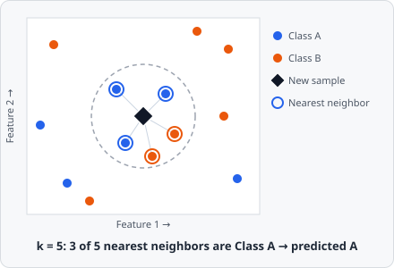

**k-Nearest Neighbors (k-NN)** is one of three algorithms selectable in the [Train Classifier](/ai/training/#choosing-a-model) dialog, for both pixel and object classifiers. Unlike Random Forest or a neural network, it has no real training step - it classifies a new sample by comparing it directly against every labeled example it was given.

## How It Works

"Training" a k-NN model just stores every labeled feature vector - there are no weights to fit, no splits to choose. All the work happens at prediction time:

1. Compute the distance from the new sample to every stored training example, in feature space (each feature - a Gaussian-blur value, an object's Circularity, and so on - is one axis of that space).
2. Take the **k** closest examples - the new sample's **nearest neighbors**.
3. Predict the class that's most common among them (a **majority vote**), optionally weighting closer neighbors more heavily than farther ones.

A sample surrounded mostly by `Class A` examples gets predicted as `Class A`; the boundary between classes falls wherever neighborhoods change composition, without any explicit rule ever being written down.

## Configuring in EVAnalyzer

| Parameter            | Description                                                                                                                                                                                                        |
| -------------------- | ------------------------------------------------------------------------------------------------------------------------------------------------------------------------------------------------------------------ |
| **K (Neighbors)**    | How many nearest neighbors vote on each prediction. Small k follows local detail (and noise) closely; large k smooths the decision boundary out                                                                    |
| **Distance Metric**  | How distance between two feature vectors is measured - Euclidean, Manhattan, or Minkowski                                                                                                                          |
| **Search Algorithm** | How the nearest neighbors are found - **Linear Search** checks every stored point; **Cover Tree** indexes them spatially to skip distant points on larger datasets. Same result either way, just a speed trade-off |
| **Vote Weighting**   | **Uniform** - every one of the k neighbors counts equally. **Distance-weighted** - closer neighbors count for more than farther ones                                                                               |

## When to Choose It

k-NN suits classes that form simple, well-separated clusters in feature space - it makes no assumption about the shape of the decision boundary the way a shallow tree or a small network might, so it can follow an irregular boundary closely if you have enough examples near it. Because every prediction re-scans the stored examples, it's most practical for object classifiers (scoring a moderate number of objects) rather than pixel classifiers (scoring every pixel of every image), where [Random Forest](/ai/random-forest/) or a [Neural Network](/ai/neural-network-mlp/) will generally run faster at inference time. Since distance is computed directly on raw feature values, keep an eye on feature scale - a feature spanning 0-1000 will dominate the distance calculation over one spanning 0-1, so it helps to pick features that are already on comparable scales.
