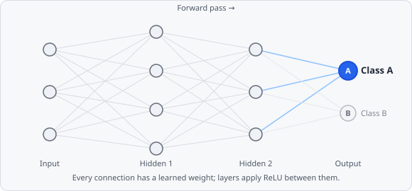

**Neural Network (MLP)** is one of three algorithms selectable in the [Train Classifier](/ai/training/#choosing-a-model) dialog, for both pixel and object classifiers. It's a small feed-forward **multi-layer perceptron** - the same family of model behind most modern deep learning, just with far fewer layers - trained from scratch on your labeled examples.

## How It Works

The network is arranged in layers: an **input layer** (one node per feature), one or more **hidden layers**, and an **output layer** (one node per class). Every node in a layer connects to every node in the next layer, each connection carrying its own **weight**. A sample is classified with a **forward pass**:

1. Each input node holds one feature value.
2. Each hidden node computes a weighted sum of the previous layer's outputs, then applies a non-linear **activation function** (ReLU by default) - without this non-linearity, stacking layers would collapse to nothing more than a single linear model.
3. The output layer produces one score per class; the highest-scoring node is the prediction.

**Training** starts from random weights and repeatedly adjusts them: run a batch of labeled samples forward, measure how wrong the predictions were (the **loss**), then propagate that error backward through the network to nudge every weight slightly toward reducing it (**backpropagation**, via the Adam optimizer here). One full pass over the training data is an **epoch** - training runs for a configured number of epochs, hopefully converging to weights that generalize beyond the exact training samples.

## Configuring in EVAnalyzer

| Parameter          | Description                                                                                                                                                                                |
| ------------------ | ------------------------------------------------------------------------------------------------------------------------------------------------------------------------------------------ |
| **Hidden Layers**  | Comma-separated node counts, one entry per hidden layer (e.g. `64, 32` = two hidden layers). More/larger layers can model more complex boundaries, but need more data to avoid overfitting |
| **Activation**     | The non-linearity applied between layers - ReLU, Sigmoid, or Tanh                                                                                                                          |
| **Max Iterations** | Number of training epochs (full passes over the training data)                                                                                                                             |
| **Epsilon**        | Convergence tolerance                                                                                                                                                                      |
| **Learning Rate**  | Step size the Adam optimizer takes on each weight update. Too high and training oscillates instead of converging; too low and it barely moves                                              |
| **Batch Size**     | Number of samples processed per gradient update                                                                                                                                            |
| **Random Seed**    | Seed for reproducible training runs                                                                                                                                                        |

Watch the live per-epoch status banner while training: it reports both training loss and, once there are at least 25 total samples, a held-out **validation loss**. If validation loss climbs while training loss keeps falling, the network is memorizing the training examples rather than generalizing - see [Choosing a Model](/ai/training/#choosing-a-model) for what to do about it.

## When to Choose It

An MLP can fit more complex, non-linear decision boundaries than a shallow Random Forest or a distance-based k-NN, but it needs a larger and more varied set of labeled examples to do it reliably - with only a handful of painted examples per class, Random Forest will usually generalize better with less tuning. Because training involves gradient descent over real-valued weights, feature scale matters more here than for Random Forest: keep the [Feature Channels](/ai/training/#feature-best-practices-pixel-classifier) or [Object Metrics](/ai/training/#choosing-object-metrics-object-classifier) you select on roughly comparable scales where possible.
