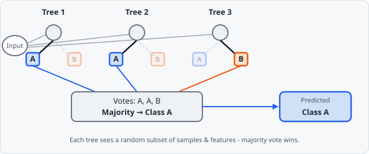

**Random Forest** is one of three algorithms selectable in the [Train Classifier](/ai/training/#choosing-a-model) dialog, for both pixel and object classifiers. It's an ensemble of many independent decision trees, each trained slightly differently, whose predictions are combined by majority vote.

## How It Works

A single **decision tree** classifies a sample by asking a sequence of yes/no questions about its features - "is Circularity < 0.4?", "is Gaussian-Blur(σ=2) intensity > 0.6?" - branching left or right at each one until it reaches a **leaf**, which holds a predicted class. Trained alone, one tree tends to overfit: given enough splits, it can carve out a rule for every quirk of the training data, including its noise.

A **Random Forest** trains many such trees and lets them disagree:

- Each tree sees a different **bootstrap sample** - a random subset of the training rows, drawn with replacement.
- At each split, each tree considers only a random subset of the available **features**, not all of them (**Features per Split** below).

Because every tree is trained on different data and different feature subsets, they make different mistakes. Averaging their votes cancels out most of that noise - a technique called **bagging** (bootstrap aggregating). To classify a new pixel or object, every tree in the forest votes for a class, and the forest predicts whichever class gets the most votes.

## Configuring in EVAnalyzer

| Parameter | Description |
| ----------------------------------------- | ------------------------------------------------------------------------------------------------------------------------------- |
| **Number of Trees** | How many trees make up the forest. More trees give a steadier vote but cost more at both training and inference time |
| **Max Tree Depth** | Maximum depth any single tree may grow to. `0` = unlimited. A deeper tree can fit finer distinctions, at higher overfitting risk |
| **Min Samples Split** | A node needs at least this many samples before it's allowed to split further |
| **Min Samples Leaf** | A split is only kept if both resulting leaves end up with at least this many samples |
| **Split Criterion** | How a split's quality is scored - **Gini** impurity or **Entropy** (information gain); both usually give similar trees |
| **Features per Split** | How many features each split may consider. `0` = automatic (√ of the total feature count) - the randomness that keeps trees decorrelated |
| **Random Seed** | Seed for the bootstrap sampling and feature selection, so the same settings reproduce the same forest |
| **Estimate accuracy from out-of-bag samples** | Each tree's bootstrap sample leaves roughly a third of rows unseen ("out-of-bag") - scoring the tree against those gives a built-in accuracy estimate without needing a separate held-out set |

:::note[Prediction cost matters for pixel classifiers]
**Number of Trees** and **Max Tree Depth** are capped at sensible defaults (50 trees, depth 20) on purpose: a pixel classifier re-walks every tree for *every pixel of every image* it's applied to via [AI Pixel Classifier](/commands/ai-segmentation/pixel-classifier/), so tree count and depth trade prediction speed against accuracy far more directly than they would for a one-off object classification pass.
:::

## When to Choose It

Random Forest is a good first try for most pixel and object classifiers: it's insensitive to feature scale (no need to normalize Gaussian-blur output against raw intensity), tolerates noisy or redundant feature channels well (an uninformative feature just doesn't get picked at many splits), and needs very little hyperparameter tuning to get a reasonable result. Its main limitation is the inference-time cost discussed above - if a forest large/deep enough to be accurate is also too slow to run over every pixel of your images, consider [k-Nearest Neighbors](/ai/k-nearest-neighbors/) or a [Neural Network](/ai/neural-network-mlp/) instead.
