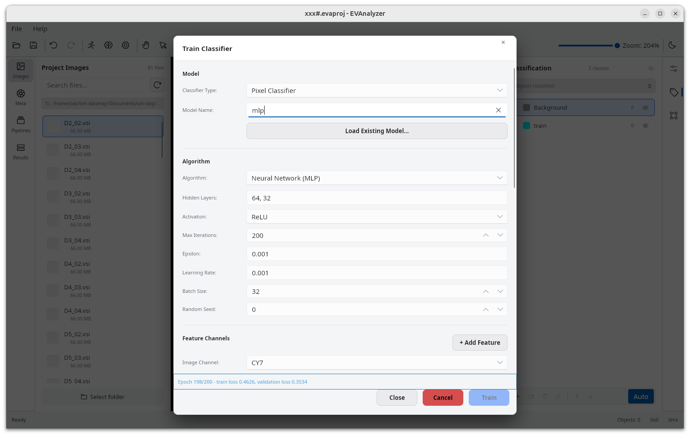

Unlike [AI Models](/ai/overview/), which run a **pretrained** deep-learning network you supply as a TorchScript export, the **Train Classifier** dialog trains a lightweight classical machine-learning model - Random Forest, k-Nearest Neighbors, or a small neural network (MLP) - directly from examples you paint on your own images. No external model file is needed to get started; the model is built entirely from your annotations and saved as an `.evamodel` file.

## Two Kinds of Classifier

| Classifier Type       | Classifies                                                    | Feature source                                                | Comparable to                                                                                                    |
| --------------------- | ------------------------------------------------------------- | ------------------------------------------------------------- | ---------------------------------------------------------------------------------------------------------------- |
| **Pixel Classifier**  | Every pixel of an image, independently                        | Intensity and texture/edge filters computed around each pixel | ilastik-style pixel classification                                                                               |
| **Object Classifier** | Objects already extracted by a pipeline (or painted directly) | Shape and per-channel intensity metrics of each object        | A learned alternative/complement to [Classify Objects](/commands/object/classify-objects/)'s rule-based criteria |

A **Pixel Classifier** produces a segmentation mask - the same output shape [Threshold](/commands/segmentation/threshold/) produces - so it slots into a pipeline before [Connected Components](/commands/segmentation/connected-components/)/[Extract Objects](/commands/object/extract-objects/).
An **Object Classifier** instead scores objects that already exist in the pipeline cache, the same input [Classify Objects](/commands/object/classify-objects/) works from.

## Workflow

### 1. Provide examples with the painting tool

Both classifier types learn from objects you draw with the **Region Annotation** tool (Rectangle / Oval / Polygon - see [Region Annotation](/guide/images/#region-annotation)), independent of any pipeline.

- **Pixel Classifier** - paint a few representative patches of each class you want to predict, **and paint a couple of background patches too**. The classifier needs negative examples of everything that _isn't_ a target class, not just positive examples of the classes themselves - a model trained only on "Nucleus" patches has never seen what a non-nucleus pixel looks like.
- **Object Classifier** - paint around whole objects (or run a segmentation pipeline first and use its output) - each candidate object gets its class assigned inside the training dialog itself, in the next step, not beforehand.

:::tip[Background is always included]
`Background` is always included as a prediction target (index 0), even if left unchecked in **Classes to Train** - so painting background examples and assigning them the `Background` class is enough; you don't need to explicitly select it.
:::

### 2. Open Train Classifier and set up the model

Pick **Classifier Type** (Pixel or Object Classifier) and a **Model Name**. Optionally click **Load Existing Model...** to continue training a previously-saved model instead of starting fresh.

### 3. Assign classes to painted objects

The **Training Objects** list shows every manually-painted object in scope (the current image, or every project image if **Include annotations from other images** is enabled under **Training Data Source**). For each one:

- Assign a class from the dropdown.
- Uncheck **Train on this** to exclude a bad or outlier annotation from training without deleting it.

Only objects with a class assigned here are used as training samples.

### 4. Pick which classes to train on

The **Classes to Train** checklist controls which of the project's classes become prediction targets. Classes with at least one labeled object are pre-checked, but any class can be selected ahead of labeling it.

### 5. Choose an algorithm

Pick **Random Forest**, **K-Nearest Neighbors**, or **Neural Network (MLP)** and configure its hyperparameters - see [Choosing a Model](#choosing-a-model) below.

### 6. Configure features

- **Pixel Classifier** - pick the **Image Channel** to train on and build a **Feature Channels** list - see [Feature Best Practices](#feature-best-practices-pixel-classifier).
- **Object Classifier** - check the **Object Metrics** to use - see [Choosing Object Metrics](#choosing-object-metrics-object-classifier).

### 7. Train

Click **Train**. A status banner shows progress; for MLP, it streams live train/validation loss per epoch. **Cancel** stops an in-flight run. The dialog stays open after training finishes so you can inspect the result and retrain without losing your settings.

### 8. Use the model in a pipeline

The trained model is saved to `<project>/models/<model name>.evamodel`. Add an [AI Pixel Classifier](/commands/ai-segmentation/pixel-classifier/) or [AI Object Classifier](/commands/object/ai-object-classifier/) step to a pipeline and point it at that file.

## Choosing a Model

| Algorithm                                           | Good default when...                                                                                                | Key defaults                                                                                                                                                                                      |
| --------------------------------------------------- | ------------------------------------------------------------------------------------------------------------------- | ------------------------------------------------------------------------------------------------------------------------------------------------------------------------------------------------- |
| **[Random Forest](/ai/random-forest/)**             | You want a robust first try - insensitive to feature scale, tolerates noisy or redundant features well              | 50 trees, max depth 20 (capped deliberately - a pixel classifier re-walks every tree for _every pixel of every image_ at inference time, so depth/tree-count trade accuracy for prediction speed) |
| **[k-Nearest Neighbors](/ai/k-nearest-neighbors/)** | Classes form simple, well-separated clusters in feature space                                                       | k = 5, distance-weighted voting, Cover Tree search                                                                                                                                                |
| **[Neural Network (MLP)](/ai/neural-network-mlp/)** | You have a larger, more varied set of labeled examples and a feature set too complex for a simple decision boundary | Hidden layers `64, 32`, ReLU, 200 epochs, Adam optimizer (learning rate 0.001)                                                                                                                    |

For MLP, watch the per-epoch status banner: if validation loss climbs while training loss keeps falling, the model is overfitting - add more/more varied examples, or shrink the hidden-layer sizes, rather than just training longer. A validation split is only computed once there are at least 25 total training samples; below that, only training loss is shown.

See [Random Forest](/ai/random-forest/), [k-Nearest Neighbors](/ai/k-nearest-neighbors/), and [Neural Network (MLP)](/ai/neural-network-mlp/) for a detailed look at how each algorithm actually works.

## Feature Best Practices (Pixel Classifier)

Each entry in **Feature Channels** is one input to the classifier, computed from the selected **Image Channel**:

| Feature              | Captures                                                                      |
| -------------------- | ----------------------------------------------------------------------------- |
| **Raw**              | The unfiltered pixel value - always worth including as a baseline             |
| **Gaussian Blur**    | Local intensity averaged over a radius (σ) - texture/context at a given scale |
| **Sobel**            | Edge strength                                                                 |
| **Laplacian**        | Zero-crossing edges (second derivative)                                       |
| **Structure Tensor** | Local orientation and coherence (Eigenvalue X/Y, Coherence)                   |
| **Hessian**          | Blob- and ridge-like structures (Determinant, Eigenvalue X/Y)                 |
| **Rank Filter**      | Local statistics - mean, median, min, max, or outlier deviation               |

A few rules of thumb (the same approach ilastik's pixel classification is built around):

- **Combine a few filter types across several scales**, rather than many filter types at one scale. Use **Quick add scales** to add the same Gaussian Blur at several σ values at once (e.g. `1, 2, 4, 8`) - small σ picks up fine detail, larger σ adds regional context.
- **Pair Laplacian/Hessian with pre-blurring.** Both are second-derivative filters and amplify noise; enabling their **Pre-blur** option (Laplacian-/Hessian-of-Gaussian) smooths the image first.
- **Pixel classifiers train on a single image channel.** If the discriminating signal is spread across channels, you'll need to pick the most informative one or train separate models.
- More features cost more inference time (every pixel of every image needs every feature computed) without necessarily improving accuracy - start small and add features only where the classifier is actually confusing two classes.

## Choosing Object Metrics (Object Classifier)

The **Object Metrics** checklist offers shape metrics (Area, Perimeter, Circularity, Solidity, Aspect Ratio, Roundness, Compactness, Feret/Min Feret Diameter, Ellipse Major/Minor/Angle, Eccentricity, Touches Edge) and per-channel intensity statistics (Sum, Min, Max, Average).

The object's own assigned class and its centroid/position are **deliberately excluded** - including the class would leak the training label itself, and position would teach the model _where_ an object is instead of _what it looks like_, a classic overfitting trap.

Pick a handful of metrics that actually distinguish your classes rather than checking everything - e.g. Circularity + Solidity to separate round vesicles from irregular debris, or a channel's Intensity Average to separate marker-positive from marker-negative objects. Fewer, meaningful features generalize better from a limited set of hand-labeled examples.
