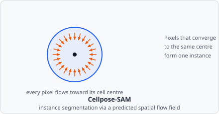

The **AI Cellpose Segmentation** command runs instance segmentation using a pretrained [Cellpose](https://github.com/MouseLand/cellpose) model exported as TorchScript.
Like [Stardist](/commands/ai-segmentation/stardist/), it recovers individual object instances directly - no [Connected Components](/commands/segmentation/connected-components/) or [Watershed](/commands/segmentation/watershed/) step is needed afterward.

Rather than predicting a shape directly, the model predicts a vector field: at every pixel, "which direction is the centre of my cell?" Simulating each pixel's short walk along that field causes every pixel belonging to the same cell to converge on the same point - so instances fall out of _where pixels end up_, which handles irregular and overlapping shapes that a fixed polygon representation (like Stardist's) can't.

:::note[Build requirement]
AI segmentation commands are only available in builds with the `ai` Cargo feature enabled (via [tch-rs](https://github.com/LaurentMazare/tch-rs)/libtorch).
:::

## Parameters

| Parameter                 | Description                                                                                                                                                                                                      |
| ------------------------- | ---------------------------------------------------------------------------------------------------------------------------------------------------------------------------------------------------------------- |
| **Model path**            | Path to a TorchScript-exported Cellpose model (`.pt` / `.pth`, via `torch.jit.script` or `torch.jit.trace`).                                                                                                     |
| **Object class**          | The segmentation class assigned to every detected object's pixels.                                                                                                                                               |
| **Probability threshold** | Cell probability above which a pixel takes part in the flow dynamics and can be assigned to an object. Range: 0.0–1.0 (default 0.5 - corresponds to Cellpose's default logit threshold of `0`).                  |
| **Flow iterations**       | Number of Euler integration steps used to follow the flow field. Higher values let pixels in large cells reach their sink, at the cost of runtime. Range: 1–1000 (default 200, matching Cellpose's own default). |
| **Minimum object size**   | Minimum instance size in pixels; smaller instances are discarded after the dynamics. `0` disables the filter. Default 15.                                                                                        |

## Model requirements

The model must accept a `[1, 1, H, W]` single-channel float tensor and return a `[1, C, H, W]` tensor with at least 3 channels, in Cellpose's spatial-gradient representation:

- Channel 0 - vertical flow (`dY`)
- Channel 1 - horizontal flow (`dX`)
- Channel 2 - cell-probability logits (a sigmoid is applied internally; the threshold above is in probability space, not logit space)

The output resolution must match the input resolution exactly. Exports that wrap the output in a tuple (e.g. `(flows, style)`) are also supported - EVAnalyzer uses the first returned tensor with at least 3 channels.

## How it works

This is a Rust port of Cellpose's own _dynamics_ step:

1. The model produces a flow field (`dY`, `dX`) and a cell-probability map for the image.
2. Pixels whose cell probability reaches **Probability threshold** are advected along the flow field for **Flow iterations** Euler steps (the predicted flow is divided by Cellpose's training scale factor of 5 to keep each step near one pixel), converging toward the centre ("sink") of their object.
3. Pixels that converge to the same sink are grouped into one instance, found via 8-connected connected components over the density of final pixel positions.
4. Instances smaller than **Minimum object size** are discarded; survivors are renumbered to contiguous instance IDs and written to the segmentation and instance maps.

Runs on GPU automatically if CUDA is available in the linked libtorch build, otherwise falls back to CPU.

:::tip[Choosing between Cellpose and Stardist]
Cellpose's flow-based approach handles irregular, elongated, and overlapping-but-distinct cell shapes that Stardist's star-convex polygons can't represent well. For round, convex objects like nuclei, Stardist is faster and equally accurate - see [Choosing a Model](/ai/overview/#choosing-a-model).
:::

## Background

Carsen Stringer, Tim Wang, Michalis Michaelos, and Marius Pachitariu, "Cellpose: A Generalist Algorithm for Cellular Segmentation," _Nature Methods_, vol. 18, pp. 100-106, 2021.
