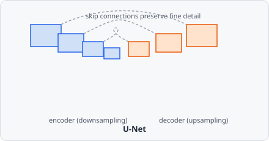

The **AI UNet Segmentation** command runs semantic segmentation using a pretrained [U-Net](https://en.wikipedia.org/wiki/U-Net) model exported as TorchScript. Unlike [AI Stardist Segmentation](/commands/ai-segmentation/stardist/), U-Net produces only a foreground/background mask - it has no notion of individual object instances. Touching objects must be separated with a follow-up step (see [Splitting touching objects](#splitting-touching-objects) below).

U-Net's defining feature is its symmetric shape: an encoder repeatedly downsamples the image to build up coarse, high-level context, and a decoder mirrors it back up to full resolution - but at each level, the decoder also receives the encoder's same-resolution features directly via a "skip connection", so fine spatial detail lost during downsampling doesn't have to be reconstructed from scratch.



:::note[Build requirement]
AI segmentation commands are only available in builds with the `ai` Cargo feature enabled (via [tch-rs](https://github.com/LaurentMazare/tch-rs)/libtorch).
:::

## Parameters

| Parameter                 | Description                                                                                                                                                     |
| ------------------------- | --------------------------------------------------------------------------------------------------------------------------------------------------------------- |
| **Model path**            | Path to a TorchScript-exported U-Net model (`.pt` / `.pth`).                                                                                                    |
| **Object class**          | The segmentation class assigned to pixels classified as foreground.                                                                                             |
| **Probability threshold** | Probability above which a pixel is classified as foreground. Range: 0.0–1.0 (default 0.5).                                                                      |
| **Output mode**           | How to interpret a multi-channel model output - `SoftmaxClasses` or `IndependentChannels`. Ignored for single-channel outputs. See [Output mode](#output-mode). |
| **Foreground channel**    | Index of the channel holding the foreground probability, used only when the output has more than one channel. Range: 0–16 (default 1).                          |
| **Boundary channel**      | Index of an optional boundary channel for boundary-aware models. Set to `-1` to disable (default). Range: −1–16.                                                |
| **Boundary threshold**    | Boundary probability at or above which a pixel is excluded from the foreground. Only used when **Boundary channel** is enabled. Range: 0.0–1.0 (default 0.5).   |

## Model requirements

The model must accept a `[1, 1, H, W]` single-channel float tensor and return either:

- a `[1, 1, H, W]` tensor of per-pixel foreground probabilities (the model already applies its final sigmoid), or
- a `[1, C, H, W]` tensor with more than one channel, in which case **Output mode** and **Foreground channel** decide how the foreground probability is extracted.

## Output mode

| Mode                    | Use for                                                                                                                                                                                                        |
| ----------------------- | -------------------------------------------------------------------------------------------------------------------------------------------------------------------------------------------------------------- |
| **SoftmaxClasses**      | A mutually-exclusive class head (e.g. a 2-class background/foreground classifier). Softmax is applied across channels first, then **Foreground channel** is read (typically `1` for a 2-class head).           |
| **IndependentChannels** | Independent, already-activated probability maps that are _not_ mutually exclusive - e.g. a foreground-mask channel plus a separate boundary channel. **Foreground channel** is read directly, with no softmax. |

:::caution
Boundary-aware models (mask + boundary heads) must use `IndependentChannels`. Running softmax across mask and boundary channels, or picking the boundary channel by mistake, is the most common cause of "I get outlines, not filled objects".
:::

## Splitting touching objects

U-Net emits one shared class for "foreground", so two touching objects become a single connected blob after segmentation. How you split them depends on the model:

### Boundary-aware models (recommended)

Models that predict an explicit boundary channel - e.g. bioimage.io's [`affable-shark`](https://bioimage.io/#/?id=affable-shark) (_NucleiSegmentationBoundaryModel_) - let you carve the boundary out as a thin gap between objects:

1. Set **Output mode** to `IndependentChannels`.
2. Set **Boundary channel** to the model's boundary channel index (commonly `1`).
3. Set **Boundary threshold** (~0.5). A pixel is foreground only where the foreground probability reaches **Probability threshold** _and_ the boundary probability stays below **Boundary threshold**.
4. Chain a plain [Connected Components](/commands/segmentation/connected-components/) afterward - no watershed needed:

```
AI UNet Segmentation (foreground_channel: 0, boundary_channel: 1) → Connected Components → Extract Objects
```

Discarding the boundary channel and relying on watershed instead is the most common reason touching objects "won't split" - a distance-map watershed can't separate a blob that has no waist, and the waist information lives in the boundary channel.

### Mask-only models

If the model gives only a foreground mask (no boundary), chain a distance-map watershed instead:

```
AI UNet Segmentation → Connected Components → Watershed → Extract Objects
```

[Connected Components](/commands/segmentation/connected-components/) labels each blob; [Watershed](/commands/segmentation/watershed/) re-splits any blob containing more than one object. This only works when touching objects form a pinched "peanut" shape - heavily overlapping objects with no waist cannot be split from the mask alone.

## Background

Olaf Ronneberger, Philipp Fischer, and Thomas Brox, "U-Net: Convolutional Networks for Biomedical Image Segmentation," *Medical Image Computing and Computer-Assisted Intervention (MICCAI)*, 2015, pp. 234-241.
