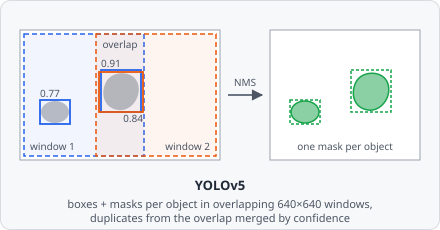

The **AI YOLOv5 Segmentation** command runs a pretrained [YOLOv5](https://github.com/ultralytics/yolov5) model exported as TorchScript. YOLOv5 is a fast, single-pass object detector: for every object it predicts a bounding box, a confidence and a class - and segmentation models (`yolov5*-seg`) also predict the object's mask. Like [Stardist](/commands/ai-segmentation/stardist/) and [Cellpose](/commands/ai-segmentation/cellpose/) it recovers individual object instances directly, so no [Connected Components](/commands/segmentation/connected-components/) or [Watershed](/commands/segmentation/watershed/) step is needed afterward.

Unlike the other AI segmentation commands, a YOLOv5 model can know **several object classes** (e.g. "healthy cell" and "dividing cell") and assigns each object to one of them.

:::note[Build requirement]
AI segmentation commands are only available in builds with the `ai` Cargo feature enabled (via [tch-rs](https://github.com/LaurentMazare/tch-rs)/libtorch).
:::

## Usage

1. **Export the model to TorchScript.** In the YOLOv5 repository, run `python export.py --weights best.pt --include torchscript --img 640`. This writes a `.torchscript` file. A training checkpoint (`best.pt` itself) can't be loaded.
2. **Add AI YOLOv5 Segmentation to the pipeline** and point **Model path** at the exported file. Models published on [bioimage.io](https://bioimage.io) with TorchScript weights can also be [imported](/ai/bioimageio-import/) directly.
3. **Map the classes.** Use **Class mapping** to choose which project segmentation class each model class becomes - or leave it empty to write model class `i` as segmentation class `i + 1`.
4. **Follow with Extract Objects.** Append [Extract Objects](/commands/object/extract-objects/), then [Classify Objects](/commands/object/classify-objects/) to assign the final object classes.

## Parameters

| Parameter                | Description                                                                                                                                                                                                                                      |
| ------------------------ | ------------------------------------------------------------------------------------------------------------------------------------------------------------------------------------------------------------------------------------------------ |
| **Model path**           | Path to a YOLOv5 model exported as TorchScript (`.torchscript` / `.pt`).                                                                                                                                                                       |
| **Class mapping**        | List of **Model class** (index in the model, `0` = its first class) → **Segmentation class** (the project's class the objects are written as). Objects of classes not listed are dropped. Leave empty to write model class `i` as segmentation class `i + 1`, for every class. |
| **Confidence threshold** | Minimum confidence (objectness × class score) of a detection. Range: 0.0–1.0 (default 0.25).                                                                                                                                                   |
| **IoU threshold**        | Detections of the same class whose boxes overlap more than this (intersection over union) are merged into the more confident one. Range: 0.0–1.0 (default 0.45).                                                                              |
| **Mask threshold**       | Mask probability above which a pixel belongs to its object. Segmentation models only. Range: 0.0–1.0 (default 0.5).                                                                                                                            |
| **Image scale**          | Factor the image is scaled by before it is given to the model; the masks are scaled back afterwards. Use it when the model was trained on downscaled images: `640 / training image size`, e.g. `0.3125` for 2048 px images that YOLOv5 shrank to 640 px. Range: 0.1–4.0 (default 1 = full resolution). |
| **Window overlap**       | Overlap of neighboring 640×640 windows, in pixels. Must be larger than the biggest object, so every object lies completely inside some window. Range: 0–512 (default 128).                                                                     |
| **Minimum object size**  | Objects with fewer pixels than this (after overlapping objects were resolved) are removed. `0` keeps every object. Default 15.                                                                                                                  |

## Model requirements

- A YOLOv5 TorchScript export (`export.py --include torchscript`) with a fixed **640×640** input.
- **Segmentation models** (`yolov5n-seg` … `yolov5x-seg`) give every object its own mask. **Detection models** (plain `yolov5*`) have no masks - each object becomes its filled bounding box.
- Any number of model classes is supported.
- Gray images are given to the model as RGB with three equal channels.

## How it works

1. If **Image scale** isn't `1`, the tile is resized by that factor.
2. The tile is analyzed in overlapping **640×640 windows** at full resolution - small tiles are padded - so small objects stay detectable instead of being shrunk away. Neighboring windows overlap by **Window overlap** pixels.
3. Each window runs through the model. Detections below **Confidence threshold** are dropped. A box touching a window edge that lies inside the tile is discarded - the neighboring window sees that object whole.
4. For segmentation models the mask of every detection is built like YOLOv5's own `process_mask`: the predicted coefficients weight the mask prototypes, the result is cut to the box, scaled up and thresholded at **Mask threshold**.
5. **Non-maximum suppression** across all windows: of overlapping detections of one class (box IoU above **IoU threshold**), only the most confident one stays. This also merges objects that two windows both saw.
6. The objects are painted into the segmentation and instance maps, more confident objects on top. Objects left smaller than **Minimum object size** are removed, and the maps are scaled back to the original size if needed.

Runs on GPU automatically if CUDA is available in the linked libtorch build, otherwise falls back to CPU.

:::tip[Choosing a window overlap]
If large objects come out cut in half along a straight line, **Window overlap** is smaller than those objects - increase it.
:::

## Background

Glenn Jocher, Ayush Chaurasia, and Alex Stoken, "ultralytics/yolov5: v7.0 - YOLOv5 SOTA Realtime Instance Segmentation," _Zenodo_, 2022. doi:[10.5281/zenodo.3908559](https://doi.org/10.5281/zenodo.3908559)
