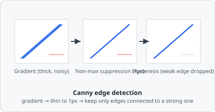

The **Canny Edge Detection** command detects edges by computing image gradients, suppressing non-maximal responses, and applying dual-threshold hysteresis to produce thin, clean edges.

Where [Sobel](/commands/edge-detection/sobel/) stops at a raw gradient magnitude map (thick, fuzzy bands around every edge), Canny adds two more stages: it thins each band down to its single strongest pixel-wide ridge, then uses two thresholds instead of one - a gradient has to be either strong on its own, or weak but touching a strong neighbour, to survive. Weak, isolated responses (noise) are dropped even if they'd pass a single loose threshold.

## When to use

Use Canny when you need precise, thin edge maps. Compared to [Sobel](/commands/edge-detection/sobel/), Canny is more accurate but slower. It is well-suited as preprocessing for contour-based segmentation.

## Parameters

| Parameter         | Description                                                                            |
| ----------------- | -------------------------------------------------------------------------------------- |
| **Kernel size**   | Size of the Gaussian smoothing kernel applied before gradient computation (range 3–27) |
| **Threshold min** | Lower hysteresis threshold - edges weaker than this are discarded                      |
| **Threshold max** | Upper hysteresis threshold - edges stronger than this are always retained              |

### Hysteresis thresholding

Edges with gradient magnitude between the two thresholds are kept only if they are connected to a strong edge (above the upper threshold). This produces cleaner, more continuous edge maps than a single-threshold approach.

## Notes

A larger kernel size increases smoothing before gradient computation, making the detector less sensitive to fine noise at the cost of detecting coarser edges. As a starting point try `kernel_size=3`, `threshold_min=0.1`, `threshold_max=0.3`.

## Background

John Canny, "A Computational Approach to Edge Detection," *IEEE Transactions on Pattern Analysis and Machine Intelligence*, vol. PAMI-8, no. 6, pp. 679-698, November 1986 - still one of the most-cited papers in computer vision, and the origin of the non-maximum-suppression + hysteresis-thresholding design used here.
