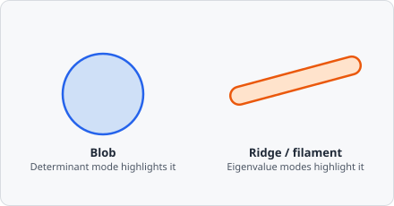

The **Hessian** command computes a scalar map from the Hessian matrix of the image - the matrix of second-order partial derivatives. This captures local curvature and is useful for detecting blobs and ridges.

Intuitively, the Hessian asks "how does the local intensity curve away in every direction?" A round blob curves away equally fast in all directions (both eigenvalues large, same sign - a large determinant); a ridge or filament curves sharply across its width but stays flat along its length (one large eigenvalue, one near zero). Choosing which scalar to extract from that matrix is choosing which of those shapes to highlight.

## When to use

- **Blob detection** - use the Determinant mode to find circular, blob-like structures (e.g. cell nuclei, vesicles).
- **Ridge detection** - use the Eigenvalue modes to detect filamentous or tubular structures.

## Parameters

| Parameter | Description                                                  |
| --------- | ------------------------------------------------------------ |
| **Mode**  | Which scalar feature to extract from the Hessian (see below) |

### Modes

| Mode              | Formula                             | Highlights                                                           |
| ----------------- | ----------------------------------- | -------------------------------------------------------------------- |
| **Determinant**   | $\det(H) = I_{xx}I_{yy} - I_{xy}^2$ | Blobs and corners                                                    |
| **Eigenvalues X** | Larger eigenvalue $\lambda_1$       | Maximum curvature; principal ridge axis                              |
| **Eigenvalues Y** | Smaller eigenvalue $\lambda_2$      | Secondary curvature; interest points when both eigenvalues are large |

## Background

The Hessian matrix at pixel $(x,y)$ is:

$$
H = \begin{pmatrix} I_{xx} & I_{xy} \\ I_{xy} & I_{yy} \end{pmatrix}
$$

where $I_{xx}$, $I_{yy}$, $I_{xy}$ are second-order spatial derivatives of the image intensity.

Using the Hessian's determinant and eigenvalues as an interest-point/blob operator traces back to P. R. Beaudet, "Rotationally Invariant Image Operators," *Proceedings of the 4th International Joint Conference on Pattern Recognition*, 1978, pp. 579-583, and was later formalized within scale-space theory by Tony Lindeberg, "Feature Detection with Automatic Scale Selection," *International Journal of Computer Vision*, vol. 30, no. 2, pp. 79-116, 1998.
