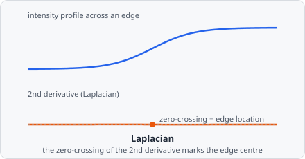

The **Laplacian** command applies the Laplacian operator - the sum of second-order partial derivatives - to detect edges via zero-crossings. The output highlights regions of rapid intensity change.

A first-derivative filter like [Sobel](/commands/edge-detection/sobel/) peaks *at* an edge. The Laplacian, being a second derivative, instead swings from positive to negative *across* an edge and crosses exactly zero at its centre - so instead of looking for a peak, edge detection with the Laplacian means finding where the output changes sign. Because it sums the second derivative in every direction equally, it responds to edges of any orientation without needing separate x/y kernels.

## When to use

The Laplacian is sensitive to fine detail and noise. Apply it after [Gaussian Blur](/commands/image-processing/gaussian-blur/) (the combined LoG - Laplacian of Gaussian - operator) for more robust edge and blob detection.

## Parameters

| Parameter       | Description                               |
| --------------- | ----------------------------------------- |
| **Kernel size** | Size of the Laplacian kernel (range 3–27) |

## Background

The Laplacian is defined as:

$$
\nabla^2 I = \frac{\partial^2 I}{\partial x^2} + \frac{\partial^2 I}{\partial y^2}
$$

Zero-crossings in the output correspond to edges in the original image. Unlike gradient-based methods (Sobel, Canny), the Laplacian is isotropic - it responds equally to edges in all directions.

Pairing a Gaussian pre-smooth with the Laplacian (the LoG operator) as a principled edge/blob detector was formalized by David Marr and Ellen Hildreth, "Theory of Edge Detection," *Proceedings of the Royal Society of London B*, vol. 207, no. 1167, pp. 187-217, 1980. EVAnalyzer implements the plain discrete Laplacian; chain a [Gaussian Blur](/commands/image-processing/gaussian-blur/) step before it to reproduce LoG.
