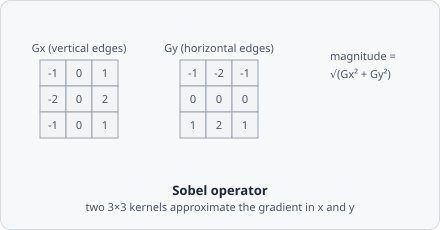

The **Sobel Edge Detection** command computes the gradient magnitude of the image using horizontal and vertical Sobel kernels. Each pixel in the output represents the local rate of intensity change.

Two small 3×3 kernels approximate the intensity derivative in x ($G_x$) and y ($G_y$) directions independently - combining them with the Pythagorean-style magnitude $\sqrt{G_x^2 + G_y^2}$ gives an edge strength that responds to intensity changes in any direction, not just horizontal or vertical ones.

## When to use

Sobel is faster and simpler than [Canny](/commands/edge-detection/canny/), making it suitable for real-time preview or as a feature extraction step feeding into a threshold. Edges are broader and less precise than Canny but the computation is significantly faster.

## Parameters

| Parameter | Description |
|---|---|
| **Kernel size** | Size of the Sobel kernel (range 3–27) |

Larger kernel sizes smooth gradients over a wider neighbourhood before computing the magnitude, reducing noise sensitivity but producing thicker edges.

## Background

The operator is named after Irwin Sobel and Gary Feldman, who presented it at a Stanford Artificial Intelligence Project talk in 1968 ("A 3×3 Isotropic Gradient Operator for Image Processing"); it was never formally published by the authors but is documented in Sobel's 2014 retrospective ("History and Definition of the Sobel Operator") and widely cited via Duda & Hart, *Pattern Classification and Scene Analysis* (Wiley, 1973).
