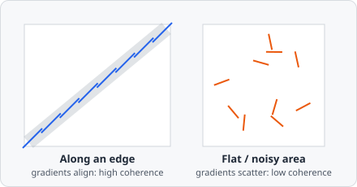

The **Structure Tensor** command computes a scalar map from the structure (second-moment) tensor of the image. It characterises local image orientation and the degree of directional coherence.

At every pixel, the gradient is computed and combined into a small matrix (the structure tensor) that summarizes the *dominant direction* of intensity change nearby, then smoothed over a Gaussian window so the estimate is stable rather than pixel-noisy. Its eigenvalues tell a simple story: both near zero means a flat, featureless area; one large and one small means a straight, one-directional edge; both large means a corner or a crossing of two edges.

## Parameters

| Parameter | Description |
|---|---|
| **Mode** | Which scalar feature to extract (see below) |
| **Kernel size** | Size of the gradient kernel (range 3–27) |
| **Sigma** | Gaussian smoothing applied to the tensor components |

### Modes

| Mode | Highlights |
|---|---|
| **Eigenvalues X** | The larger eigenvalue $\lambda_1$ - variation perpendicular to an edge; useful for edge detection |
| **Eigenvalues Y** | The smaller eigenvalue $\lambda_2$ - variation along an edge; high values typically indicate corners or noise |
| **Coherence** | $(\lambda_1-\lambda_2)/(\lambda_1+\lambda_2)$ - how strongly the local neighbourhood is oriented (0 = isotropic/noise, 1 = perfectly oriented/straight edge) |

## When to use

Structure tensor analysis is useful for:
- Detecting and enhancing fibrous or elongated structures (collagen fibres, actin filaments).
- Filtering based on local anisotropy before segmentation.

## Background

The structure tensor (also called the second-moment matrix) for feature and corner detection was introduced by Wolfgang Förstner and Eberhard Gülch, "A Fast Operator for Detection and Precise Location of Distinct Points, Corners and Centres of Circular Features," *Proceedings of the ISPRS Intercommission Workshop*, 1987, and is the same underlying construction used by the Harris corner detector (Harris & Stephens, 1988).
