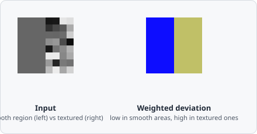

The **Weighted Deviation** command computes the Gaussian-weighted local standard deviation at each pixel. Pixels in smooth, uniform regions produce low values; pixels in textured or edge regions produce high values.

It's computed from the identity $\mathrm{Var}(X) = E[X^2] - (E[X])^2$: a Gaussian-weighted average of the raw intensities, and a separate Gaussian-weighted average of the *squared* intensities, combined to get a smooth, stable local variance map - without the blocky artifacts a plain rectangular window would produce.

## When to use

Use Weighted Deviation to:
- Highlight regions with high local variation (edges, textures) while suppressing uniform areas.
- Create a feature image for thresholding heterogeneous structures.

## Parameters

| Parameter | Description |
|---|---|
| **Kernel size** | Size of the local window (range 3–27) |
| **Sigma** | Standard deviation of the Gaussian weighting within the window |

A larger kernel size and higher sigma increases the scale of the detected variation. Smaller values respond to fine-grained texture.
