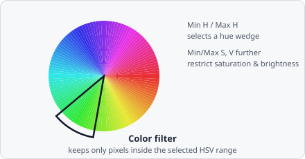

The **Color Filter** command keeps only pixels whose colour falls within a defined HSV (Hue–Saturation–Value) range and sets all other pixels to zero.

HSV separates colour into a wedge of hue (which colour), a ring of saturation (how vivid vs. washed-out), and brightness - so "select the purple stain" becomes one contiguous slice of the wheel, rather than a scattered region in RGB's red/green/blue axes. That's what makes HSV the natural space for chroma-key-style colour isolation.

## When to use

Use this command on RGB colour images to isolate a specific stain colour before greyscale processing. For example, extracting a haematoxylin (blue/purple) stain from an H&E image.

## Parameters

| Parameter | Description |
|---|---|
| **Min H / Max H** | Hue range (0°–360°) |
| **Min S / Max S** | Saturation range (0.0–1.0) |
| **Min V / Max V** | Value (brightness) range (0.0–1.0) |

### HSV overview

| Component | Description |
|---|---|
| **Hue** | The colour angle on the colour wheel (0° = red, 120° = green, 240° = blue) |
| **Saturation** | Colour purity (0 = grey, 1 = fully saturated) |
| **Value** | Brightness (0 = black, 1 = full brightness) |

## Notes

Pixels with hue spanning the red wrap-around (near 0° / 360°) can be captured by setting Min H to a value close to 360° and Max H to a value near 0°; EVAnalyzer handles the circular wrap automatically.
