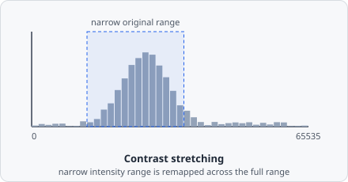

The **Enhance Contrast** command improves image visibility by adjusting the intensity distribution.

Many raw microscopy images only use a narrow slice of the available intensity range (a 16-bit sensor might report signal entirely between, say, 2000 and 8000 out of 65535) - which looks flat and low-contrast on screen even though the underlying signal is fine. Enhance Contrast re-maps that narrow band across the full range, without changing which pixel is brighter than which.

## Parameters

| Parameter | Description |
|---|---|
| **Saturated pixels** | Fraction of pixels (%) to clip at each end of the histogram when stretching |
| **Normalize** | Rescale the histogram so the full intensity range is used |
| **Equalize histogram** | Redistribute intensities to flatten the histogram, maximising local contrast |

## Modes

### Normalize

Stretches the histogram so the darkest non-clipped pixel maps to 0 and the brightest maps to 65535 (for 16-bit). The **Saturated pixels** parameter allows a small fraction of extreme values to be clipped, which prevents a few bright outliers from compressing the rest of the range.

### Equalize histogram

Applies histogram equalization: each intensity value is remapped so that the cumulative distribution becomes uniform. This enhances local contrast in images where the signal occupies only a narrow portion of the available range - at the cost of also amplifying background noise in flat regions, since it doesn't distinguish "narrow because it's genuinely low-contrast" from "narrow because it's actually background."

## When to use

Enhance Contrast can improve visibility in the live preview or in exported control images. For analysis pipelines, normalisation before thresholding can reduce sensitivity to exposure variation between images.

:::caution
Both modes change pixel values, which changes any downstream intensity measurement. If you need the raw intensity metrics (Sum/Avg/Min/Max) to reflect the original acquisition, apply Enhance Contrast only for visualization/export, on a branch that doesn't feed into [Classify Objects](/commands/object/classify-objects/).
:::
