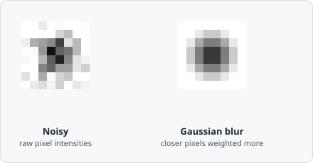

The **Gaussian Blur** command smooths the image using a Gaussian-weighted kernel. Compared to plain [Blur](/commands/image-processing/blur/), the Gaussian falloff preserves edges more faithfully and avoids the ringing artefacts of a hard box kernel.

## When to use

Gaussian Blur is the preferred noise-reduction step for fluorescence images before threshold segmentation.

## Parameters

| Parameter | Description |
|---|---|
| **Kernel size** | Side length of the kernel in pixels (must be odd; range 3–27) |
| **Sigma** | Standard deviation of the Gaussian distribution (controls the spread) |

### Choosing sigma

A good rule of thumb is `sigma ≈ kernel_size / 6`. A smaller sigma relative to the kernel size produces a sharper result; a larger sigma increases smoothing towards a flat box filter.

## Notes

The Gaussian function weights pixels by their distance from the centre:

$$
G(x, y) = \frac{1}{2\pi\sigma^2} e^{-\frac{x^2+y^2}{2\sigma^2}}
$$

Larger kernel sizes or higher sigma values remove more noise but also blur small objects.

## Background

Gaussian smoothing is the foundation of *scale-space theory* in computer vision - the idea that an image can be analyzed at multiple levels of detail by convolving it with Gaussians of increasing $\sigma$, from fine noise-level detail up to coarse structure. See Witkin, "Scale-Space Filtering" (*IJCAI*, 1983) and Lindeberg, "Scale-Space Theory in Computer Vision" (Springer, 1994) for the underlying theory.
