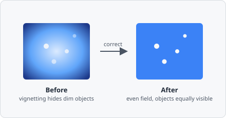

The **Illumination Correction** command estimates and removes a smooth, slowly-varying gain/offset field caused by uneven illumination - vignetting, dust on the condenser, uneven excitation - equivalent to CellProfiler's `CorrectIlluminationCalculate` and `CorrectIlluminationApply` modules combined into one step.

## When to use

Use it when images are brighter in the middle and dimmer toward the edges/corners, or show any other smooth shading pattern that repeats the same way across every tile or every image from the same microscope/camera setup - a consequence of the optics or illumination, not the sample. Left uncorrected, that shading makes intensity comparisons between regions of an image (or between images/wells) unreliable, even though it rarely stops segmentation from finding objects on its own.

Use [Rolling Ball](/commands/image-processing/rolling-ball/) instead when the problem is a *local* background glow or halo under/around individual objects (out-of-focus light, autofluorescence, uneven staining) that differs from image to image rather than being tied to the acquisition setup. Illumination Correction estimates one *global*, low-frequency field for the whole image/channel; Rolling Ball estimates a *local* per-object baseline. Illumination Correction won't remove a local halo, and Rolling Ball won't fix a global brightness gradient.

## Parameters

| Parameter | Description |
|---|---|
| **Method** | How the illumination field is estimated from the image - _Regular_ (block mean) or _Background_ (block minimum) |
| **Block size** | Block size in pixels used to reduce the image to a coarse illumination estimate before smoothing (default 60) |
| **Smoothing** | How the block-reduced field is smoothed to remove blockiness - _None_, _Gaussian_, _Median_, or _Fit polynomial_ |
| **Apply method** | How the estimated field is combined with the original image - _Divide_ or _Subtract_ |
| **Rescale** | Stretch the corrected image's intensities back to fill the full range afterward |

### Method

- **Regular** (block *mean*) - the right default for typical uneven illumination. Every block contributes its average brightness to the estimated field.
- **Background** (block *minimum*) - use this when dense or bright foreground objects would otherwise pull the mean-based estimate upward; the minimum hugs the true background floor instead.

### Block size

Should be larger than the largest foreground object in the image, so objects are averaged/eroded away during block-reduction and only the slow-varying illumination trend survives.

### Smoothing

Applied to the block-reduced field to remove blockiness/noise before it's enlarged back to full resolution:

| Option | Description |
|---|---|
| **None** | Use the block-reduced field as-is |
| **Gaussian** | Separable Gaussian blur of the block grid, controlled by **Sigma** (in block-grid units) |
| **Median** | Windowed median filter of the block grid, controlled by **Radius** (in block-grid units) |
| **Fit polynomial** | Fits a smooth 2nd-order polynomial surface through the block grid - no tunable radius/sigma, so it's the most stable option when unsure |

### Apply method

- **Divide** - `corrected = image * mean(field) / field`. Multiplicative correction that preserves overall image brightness; the right default for gain/vignetting-style illumination problems.
- **Subtract** - `corrected = image - (field - mean(field))`. Additive correction.

### Rescale

Enable to stretch intensities back to fill `[0, 1]` after correction - guards against **Divide** pushing previously-dim regions above the maximum.

## How it works

1. **Block reduce** - the image is reduced to a coarse grid, one value per block (mean or min, per **Method**).
2. **Smooth** - the block grid is smoothed per **Smoothing** to remove blockiness/noise.
3. **Enlarge** - the smoothed grid is bilinearly upscaled back to the original resolution, producing the full-size illumination field.
4. **Apply** - the field is divided out or subtracted per **Apply method**, and optionally rescaled.

For RGB images, each channel is corrected independently, since illumination unevenness (vignetting, filter/dichroic effects) is frequently channel/wavelength dependent.
