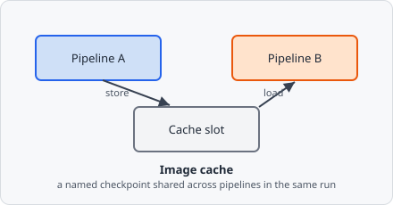

The **Image Cache** command saves or loads an intermediate image to/from a named cache slot. Cache slots are shared across all pipelines within a single image analysis run.

Pipelines in EVAnalyzer normally run independently, each seeing only its own image data - Image Cache is the one mechanism that lets one pipeline hand a processed image to another, so a channel-specific preprocessing result (a background estimate, a mask) can be reused elsewhere instead of being recomputed.

## Parameters

| Parameter   | Description                                                                                           |
| ----------- | ----------------------------------------------------------------------------------------------------- |
| **Mode**    | _Store_ - save the current image to the cache; _Load_ - replace the current image with a cached image |
| **Address** | The cache slot identifier                                                                             |

## When to use

Use Image Cache when you need to:

- Re-use an intermediate processing result in a later pipeline step or a different pipeline.
- Pass a pre-processed image to [Image Math](/commands/image-processing/image-math/) as the second operand.

### Example: background-subtracted signal available for measurement

1. Pipeline A: process the DAPI channel → **Store** to cache slot `dapi_bg`.
2. Pipeline B: after thresholding the Cy5 channel, use **Image Math** with the `dapi_bg` cache to create a masked image.

## Notes

Cache contents are discarded at the end of each image's processing. They do not persist between images.
