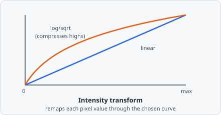

The **Intensity Transform** command adjusts pixel intensities using a configurable mathematical transformation.

The three modes trace out different curves through the same input→output space: Linear keeps proportions intact (twice as bright stays twice as bright), while Logarithmic and Square root bend the curve to compress the high end and expand the low end - useful when a few very bright pixels would otherwise dominate the visible range and hide dim but real signal.

## Parameters

| Parameter      | Description                                                    |
| -------------- | -------------------------------------------------------------- |
| **Mode**       | The transform to apply (see below)                             |
| **Contrast**   | Multiplicative scaling factor applied after the mode transform |
| **Brightness** | Additive offset applied after scaling                          |

## Transform Modes

| Mode            | Description                                                                                         |
| --------------- | --------------------------------------------------------------------------------------------------- |
| **Linear**      | `output = contrast × input + brightness` - simple gain/offset adjustment                            |
| **Logarithmic** | `output = contrast × log(input + 1) + brightness` - compresses bright regions; expands dark regions |
| **Square root** | `output = contrast × sqrt(input) + brightness` - moderate compression of bright regions             |

## When to use

- **Linear** - correct for systematic over/under-exposure across a batch.
- **Logarithmic** - useful when signal spans several orders of magnitude (e.g. very dim and very bright objects in the same image).
- **Square root** - a milder alternative to log when the intensity range is not extreme.
