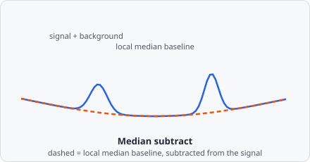

The **Median Subtract** command estimates the local background by computing a median-filtered version of the image and subtracting it from the original. The result retains only the features that differ from the local median - typically small bright objects on a smooth background.

Where [Rolling Ball](/commands/image-processing/rolling-ball/) traces a geometric baseline that can't dip into peaks, Median Subtract estimates the background statistically: at every pixel, "what's the typical (median) intensity nearby?" Small, bright objects are outliers relative to their neighbourhood and survive the subtraction; anything that IS the local median - the background - cancels out to near zero.

## When to use

Use Median Subtract as an alternative to [Rolling Ball](/commands/image-processing/rolling-ball/) when the background variation is not gradual but is best captured by a local median.

## Parameters

| Parameter  | Description                                  |
| ---------- | --------------------------------------------- |
| **Radius** | Radius of the median filter window in pixels |

A larger radius estimates the background over a wider area. The radius should be larger than the largest object of interest so those objects do not distort the background estimate.
