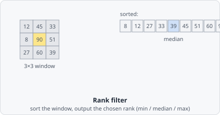

The **Rank Filter** collects pixel intensities in a circular neighbourhood, sorts them by value, and replaces the centre pixel with the value at a chosen rank - the lowest (Min), middle (Median), or highest (Max).

Because it works by sorting rather than averaging, a single extreme outlier in the window (a hot pixel, a cosmic ray hit) can't drag the result away from the bulk of the data the way it would with a mean filter - it just gets sorted to one end and ignored (for Median) or becomes the answer itself (for Min/Max).

## Filter types

| Type        | Rank          | Common use                                                   |
| ----------- | ------------- | ------------------------------------------------------------ |
| **Minimum** | Lowest value  | Background estimation; erosion-like effect on bright objects |
| **Median**  | Middle value  | Impulse noise removal while preserving edges                 |
| **Maximum** | Highest value | Dilation-like effect; filling small gaps in bright regions   |

## When to use

- **Median** - the most common choice for salt-and-pepper or impulse noise removal before thresholding.
- **Minimum / Maximum** - morphological-style operations when you need a non-linear, non-Gaussian effect.

## Parameters

| Parameter       | Description                                    |
| --------------- | ---------------------------------------------- |
| **Radius**      | Radius of the circular neighbourhood in pixels |
| **Filter type** | _Minimum_, _Median_, or _Maximum_              |

Larger radius values affect a wider neighbourhood and produce a stronger effect. Unlike convolution-based filters, rank filters are non-linear and cannot be described by a kernel matrix.
