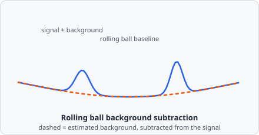

The **Rolling Ball** command removes uneven background illumination. A virtual ball or paraboloid rolls beneath the image surface; the computed local background is subtracted from the original image, leaving only the foreground signal.

Picture the image as a 3D landscape where pixel intensity is height. A ball too big to fit inside the sharp peaks (your actual objects) rolls along underneath them, tracing out only the slow, sweeping curves of the background illumination - which is exactly the baseline that gets subtracted.

## When to use

Use Rolling Ball as the first preprocessing step when images have uneven or sloped background intensity - common in widefield fluorescence microscopy.

:::tip
The radius should be **at least as large as the largest object that is not background**. Using a radius smaller than the objects of interest will incorrectly subtract those objects as background.
:::

## Parameters

| Parameter      | Description                                                                             |
| -------------- | --------------------------------------------------------------------------------------- |
| **Radius**     | Radius of the rolling ball in pixels                                                    |
| **Ball type**  | Shape of the virtual probe: _Ball_ (spherical cap) or _Paraboloid_                      |
| **Pre-smooth** | Apply a light Gaussian blur before background estimation to reduce sensitivity to noise |

### Ball type

| Type           | Behaviour                                                                                            |
| -------------- | ---------------------------------------------------------------------------------------------------- |
| **Ball**       | Traditional ImageJ algorithm. Best for images with distinct, round objects.                          |
| **Paraboloid** | Smoother at the edges; fewer artefacts on complex gradients. Recommended for most microscopy images. |

## Background

The algorithm was originally described by Stanley R. Sternberg, "Biomedical Image Processing," *IEEE Computer*, vol. 16, no. 1, pp. 22-34, January 1983, and ported from the ImageJ/NIH Image Pascal implementation.
