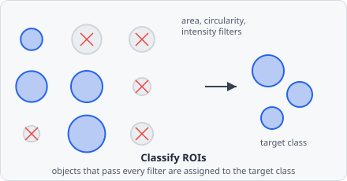

The **Classify Objects** command evaluates every object against a set of shape criteria and, optionally, an intersection criterion. Each object either **matches** (passes every enabled criterion) or does not, and the selected **match handling** mode decides what happens to the object's class labels in each case - add a class, strip a class, or reclassify entirely.

This is where raw segmentation output ("every connected group of bright pixels") turns into biological meaning ("this is a nucleus, this is an EV - that speck isn't") - the criteria exist because segmentation almost always over-detects, picking up noise, debris, and imaging artifacts alongside genuine objects. Because match handling is itself configurable, the same command also covers narrowing an already-named population and reclassifying objects based on what they overlap.



## Input Selection

| Parameter         | Description                                                                                                                                           |
| ----------------- | ------------------------------------------------------------------------------------------------------------------------------------------------------ |
| **Input Classes** | Restrict evaluation to objects that already carry at least one of these classes. Leave empty to evaluate every object regardless of its current class |

Objects created by [Extract Objects](/commands/object/extract-objects/) carry their segmentation class as an object class from the start, so a fresh, unfiltered population can be selected here the same way as an already-named class from an earlier Classify Objects step.

## Shape Criteria

An object matches only if it satisfies every criterion below - they combine as a logical AND, not a choice of one.

All shape-based criteria accept the field's maximum representable value as "no limit" for the upper bound and `0` for "no lower limit" - there is no dedicated "disabled" sentinel, so leaving a bound at its default effectively disables it.

| Criterion                                | Description                                                     |
| ----------------------------------------- | ---------------------------------------------------------------- |
| **Min area / Max area**                   | Object area, in the chosen **Size unit**                         |
| **Min circularity / Max circularity**     | Range 0.0-1.0; 1.0 = perfect circle                              |
| **Min solidity / Max solidity**           | Ratio of area to convex hull area (0-1)                          |
| **Min aspect ratio / Max aspect ratio**   | Fitted-ellipse major/minor axis ratio                            |
| **Min eccentricity / Max eccentricity**   | Elongation from fitted ellipse (0 = circle, 1 = line segment)    |
| **Min Feret / Max Feret**                 | Bounding-box diagonal, in the chosen **Size unit**                |
| **Allow edge touching**                   | If disabled, objects that touch the image border fail the match  |

### Size unit

Shape criteria that depend on physical size (area, Feret) use a single **Size unit** shared by both:

- **Pixels (px)** - absolute pixel count
- **Nanometres (nm)** - converted using the pixel size from image metadata

There is no separate intensity filter in Classify Objects - mean/min/max/sum intensity per channel are recorded as [metrics](/fundamentals/metrics/#intensity-metrics) on every object, but they aren't part of the match criteria here.

## Intersection Criterion

An optional, additional criterion evaluated alongside the shape criteria above - an object must satisfy this too, not instead.

| Criterion                 | Description                                                                                                                                                            |
| -------------------------- | --------------------------------------------------------------------------------------------------------------------------------------------------------------------- |
| **Intersecting With**      | An object class to test overlap against. When set, the object only matches if it also overlaps at least one object of this class by at least **Min intersection area** |
| **Min intersection area** | Minimum overlap area, in the chosen **Size unit**. Has no effect while **Intersecting With** is unset                                                                  |

Unlike the shape criteria, this one is disabled entirely by leaving **Intersecting With** unset (no sentinel value needed) rather than by relaxing a threshold. It corresponds to the [Intersection Count](/fundamentals/metrics/#intersection-count) metric - counting how many objects from another class overlap a given object - used here as a pass/fail gate rather than just a recorded value.

## Match Handling

Every object is evaluated once against the criteria above to get a single **match** / **no match** result. **Match Handling** then decides what that result does to the object's classes:

| Mode (GUI label)                                   | On match                                            | On non-match                                        |
| --------------------------------------------------- | ----------------------------------------------------- | ----------------------------------------------------- |
| **Add class on match**                              | Add **Output Tag** to the object's existing classes  | No change                                             |
| **Add class on mismatch**                           | No change                                            | Add **Output Tag** to the object's existing classes  |
| **Remove output class on match**                    | Remove **Output Tag** from the object                 | No change                                             |
| **Remove output class on mismatch**                 | No change                                            | Remove **Output Tag** from the object                 |
| **Remove objects matching criteria**                | Clear *all* classes from the object                   | No change                                             |
| **Keep objects matching criteria** *(default)*      | No change                                            | Clear *all* classes from the object                   |
| **Reclassify on match**                             | Clear all classes, then add **Output Tag**            | No change                                             |
| **Reclassify on mismatch**                          | No change                                            | Clear all classes, then add **Output Tag**            |

:::note
Two further modes - **Remove class on match** and **Remove class on mismatch** - are hidden from the command picker but still valid in project files (e.g. hand-edited or migrated from an older version): they strip every class listed in **Input Classes** (not the output class) from the object, without touching any other class it carries. "Clear all classes" removes an object's classification entirely - it still exists (its geometry and metrics are computed), but with no class assigned it won't appear in any class-filtered results, count, or export.
:::

### Choosing a mode

- **First-time classification** (segmentation class → a real named class) and **reclassifying by overlap** (moving objects into another class based on what they intersect) are both worked through in the examples below.
- **Narrowing an already-named population** with a stricter filter, without renaming it: leave **Output Tag** unset and use the default **Keep objects matching criteria** - objects that fail the new criteria are dropped; objects that pass keep their existing class untouched.
- **Tagging without removing anything else**: use **Add class on match** to layer an additional class onto objects that already carry others, e.g. flagging objects that also satisfy a secondary criterion.

## Example: Spot detection

```
Input Classes:   (empty - segmentation class from Extract Objects)
Min area:        3 px²
Min circularity:  0.1
Allow edge touching: true
Match Handling:  Reclassify on match
Output Tag:      ch1@spot
```

Objects larger than 3 px² with any circularity are reclassified as `ch1@spot`; everything else keeps only its segmentation class and is dropped from all named-class results.

## Example: Reclassify by overlap

```
Input Classes:      ch1@spot
Intersecting With:   tetraspeck@spot
Min intersection area: 1 px²
Match Handling:      Reclassify on match
Output Tag:          tetraspeck@spot
```

Any `ch1@spot` object that overlaps a `tetraspeck@spot` calibration bead is moved into the `tetraspeck@spot` class, removing it from the spot count - the pattern used in [Spot Count](/tutorials/spot-count/) to exclude bead artefacts.
