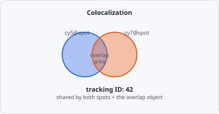

The **Colocalization** command identifies objects from two or more input classes that overlap each other. Overlapping objects are defined as _colocalising_. EVAnalyzer assigns all colocalising objects a shared **tracking ID**, allowing them to be grouped in the results table.

Unlike [ROI Math](/commands/object/roi-math/), which *derives a new shape* from two object sets, Colocalization's job is to *link* objects that already exist - each overlapping pair (or group) keeps its own identity and metrics, but gains a shared tracking ID and, optionally, a new object recording the overlap area itself.

## Parameters

| Parameter                             | Description                                                                                                     |
| ------------------------------------- | --------------------------------------------------------------------------------------------------------------- |
| **Classes to colocalize**             | Two or more object classes that must all have an overlapping member for an object to be considered colocalising |
| **Filter classes**                    | Additional classes that must also overlap (optional secondary filter)                                           |
| **Class for overlapping areas**       | A class assigned to a new object representing the actual overlap area                                           |
| **Allow multi-object colocalization** | If enabled, an object may colocalize with more than one partner from the same class                             |
| **Min colocalization area**           | Minimum overlap area in the selected unit                                                                       |
| **Size unit**                         | Unit for the min area threshold                                                                                 |

## Colocalizing handling

When an object is found to colocalize, one of two operations is applied:

- **Move** - the object's class is changed to a new class. The Object ID is unchanged.
- **Copy** - a new object is created with the new class; the origin object's ID is recorded in the copy's origin object ID field.

A new **colocalizing area** object is created for the overlapping region. This object is assigned to the class specified by **Class for overlapping areas** and can be used for further measurements.

All colocalising objects - input objects and the colocalization-area object - receive the same tracking ID. In the results table, rows with the same tracking ID appear adjacent to each other.

## Example: Two-channel spot colocalization

1. Classify spots in Cy5 channel → `cy5@spot`
2. Classify spots in Cy7 channel → `cy7@spot`
3. Add a Colocalization step:
   - Classes: `cy5@spot`, `cy7@spot`
   - Class for overlapping areas: `coloc@cy5cy7`
4. All Cy5 spots that overlap with a Cy7 spot (and vice versa) receive a common tracking ID.
