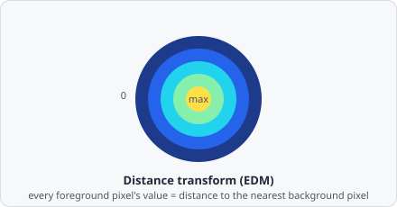

The **Distance Transform** command computes the Euclidean Distance Map (EDM) of a binary image. Each foreground pixel is assigned a value equal to its distance to the nearest background pixel. The result is a greyscale image that can be used as input to subsequent image-processing steps.

The EDM turns a flat binary mask into a "how deep inside the object am I" landscape - pixels right at the edge are near zero, pixels at the object's core are the brightest. This is exactly the landscape [Watershed](/commands/segmentation/watershed/) floods from local maxima to split touching objects.

## When to use

The Distance Transform is useful as an intermediate processing step:

- Feed the EDM into [Watershed](/commands/segmentation/watershed/) for improved separation of touching objects.
- Use the EDM to create distance-weighted masks.

For measuring pairwise distances **between detected objects**, refer to the distance metrics in [Classify ROIs](/commands/object/classify-rois/) and the [Metrics](/fundamentals/metrics/) reference - these are computed automatically during object classification.

## Parameters

| Parameter                | Description                                                                             |
| ------------------------ | --------------------------------------------------------------------------------------- |
| **Threshold**            | Pixels below this intensity are treated as background (0) before distance computation   |
| **Edges are background** | If enabled, image border pixels are treated as background regardless of their intensity |

## Background

Computing an exact (rather than approximated "chamfer") Euclidean distance map efficiently was addressed by Per-Erik Danielsson, "Euclidean Distance Mapping," *Computer Graphics and Image Processing*, vol. 14, no. 3, pp. 227-248, 1980 - one of the foundational references for this class of algorithm, which underlies distance-map watershed segmentation throughout image analysis software including ImageJ.
