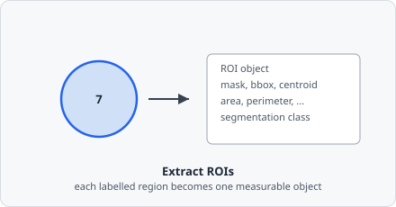

The **Extract Objects** command reads a labelled instance map and creates one segmentation-class object per labelled region. That map can come from [Connected Components](/commands/segmentation/connected-components/) (or [Watershed](/commands/segmentation/watershed/)), or directly from an instance-segmentation command such as [AI Cellpose Segmentation](/commands/ai-segmentation/cellpose/) or [AI Stardist Segmentation](/commands/ai-segmentation/stardist/), which already separate touching objects on their own. These objects are the raw candidates passed to [Classify Objects](/commands/object/classify-objects/) for final filtering and class assignment.

This is the boundary between "pixels" and "objects" in the pipeline: everything before this step operates on whole images, and everything after operates on individually addressable regions with their own [metrics](/fundamentals/metrics/), mask, and object ID.



## Parameters

| Parameter | Description |
|---|---|
| **Max objects before fail** | Hard upper limit on the number of regions extracted. If more regions are found the pipeline step fails, preventing runaway processing on misconfigured segmentation (default: –1 = unlimited) |

## Pipeline position

```
Threshold → Connected Components → [Watershed] ─┐
                                                  ├─→ Extract Objects → Classify Objects
      AI Cellpose Segmentation / AI Stardist ────┘
```

Extract Objects is always followed by [Classify Objects](/commands/object/classify-objects/). The segmentation class assigned here is the intermediate class used internally; the final named object class is assigned by Classify Objects.

:::note[New in EVAnalyzer vs ImageC]
In the predecessor application (ImageC), region extraction and classification were combined into a single *Classifier* step. EVAnalyzer splits them into Extract Objects (geometry extraction) and Classify Objects (filtering + class assignment) for greater flexibility and clearer pipeline structure.
:::
