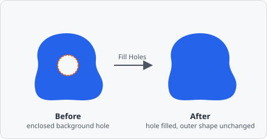

The **Fill Holes** command closes enclosed background holes in the segmentation map - a direct port of ImageJ's *Process > Binary > Fill Holes*. A background pixel is a "hole" exactly when it cannot be reached from the image border by a path of other background pixels; every such pixel is turned into foreground, while everything else is left untouched.

## Parameters

Fill Holes has no configurable parameters - drop it into the pipeline and it runs.

## How it works

The mask is treated as strictly binary, the same way ImageJ's own command does:

- Every non-background pixel counts as foreground, regardless of its actual class/label value.
- A filled hole is stamped with a single fixed value rather than inheriting the label of the region that encloses it. If the segmentation map carries several distinct labels, a hole is not attributed back to the specific object surrounding it.
- Connectivity is 4-connected (up/down/left/right), not 8-connected: a background region that only touches the outside diagonally through a corner still counts as enclosed and gets filled. This matches ImageJ's `FloodFiller` exactly.

## When to use

- Close small punctures or single-pixel gaps left inside an otherwise solid object after thresholding.
- Run it before [Extract Objects](/commands/object/extract-objects/) so area and shape metrics aren't skewed by holes that should belong to the object.

## Background

Fill Holes belongs to the **Object** category, alongside commands like [Extract Objects](/commands/object/extract-objects/) and [Voronoi](/commands/object/voronoi/), and can only be followed by another Object-category command.
