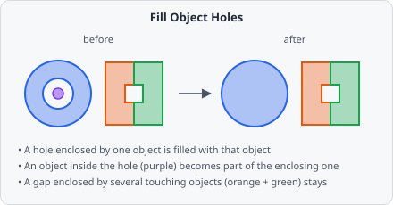

The **Fill Object Holes** command fills the holes inside each object individually. Unlike [Fill Holes](/commands/object/fill-holes/), which works on the segmentation map before objects exist, it works on the objects (the instance map) - so it knows which object a hole belongs to.



## Parameters

Fill Object Holes has no configurable parameters.

## How it works

- A pixel becomes part of an object when it is enclosed by **that object alone**.
- A gap enclosed by **several touching objects together** is left as it is - it belongs to none of them.
- An object lying **completely inside another object's hole** becomes part of the enclosing object.
- Filled pixels get the class of the object they now belong to.

## Pipeline position

The command needs objects, so it comes after a step that creates them and before [Extract Objects](/commands/object/extract-objects/):

```
AI Cellpose / AI Stardist Segmentation ─┐
Watershed / Connected Components ───────┼─→ Fill Object Holes → Extract Objects → Classify Objects
```

## When to use

- After [AI Cellpose Segmentation](/commands/ai-segmentation/cellpose/): Cellpose itself fills the holes inside every object as the last step of its post-processing. Add Fill Object Holes directly after the Cellpose step to get the same result as the Cellpose GUI.
- After [Watershed](/commands/segmentation/watershed/) or [Connected Components](/commands/segmentation/connected-components/) when objects touch: Fill Holes on the segmentation map would also fill the gaps *between* touching objects, Fill Object Holes doesn't.

Use [Fill Holes](/commands/object/fill-holes/) instead when you want to close holes in the segmentation map right after a [Threshold](/commands/segmentation/threshold/), before objects are created.
