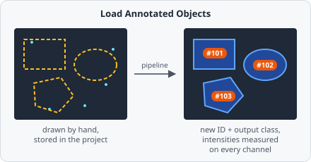

The **Load Annotated Objects** command brings the objects you annotated by hand on an image (see [Region Annotation](/guide/images/#region-annotation)) into the pipeline. From there on they are handled exactly like segmented objects: they are measured, can be classified, colocalized, used as parents for in-cell counting and appear in the [results](/guide/results/).

Use it when automatic segmentation isn't possible or reliable for one population - for example a few hand-outlined regions of interest, cells that are hard to segment, or a manually drawn tissue area in which spots should be counted.

## Parameters

| Parameter                  | Description                                                                                                                     |
| -------------------------- | ------------------------------------------------------------------------------------------------------------------------------- |
| **Input classes**          | Only load annotations that carry at least one of these classes. Leave empty to load every annotated object of the image.      |
| **Output class**           | Class added to every loaded object, so later steps can select them. Set to **Unset** to add none.                              |
| **Keep annotated classes** | Keep the classes the objects were given while annotating. Off (the default), the objects start with the **Output class** only. |

## How it works

For every image the pipeline runs on, the command takes the annotations stored for that image in the project and turns each one into a pipeline object:

- Every loaded object gets a **new object ID** and is marked as manually annotated.
- Its **intensities are measured** on every channel of the image being analyzed - values stored with the annotation are not reused, since they may be outdated or were never measured for a hand-drawn shape.
- Links the annotation may carry to other objects (colocalization partners, parent/child relations, tracking IDs) are dropped, because they refer to the stored IDs.

The command runs once per image and plane on the whole image, so an annotation crossing a tile border stays one object. Only the annotations of the plane being processed are loaded; with a [Z-projection](/guide/images/#z-stack-navigation) the annotations of the projected time frame are used.

## Example: count spots inside hand-drawn regions

1. Draw the regions of interest on each image with the **Rectangle**, **Oval** or **Polygon** tool and assign them the class `roi@region`.
2. In a first pipeline, add **Load Annotated Objects** with **Input classes** set to `roi@region` and **Output class** set to `roi@region`.
3. In a second pipeline, detect the spots as usual, e.g. Threshold → Connected Components → [Extract Objects](/commands/object/extract-objects/) → [Classify Objects](/commands/object/classify-objects/) as `cy5@spot`.
4. Add a [Colocalization](/commands/object/colocalization/) step with `roi@region` and `cy5@spot`, multiplicity limited to `roi@region`, to count the spots per region.

:::tip
Annotations are stored per image in the project file. Only images you have annotated contribute objects - the command loads nothing on an image without annotations.
:::
