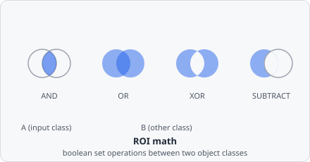

The **Object Math** command performs a pixel-level boolean set operation between two object classes — an **Input class** ("A") and an **Other class** ("B") — and writes the result into an **Output class**. It is used to derive new object shapes from the combination of existing segmented regions, for example to subtract a nucleus mask from a whole-cell mask to isolate cytoplasm, or to restrict spots to the interior of another object.

When multiple **Other class** objects overlap a single **Input class** object, they are first unified into one combined "B" mask before the operation is applied.



## Parameters

| Parameter              | Description                                                                                                                           |
| ---------------------- | ------------------------------------------------------------------------------------------------------------------------------------- |
| **Operation**          | The boolean set operation to apply — see [Operations](#operations) below                                                              |
| **Input class**        | The "A" object set. Each object in this class is processed individually                                                               |
| **Other class**        | The "B" object set. All overlapping objects of this class are unioned before the operation                                            |
| **Other filter classes** | Additional classes used to restrict which **Other class** objects are considered — leave empty to use all **Other class** objects    |
| **Min overlap area**   | Minimum overlap area (in the chosen **Unit**) required before a B object is considered to overlap an A object                         |
| **Output class**       | Class assigned to the resulting shape                                                                                                 |
| **Keep unmatched**     | When enabled, input objects that have no overlapping B objects are preserved unchanged in the output class                            |

## Operations

| Operation    | Result                                                                                                                                                                    |
| ------------ | ------------------------------------------------------------------------------------------------------------------------------------------------------------------------- |
| **AND**      | Intersection: pixels present in **both** A and B. If no B object overlaps A, the result is empty regardless of **Keep unmatched**                                        |
| **OR**       | Union: pixels present in A **or** B (or both). The result can extend beyond A's own bounding box into B's area                                                           |
| **XOR**      | Symmetric difference: pixels present in **exactly one** of A and B (the overlap itself is excluded). Like OR, the result can extend beyond A's bounding box              |
| **Subtract** | Set difference (A \ B): pixels in A that are **not** in B. The classic use case is deriving a cytoplasm-only region from a whole-cell mask by subtracting its nucleus    |

## Behaviour Notes

- The operation is applied per A object: each A object is matched against all B objects that overlap it (above the **Min overlap area** threshold), and their union is treated as the single "B" mask for that pair.
- If **Keep unmatched** is disabled (default), A objects without any overlapping B are dropped entirely and do not appear in the output.
- The **Output class** can be the same as **Input class**, in which case the original object is replaced. If it is a new class, the result is added alongside the original.
- Resulting shapes that extend to the image boundary are flagged as edge-touching, identical to any other boundary object.

## Example: Isolate cytoplasm by subtracting the nucleus

```
Operation:      Subtract
Input class:    cell@whole
Other class:    dapi@nucleus
Output class:   cell@cytoplasm
Keep unmatched: off
```

This removes the nuclear region from each whole-cell mask. Cells without a detected nucleus are discarded (because no subtraction is possible). The resulting `cell@cytoplasm` objects contain only the cytoplasmic area, ready for downstream intensity or colocalization measurements.

## Example: Restrict spots to within cell boundaries

```
Operation:      AND
Input class:    cy5@spot
Other class:    cell@whole
Output class:   cy5@incell
Keep unmatched: off
```

Only the parts of each spot that fall inside a cell boundary are kept. Spots outside any cell are dropped.
