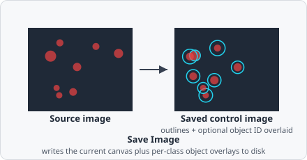

The **Save Image** command writes a composite image to disk. It overlays detected objects (outlines or filled shapes) on the original or processed image and saves it as a TIFF file. These *control images* are useful for visually verifying segmentation quality.



## Parameters

| Parameter | Description |
|---|---|
| **Path** | Output path relative to the job folder, e.g. `images/${imageName}` |
| **Source** | Which image to use as the background canvas (*Original* channel image, *Last pipeline step*, etc.) |
| **Compression** | TIFF compression level (1 = none, higher = more compression) |

### Per-class overlay settings

For each object class to render, configure:

| Setting | Description |
|---|---|
| **Input class** | Which object class to overlay |
| **Style** | *Filled* (solid colour fill) or *Outline* (border only) |
| **Paint bounding box** | Draw the axis-aligned bounding box around each object |
| **Paint object ID** | Annotate each object with its numeric ID |

## Output path variables

The **Path** field supports the following variable:

| Variable | Replaced with |
|---|---|
| `${imageName}` | The filename of the source image (without extension) |

## File location

Saved images are stored relative to the job folder:

```
<image_directory>/evanalyzer/<job_name>/<path>/
```

They are also accessible from the results viewer via the **Open results folder** button.
