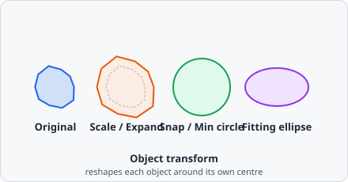

The **Object Transform** command applies a geometric transform to every object carrying **Input class**, keeping the object's bounding-box centre fixed. Depending on the **Output class**, the transformed shape either replaces the input object in place or is added as a new, separate object alongside the untouched original.



## Parameters

| Parameter        | Description                                                                                                                                                                                                                   |
| ---------------- | ----------------------------------------------------------------------------------------------------------------------------------------------------------------------------------------------------------------------------- |
| **Function**     | The geometric transform to apply - see below                                                                                                                                                                                  |
| **Input class**  | Objects carrying this class are the input to the transform                                                                                                                                                                    |
| **Output class** | If unset (or equal to **Input class**), the transformed shape replaces the input object in place. If set, a new object carrying this class is created for each transformed object instead, leaving the input object untouched |

## Functions

| Function            | Description                                                                                                                                             |
| ------------------- | ------------------------------------------------------------------------------------------------------------------------------------------------------- |
| **Scale**           | Scales the object by a unitless **factor**. Shape is preserved; the object is only shrunk or expanded around its centre                                 |
| **Snap area**       | Draws a circle around the object's bounding box, enlarged by **Extra size** (in the chosen **Unit**) on top of the bounding-box diameter                |
| **Min circle**      | Draws a circle around the object's bounding box, using **Min diameter** as a lower bound - the circle never shrinks below the object's own bounding box |
| **Draw circle**     | Draws a circle with exactly **Diameter** as its diameter. If **Diameter** is 0, the object's bounding box is used instead                               |
| **Fitting ellipse** | Replaces the object with the ellipse fitted to its mask, scaled by **Scale** (values ≤ 1.0 have no effect)                                              |
| **Expand**          | Grows the object outward by **Margin** (in the chosen **Unit**), following its actual contour uniformly. Unlike **Scale**, irregular shapes grow by a flat margin rather than proportionally |
| **Shrink**          | Shrinks the object inward by **Margin**, following its actual contour. Objects that vanish after shrinking are removed                                   |

`Snap area`, `Min circle`, `Draw circle`, `Expand`, and `Shrink` express their size in a configurable **Unit** (e.g. _px_, _nm_, _µm_).

## Behaviour Notes

- The transform keeps the object's bounding-box centre fixed - only the shape and/or size change.
- A transformed shape that would extend past the image border is clipped, and the resulting object is flagged as touching the edge (same as any other object at the image boundary).
- Only objects carrying **Input class** are processed; objects without that class are left untouched.

## Example: Approximating a cell area around each nucleus

```
Function:     Min circle
  Min diameter: 30
  Unit:         µm
Input class:  dapi@nucleus
Output class: cell@area
```

This creates a new `cell@area` object around every detected nucleus, at least 30 µm in diameter, without modifying the original nucleus objects - useful as a quick cell-area proxy when no cell-surface stain is available (compare with [Voronoi](/commands/object/voronoi/) for a partition-based alternative).
