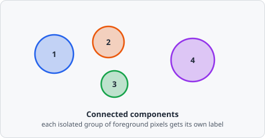

The **Connected Components** command scans the binary mask produced by [Threshold](/commands/segmentation/threshold/) and assigns a unique integer label to each connected group of foreground pixels. Each labelled region is one candidate object.



Internally this runs as a two-pass union-find labeling: a first pass walks the image assigning provisional labels and recording which labels turn out to be the same object (because two differently-labelled regions touch), and a second pass resolves every provisional label to its final one.

## When to use

Connected Components is a required intermediate step between Threshold and Extract ROIs. It separates the monolithic foreground mask into individually labelled regions that can be further split by [Watershed](/commands/segmentation/watershed/) or immediately passed to [Extract ROIs](/commands/object/extract-rois/).

## Parameters

| Parameter             | Description                                                                                                                                                                                                     |
| --------------------- | --------------------------------------------------------------------------------------------------------------------------------------------------------------------------------------------------------------- |
| **Min size** (px²)    | Objects with a pixel area below this threshold are discarded immediately after labelling, before any downstream step sees them. Useful for suppressing noise and speckle artifacts. Default `0` disables the filter |

Setting **Min size** to a small positive value (e.g. 5–20 px²) is a lightweight alternative to running a [Morphological Transform](/commands/morphology/morphological-transform/) opening step just to remove speckle, and avoids inflating the object count seen by [Extract ROIs](/commands/object/extract-rois/).

## Pipeline position

```
Threshold → Connected Components → [optional Watershed] → Extract ROIs
```

:::note[New in EVAnalyzer vs ImageC]
Connected Components is an explicit pipeline step in EVAnalyzer. In the predecessor ImageC, this step was automatically performed inside the classifier command. Making it explicit allows more control over the segmentation pipeline.
:::

## Background

Two-pass connected-component labelling with an equivalence table (union-find) is one of the oldest algorithms in image analysis, going back to Azriel Rosenfeld and John Pfaltz, "Sequential Operations in Digital Picture Processing," *Journal of the ACM*, vol. 13, no. 4, pp. 471-494, 1966.
