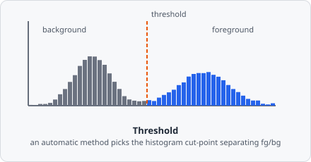

The **Threshold** command is the primary segmentation step. It converts a greyscale image to a binary mask: pixels with intensity below the minimum threshold become 0 (background); pixels above become 65535 (foreground).

The output of Threshold feeds directly into [Connected Components](/commands/segmentation/connected-components/).

## Single threshold

Define one threshold entry to produce a simple binary mask:

| Parameter         | Description                                                                 |
| ----------------- | --------------------------------------------------------------------------- |
| **Method**        | _Manual_ or one of the auto-threshold algorithms                            |
| **Min threshold** | Minimum intensity to include as foreground                                  |
| **Max threshold** | Maximum intensity to include as foreground (set to 65535 to disable)        |
| **Unit**          | Intensity unit (_Absolute_ 0–65535, _Percent_ 0–100, or _Relative_ 0–1)     |
| **Object class**  | The segmentation class assigned to objects detected by this threshold entry |

:::tip
Examine the image histogram to choose a starting value for the minimum threshold. Set it just above the highest background pixel intensity.
:::

:::caution
Always set a **minimum threshold greater than zero** even when using an auto-threshold method. Control images containing only background noise will otherwise produce false-positive detections.
:::

## Multiple threshold classes

Click **+ Add** to define additional threshold entries for the same image. Each entry uses a different intensity range and assigns a different segmentation class, allowing two or more object populations to be detected from one image in a single step.

Under the hood, each threshold class maps to a distinct greyscale value in the binary output (65535 for the first class, decrementing for subsequent classes). [Connected Components](/commands/segmentation/connected-components/) and [Extract ROIs](/commands/object/extract-rois/) use these values to distinguish the populations.

## Auto-threshold algorithms

When **Method** is not _Manual_, EVAnalyzer analyses the image histogram and computes a threshold automatically, following the same set of methods popularized by ImageJ's Auto Threshold plugin. Each one makes a different assumption about what separates foreground from background, so the "best" method depends on the shape of your histogram:

| Method | Assumption | Reference |
| --- | --- | --- |
| **Otsu** | Maximizes between-class variance (the most widely used general-purpose method) | Otsu, "A Threshold Selection Method from Gray-Level Histograms," *IEEE Trans. SMC*, vol. 9, no. 1, pp. 62-66, 1979 |
| **Li** | Minimizes cross-entropy between the image and its thresholded version | Li & Lee, "Minimum Cross Entropy Thresholding," *Pattern Recognition*, vol. 26, no. 4, pp. 617-625, 1993 |
| **MinError** | Iteratively fits two Gaussians and minimizes classification error | Kittler & Illingworth, "Minimum Error Thresholding," *Pattern Recognition*, vol. 19, no. 1, pp. 41-47, 1986 |
| **Triangle** | Geometric: line from the histogram peak to its tail, threshold at max distance | Zack, Rogers & Latt, "Automatic Measurement of Sister Chromatid Exchange Frequency," *J. Histochem. Cytochem.*, vol. 25, no. 7, pp. 741-753, 1977 |
| **Moments** | Preserves the first three moments of the original histogram | Tsai, "Moment-Preserving Thresholding: A New Approach," *Computer Vision, Graphics, and Image Processing*, vol. 29, no. 3, pp. 377-393, 1985 |
| **Huang** | Minimizes a fuzzy-set measure of image "fuzziness" | Huang & Wang, "Image Thresholding by Minimizing the Measures of Fuzziness," *Pattern Recognition*, vol. 28, no. 1, pp. 41-51, 1995 |
| **Intermodes** | Assumes a bimodal histogram; smooths until only two peaks remain, cuts between them | Prewitt & Mendelsohn, "The Analysis of Cell Images," *Annals of the New York Academy of Sciences*, vol. 128, no. 3, pp. 1035-1053, 1966 |
| **IsoData** | Iterative clustering around the mean of two classes | Ridler & Calvard, "Picture Thresholding Using an Iterative Selection Method," *IEEE Trans. SMC*, vol. 8, no. 8, pp. 630-632, 1978 |
| **MaxEntropy** | Maximizes the combined Shannon entropy of foreground and background | Kapur, Sahoo & Wong, "A New Method for Gray-Level Picture Thresholding Using the Entropy of the Histogram," *Computer Vision, Graphics, and Image Processing*, vol. 29, no. 3, pp. 273-285, 1985 |
| **Mean** | The average intensity of all pixels | - |
| **Minimum** | Smooths the histogram until it is bimodal, cuts at the valley between peaks | - |
| **Percentile** | Assumes a fixed fraction of pixels is foreground | Doyle, "Operations Useful for Similarity-Invariant Pattern Recognition," *J. ACM*, vol. 9, no. 2, pp. 259-267, 1962 |
| **RenyiEntropy** | A generalization of MaxEntropy using Rényi entropy | Sahoo, Wong & Chen, "Threshold Selection Using Rényi's Entropy," *Pattern Recognition*, vol. 30, no. 1, pp. 71-84, 1997 |
| **Shanbhag** | An information-theoretic extension of Kapur's method | Shanbhag, "Utilization of Information Measure as a Means for Image Thresholding," *CVGIP: Graphical Models and Image Processing*, vol. 56, no. 5, pp. 414-419, 1994 |
| **Yen** | Maximizes a entropic correlation criterion between classes | Yen, Chang & Chang, "A New Criterion for Automatic Multilevel Thresholding," *IEEE Trans. Image Processing*, vol. 4, no. 3, pp. 370-378, 1995 |

Auto-thresholds can fail on empty images (no objects, only noise) because they always find a separation. Prevent this by setting a non-zero **Min threshold** as a lower bound: if the computed value falls below it, EVAnalyzer uses the minimum instead.

## Maximum threshold

Setting **Max threshold** to a value below 65535 restricts detection to pixels within the `[min, max]` range. This allows extraction of a specific intensity band - for example to separate bright artefacts from dim objects, or to extract the background itself by setting Min to 0 and Max to just below the signal level.
