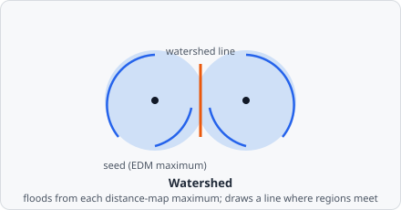
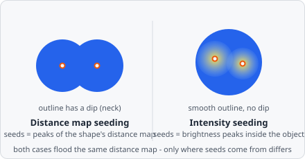

The **Watershed** command separates objects that are close together or touching by treating pixel intensities as altitude and finding the valleys between peaks. It is placed after [Connected Components](/commands/segmentation/connected-components/).

## When to use

Use Watershed when high object density causes nearby objects to be detected as a single merged region after thresholding. Typical scenarios:
- Dense vesicle populations
- Touching cell nuclei

:::caution[Performance]
Watershed is a computationally expensive algorithm. Enable it only when necessary, as it significantly increases analysis time.
:::

## Parameters

| Parameter | Description |
|---|---|
| **Seed source** | Which surface local maxima are seeded from - _Distance map_ (default) or _Intensity_. See [Seed source](#seed-source) below. |
| **Maximum finder tolerance** | Prominence tolerance for the maximum finder (range 0.1–20.0, default 0.5). Meaning depends on **Seed source** - see below. |
| **Smoothing sigma** | Standard deviation (px) of an optional Gaussian blur applied before seed-finding, to whichever surface **Seed source** seeds from. `0` disables it (default). |
| **Min object size** | Minimum object size in pixels; any object smaller than this after splitting is removed. `0` disables the filter (default). |

## How it works

1. The Euclidean distance transform of the binary mask is computed - every foreground pixel's value becomes its distance to the nearest background pixel, so the "deepest" interior of each blob becomes a local peak. The flood in step 3 always runs on this distance map, regardless of **Seed source**.
2. Local maxima are found on the surface selected by **Seed source**; nearby maxima that don't stick up above their connecting ridge/neighbourhood by more than **Maximum finder tolerance** are merged into one, which is what keeps noisy, near-flat peaks from over-splitting a single round object. If **Smoothing sigma** is non-zero, that surface is blurred first to suppress spurious peaks.
3. Each surviving maximum is a seed; the distance map floods outward from every seed simultaneously, growing downhill.
4. Where two floods meet, a one-pixel-wide watershed line is drawn, splitting the original merged region into separate objects. Objects smaller than **Min object size** are then dropped.

With **Seed source** set to _Distance map_, this is a faithful port of ImageJ's `Process > Binary > Watershed` (its `MaximumFinder` class applied to the distance map), so results should match ImageJ pixel-for-pixel for the same input.

### Seed source

- **Distance map** (default) - seeds and flood both come from the distance map, matching ImageJ's watershed. **Maximum finder tolerance** is the ImageJ "prominence"/"noise tolerance" parameter: a local maximum is treated as a separate object only if it protrudes more than this value above the ridge connecting it to a higher maximum.
  - *Low values*: more sensitive; may over-segment ragged objects.
  - *High values*: more robust; may fail to split genuinely touching objects.
  - ImageJ's `trueEdmHeight` correction already handles ordinary ragged mask boundaries, so **Smoothing sigma** is rarely needed here; for extremely noisy AI masks, a value of `1.0`–`2.0` can further suppress spurious maxima.
- **Intensity** - seeds are instead found as local maxima of the (optionally smoothed) grayscale image, restricted to each object's own footprint - a faithful port of CellProfiler `IdentifyPrimaryObjects`' "Intensity" unclumping method. The flood itself is unaffected and still runs on the distance map. Use this for diffusely-connected regions whose *shape* has no separate peaks but whose *brightness* clearly does - shape-based (distance map) seeding can't split those, since there's no dip in the mask outline to find.
  - Here, **Maximum finder tolerance** instead acts as CellProfiler's "typical object diameter"-derived maxima-suppression radius, in pixels (its disk-shaped local-maximum search footprint is `max(1, tolerance - 0.5)`) - same field, different meaning, because both are fundamentally a spatial scale over the seed-finding surface.

## Background

The distance-map/immersion approach to watershed segmentation was formalized by Luc Vincent and Pierre Soille, "Watersheds in Digital Spaces: An Efficient Algorithm Based on Immersion Simulations," *IEEE Transactions on Pattern Analysis and Machine Intelligence*, vol. 13, no. 6, pp. 583-598, 1991. The specific tolerance-based maximum-merging strategy ported here originates in ImageJ/Fiji - see Schindelin et al., "Fiji: An Open-Source Platform for Biological-Image Analysis," *Nature Methods*, vol. 9, pp. 676-682, 2012.
