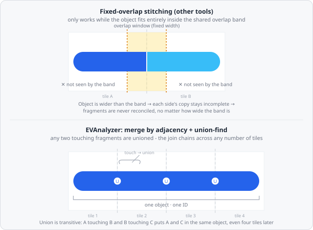
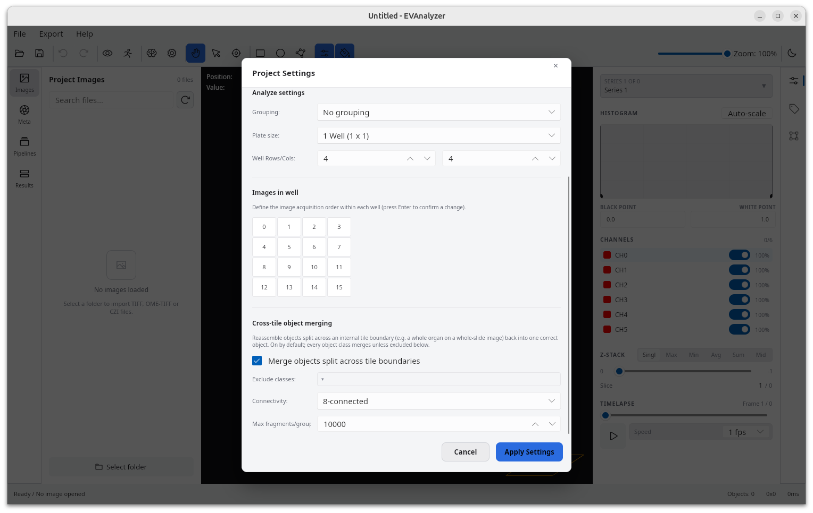

Whole-slide and other big images are too large to hold in memory or segment as one array, so EVAnalyzer - like every tool in this space - splits them into [4096 × 4096 px analysis tiles](/fundamentals/image-formats/#big-images) and processes each one independently. The problem that creates: real objects don't know where a tile boundary is. A whole organ, a tissue section, or any large connected structure on a whole-slide scan routinely spans many tiles at once.

**Cross-tile object merging** is EVAnalyzer's solution: it reassembles a segmented object that was cut apart by one or more internal tile boundaries back into the single, correctly-shaped object it always was - with area, perimeter, ellipse fit, intensity statistics, and every other metric recomputed from the true merged shape. It is on by default, works for an object of **any size**, spanning **any number of tiles**, and is what makes every downstream object-based command - [Colocalization](/commands/object/colocalization/), shape/size filters, [Object Math](/commands/object/object-math/), [Classify Objects](/commands/object/classify-objects/) - give a correct answer regardless of where the tile grid happens to fall.

## The problem: an object bigger than a tile

Split any image into tiles and segment each tile on its own, and a foreground object that happens to straddle a seam gets cut in two: tile A ends up with one fragment, tile B with the other, and each fragment is independently a smaller, wrongly-shaped object with the wrong area, the wrong perimeter, and a centroid nowhere near where the real object's centroid is. Left uncorrected, a single organ on a whole-slide scan is reported as several disconnected objects, none of which describes the real structure.

## How other tools handle it - and where that breaks down

The common fix for this in tiled image processing is **overlap-based stitching**: give neighbouring tiles a fixed-width overlapping border (a "halo"), and reconcile objects found inside that shared strip - typically by keeping the copy from one tile and discarding the duplicate from the other, once both are fully visible within the overlap.

That only works as long as the object fits **entirely inside the overlap band**. If it doesn't - if it's larger than whatever overlap width was configured - neither tile's copy of it is ever complete, so there's nothing for the stitching step to reconcile: the object still comes out as multiple disconnected fragments, exactly as if no overlap existed at all. And the fix isn't "use a bigger overlap": every tile has to be reprocessed with that much extra border on every side, memory and compute cost grows accordingly, and a large enough tissue region or organ can always exceed whatever fixed width was chosen. Overlap-based stitching, by construction, only ever solves the problem for objects smaller than the overlap - never for objects of arbitrary size.

## EVAnalyzer's approach: merge by adjacency, not by overlap window

EVAnalyzer doesn't try to fit the whole object inside a shared window at all. Instead, it tracks which fragments *touch* wherever they happen to touch, and lets that touching relationship chain across as many tiles as the object actually spans:

1. **Independent per-tile segmentation.** Each tile is segmented on its own, exactly as described in [Big Images](/fundamentals/image-formats/#big-images) - no dependency on any neighbour's result, so tiles are still processed in parallel across CPU cores.
2. **Edge-touch flagging, once every tile is done.** Once every tile's segmentation has finished, any object whose bounding box touches its own tile's edge (on any of the four sides) is flagged as a merge candidate and grouped with every other candidate that shares the same object class(es) and image plane (channel/Z/T) - objects fully interior to their tile can never have a cross-tile neighbour, so they're never even considered.
3. **Spatial-index adjacency pass, not a seam walk.** Within each class/plane group, candidates are indexed in a lightweight spatial grid keyed by bounding box, so finding "who's near whom" stays cheap even with thousands of edge-touching fragments across a gigapixel image - no need to enumerate tile seams one by one. For every pair the grid turns up, fragments from the *same* tile are skipped outright (two objects a single tile's own segmentation produced are always genuinely separate), and the remaining pairs get an exact pixel-level touch test - scanning only the small window where the two fragments' (slightly dilated) bounding boxes overlap, under the configured **Connectivity** rule (4- or 8-connected). That window is bounded by the length of the shared seam, not by either fragment's own extent, so the check stays cheap even for a whole-organ-sized fragment. Every touching pair is joined into the same equivalence class using a **union-find (disjoint-set)** structure - the standard data structure for exactly this kind of "which of these things are actually the same thing" problem, and already the same technique EVAnalyzer's [Connected Components](/commands/segmentation/connected-components/) command uses within a single tile.
4. **Transitive chaining.** Union-find equivalence is transitive: if fragment A touches B, and B touches C on the next tile over, A and C end up in the same class even though they never touch each other directly - the same logic that lets four fragments meeting at a single four-tile corner collapse into one object even though two of those four only touch diagonally. This is the entire reason object size stops mattering - a shape can wind through an unbounded chain of tiles, and it still collapses to one equivalence class at the end, because merging never depended on any single tile (or any fixed window) seeing the whole thing at once.
5. **Geometry recomputation.** For every equivalence class with more than one fragment, EVAnalyzer unions all of its fragments' masks into one - work proportional to the fragments' combined pixel area, not to the size of the bounding box spanning them, since that bounding box can cover most of a whole-slide image while the fragments themselves stay sparse - and rebuilds it through the same object constructor used for any freshly segmented object, so area, perimeter, ellipse fit, centroid, and per-channel intensity statistics are all derived from the true merged shape rather than special-cased. The result gets a fresh object ID; the fragments that fed it are removed from the results entirely, so they're never exported alongside the merged object. A "group" of exactly one fragment - one that touched a tile edge but turned out to have no real cross-tile neighbour - is left exactly as it already was; nothing gets rebuilt for it.

Because the merge decision is "do these two fragments touch, however far apart the tiles are that produced them?" rather than "can I see the whole object inside this window?", it is entirely indifferent to how large the object is or how many tiles it crosses - the same mechanism handles a nucleus straddling one seam and an organ spanning hundreds of tiles across a gigapixel slide. This step always runs before any other whole-image pipeline command, so everything downstream - [Voronoi](/commands/object/voronoi/) included - only ever sees the merged object, never a fragment.

## Settings

Cross-tile object merging is configured in the project's **Project Settings** dialog, under **Cross-tile object merging**:

| Setting                                       | Description                                                                                                                                                                                          |
| ---------------------------------------------- | ------------------------------------------------------------------------------------------------------------------------------------------------------------------------------------------------- |
| **Merge objects split across tile boundaries** | Master on/off switch. **On by default.** Disable to fully restore the old per-tile-only export behaviour, where every fragment is kept and exported separately.                                    |
| **Exclude classes**                            | An opt-out list of object classes that should never be merged across tiles, for [classes](/fundamentals/classes/) where per-tile fragments should stay separate. Every class merges by default.    |
| **Connectivity**                               | Whether two fragments from opposite sides of a seam must be 4- or 8-connected to count as touching. Default: **8-connected**.                                                                       |
| **Max fragments/group**                        | A safety limit (default `10000`) on how many edge-touching fragments of one class/plane group may be considered together before matching even starts. Exceeding it fails the analysis with an explicit error instead of silently building a pathological merge - the fix is to add the offending class to **Exclude classes**, not to raise the limit. |

Most users never need to touch these - merging is on by default precisely because objects should be detected correctly regardless of where a tile boundary happens to fall, without anyone having to know or care that tiles exist at all.

## Why it matters: object-based analysis that's actually correct at any scale

Every metric and every object-based command in EVAnalyzer operates on whatever object record it's handed. If that record is a truncated fragment rather than the real object, the result is wrong in ways that are easy to miss:

- **Shape and size metrics** - area, perimeter, circularity, ellipse fit - are all computed from a fragment's boundary, not the object's. A large structure clipped by a seam measures smaller and a different shape than it actually is, and it does so silently: there's no error, just a wrong number.
- **Colocalization** ([Colocalization](/commands/object/colocalization/)) tests spatial overlap between objects from different classes. If one channel's object is merged correctly but is compared against a still-fragmented copy from another channel/class, overlap area is undercounted, or a genuinely overlapping pair is missed entirely because the fragment on this side of the seam never overlaps its counterpart's fragment on the other side.
- **Any other object-based algorithm** - [Object Math](/commands/object/object-math/) boolean set operations, [Classify Objects](/commands/object/classify-objects/)' shape/intersection criteria, [Voronoi](/commands/object/voronoi/) tessellation, [Distance Transform](/commands/object/distance-transform/) - inherits whatever shape it's given. Feed it fragments and it does fragment-shaped math; feed it the real object and the result is right.

Because merging happens once, before any of these commands run, they never need to know tiling exists in the first place - a pipeline behaves identically whether it's run on a small single-tile image or a gigapixel whole-slide scan where objects legitimately cross hundreds of tile boundaries.

## Background

Recording which regions are "the same thing" and merging them under transitivity is the union-find (disjoint-set) problem, most famously analysed for near-linear amortised performance by Tarjan [1]. Its application specifically to image labelling - resolving which differently-labelled regions of an image are actually one connected component - goes back to the same two-pass connected-component labelling lineage already cited for [Connected Components](/commands/segmentation/connected-components/#background) (Rosenfeld & Pfaltz [2]), and was formalised as an explicit union-find strategy by Fiorio and Gustedt [3]. Adapting two-pass, union-find-based labelling to block/tile-partitioned images specifically - independent local labelling per block, followed by a boundary-reconciliation pass that merges equivalence classes across block edges - is discussed by Wu, Otoo, and Suzuki [4].

EVAnalyzer's cross-tile merge is a direct application of that block-boundary union-find idea to object export rather than raw labelling: fragments replace provisional labels, tile seams replace block boundaries, and the final equivalence classes become merged objects with geometry recomputed from their union - which is exactly what removes the fixed-overlap-window ceiling that halo/stitching-based approaches are otherwise bound by. This isn't just an external analogy: the merge step's own citation metadata in EVAnalyzer's source attributes it directly to Rosenfeld & Pfaltz's two-pass labelling paper [2], describing it in the code as "a tiled/blocked variant of the classical two-pass connected-component labeling algorithm ... each tile is labeled independently, then object identity is reconciled across tile boundaries via the same union-find idea, just run as one end-of-image batch pass instead of incrementally online."

## References

1. R. E. Tarjan, "Efficiency of a Good but Not Linear Set Union Algorithm," *Journal of the ACM*, vol. 22, no. 2, pp. 215-225, 1975.
2. A. Rosenfeld and J. L. Pfaltz, "Sequential Operations in Digital Picture Processing," *Journal of the ACM*, vol. 13, no. 4, pp. 471-494, 1966.
3. C. Fiorio and J. Gustedt, "Two Linear Time Union-Find Strategies for Image Processing," *Theoretical Computer Science*, vol. 154, no. 2, pp. 165-181, 1996.
4. K. Wu, E. Otoo, and K. Suzuki, "Optimizing Two-Pass Connected-Component Labeling Algorithms," *Pattern Analysis and Applications*, vol. 12, no. 2, pp. 117-135, 2009.
