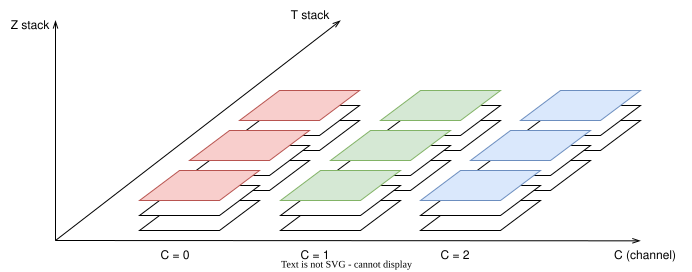
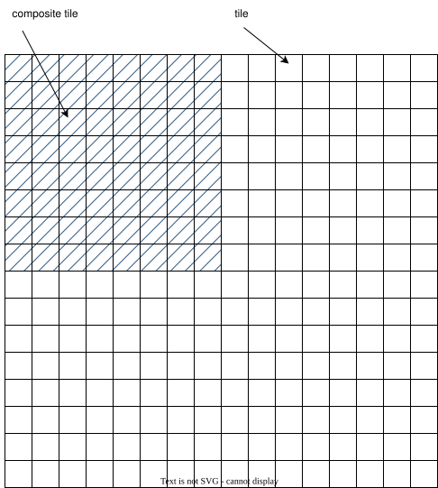
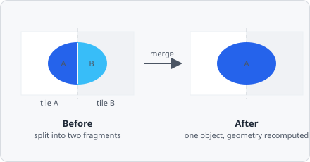

EVAnalyzer reads images through the open-source [Bio-Formats](https://www.openmicroscopy.org/bio-formats/) library, which is bundled with the application.
Both 8-bit and 16-bit greyscale and 8-bit RGB color images are supported.

## Supported Extensions

```
tif  tiff  btif  btiff  btf
jpg  jpeg
vsi  ics  czi  nd2  lif  lei
fli  scn  sxm  lim  oir  top
stk  nd  bip  msr  dm3  dm4
img  cr2  ch5  dib  ims  pic
raw  1sc  std  spc  avi  cif
sif  aim  svs  arf  sld  ome.tiff
```

A complete list of all Bio-Formats–supported formats is available at [docs.openmicroscopy.org](https://docs.openmicroscopy.org/bio-formats/latest/supported-formats.html).

:::tip[Best results]
Use raw, uncompressed images directly from your microscope without any pre-processing or compression applied. For multi-channel images, keep the channels in their original multi-channel format rather than merging them into an RGB image.
:::

:::caution
Certain Photoshop-encoded TIFF files are not supported. Use RAW TIFF or [OME-TIFF](https://docs.openmicroscopy.org/ome-model/latest/ome-tiff/) for multi-channel TIFF files.
:::

## Image Planes

A single microscopy file typically contains many individual images organized into three dimensions:

| Dimension  | Symbol | Description                         |
| ---------- | ------ | ----------------------------------- |
| Channel    | C      | Fluorescence or brightfield channel |
| Z-plane    | Z      | Focal plane in a z-stack            |
| Time frame | T      | Frame in a time-lapse sequence      |



Each unique combination of (C, Z, T) is one **image plane**.
EVAnalyzer can access and process any plane individually.

Pipeline input is specified by channel index (0-based).
Z and T handling is configured in the [Image control tab]() on the right hand side.

## OME-XML Metadata

EVAnalyzer reads OME-XML metadata embedded in or alongside image files. OME metadata provides:

- Number and order of channels
- Physical pixel sizes (nm/µm/mm)
- Z-step size

:::caution
If no OME metadata is found in a multi-channel file, EVAnalyzer assumes a single channel. Ensure your multi-channel images include valid OME metadata for correct channel loading.
:::

## Big Images

Large whole-slide images are handled automatically via tiling.
EVAnalyzer splits any image larger than the configured tile size into overlapping tiles, analyses them independently, and stitches the results.

The tile size used for analysis is 4096 × 4096 px.



### Cross-tile object merging

An object that straddles an internal tile boundary (for example a whole organ or tissue region on a whole-slide image) would otherwise be exported as two or more separate fragments, one per tile. EVAnalyzer reassembles these back into a single correct object once every tile of an image has finished processing, recomputing its geometry (area, perimeter, ellipse fit, …) from the true merged shape rather than from either fragment alone.



This is **on by default** - most users have no reason to know or care about tiles, and just expect objects to be detected correctly regardless of where a tile boundary happens to fall. It's configurable in the project's Project Settings dialog:

- **Merge objects split across tile boundaries** - disable to fully restore the old per-tile-only export behaviour.
- **Exclude classes** - an opt-out list of object classes that should never be merged across tiles, for classes where you specifically want per-tile fragments kept separate. Every class merges by default.
- **Connectivity** - whether two fragments from different tiles must be 4- or 8-connected across the shared seam to count as touching (default: 8-connected).

:::note
EVAnalyzer can generate a navigator minimap for big images only when the file contains a pyramid representation (reduced-resolution levels). Ensure pyramid support is enabled when saving whole-slide images.
:::

Formats that support big (pyramid) images:

```
.afi  .svs  .ims  .vsi  .ndpi  .ndpis  .jp2
.tiff .tif  .tf2  .tf8  .btf   .sld    .jpg  .czi
```
