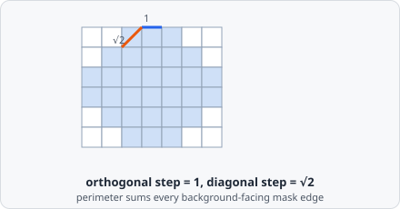
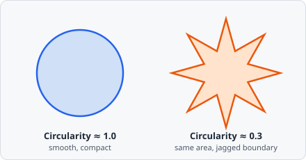
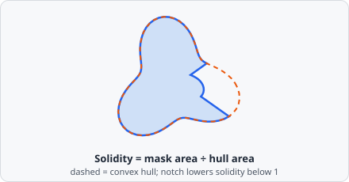
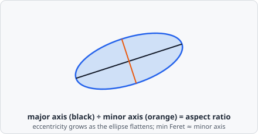
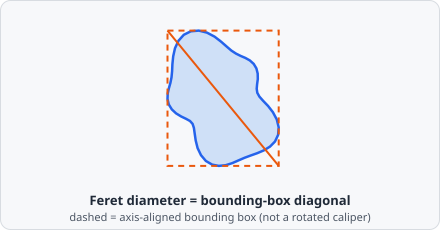
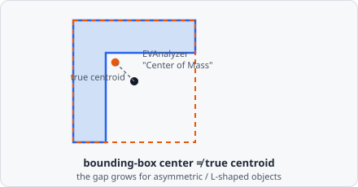
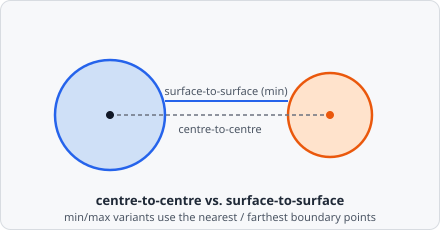

An **object** is the result of an image classification step. It represents a quantified region extracted from an image plane and stored in the results database.

Every object is assigned to exactly one [object class](/guide/classification/). Together with the class assignment, a set of geometric, intensity, and relational metrics is calculated and stored - visible in the results table and exportable to CSV or XLSX.

## Geometric Metrics

These describe an object's shape, size, and position - useful for telling apart, for example, a round healthy nucleus from a fragmented apoptotic one, or a compact vesicle from a smeared imaging artifact.

### Area Size

The count of pixels inside the object's mask. Unit: px². The most basic size measure - used for everything from filtering out noise-sized specks to comparing cell sizes across conditions.

### Perimeter

The boundary length of the object, following ImageJ's boundary-walk algorithm: for every mask pixel, an orthogonal (up/down/left/right) neighbor that's background contributes 1, and a diagonal neighbor that's background contributes $\sqrt{2}$. Since every boundary contact is counted from both sides, the total is halved:

$$
P = \frac{N_{\text{orth}} + \sqrt{2} \, N_{\text{diag}}}{2}
$$

A jagged, spiky boundary racks up far more of these steps than a smooth one enclosing the same area - which is exactly what [Circularity](#circularity) below exploits.

### Circularity

How closely the object resembles a circle, from its area and perimeter. Range: 0 (very irregular) to 1 (perfect circle). A circle is the shape that encloses the most area for the least perimeter, so anything jagged, elongated, or branching scores lower.

$$
c = \frac{4\pi A}{P^2}
$$

Useful for spotting membrane blebbing, fragmented nuclei, or aggregated/clumped particles that should otherwise be round.

### Roundness

Computed identically to [Circularity](#circularity) in the current implementation - same formula, same interpretation:

$$
r = \frac{4\pi A}{P^2}
$$

### Compactness

The reciprocal relationship to Circularity - lower means more compact (closer to a circle), higher means more perimeter for the enclosed area (more irregular):

$$
k = \frac{P^2}{A} = \frac{4\pi}{c}
$$

Circularity and Compactness describe the same underlying shape property from opposite ends - if you're used to thinking "bigger number = more irregular," Compactness reads more naturally than Circularity's "bigger number = more circular."

### Solidity

Area divided by the area of the mask's convex hull (taken over the corners of its pixel squares, so the mask is always fully contained in its hull). Range: 0-1; 1 = perfectly convex, lower means more concave boundaries, bays, or holes.

$$
s = \frac{A}{A_{\text{hull}}}
$$

Where Circularity penalizes *any* deviation from round (including smooth elongation), Solidity specifically flags concave indentations - think of a crescent-shaped nucleus, a cell mid-division, or two touching objects that didn't get fully separated by segmentation.

### Aspect Ratio

The ratio of the fitted ellipse's major to minor axis (see [Eccentricity](#eccentricity) for how the ellipse is fitted) - **not** the bounding box's width/height ratio. 1.0 means the object is as wide as it is long; larger values mean it's elongated along one axis.

$$
\text{AR} = \frac{\text{major axis}}{\text{minor axis}}
$$

Handy for telling round objects (nuclei, vesicles) apart from rod- or fiber-like ones (some bacteria, cytoskeletal fragments) regardless of which way they happen to be rotated in the image.

### Eccentricity

Elongation of the object's fitted ellipse (0 = circle, approaching 1 = increasingly elongated - a flattened sliver). It answers the same "how stretched is this object?" question as [Aspect Ratio](#aspect-ratio), just on a bounded 0-1 scale instead of an open-ended ratio, which can make it easier to set a filter threshold in [Classify Objects](/commands/object/classify-objects/).

The ellipse is fitted from the mask's second-order central moments - a standard way of asking "if I approximated this exact pixel mask with the closest-fitting ellipse, how big would its axes be?":

$$
\mu_{20} = \frac{\sum x^2}{A} - \bar{x}^2, \quad
\mu_{02} = \frac{\sum y^2}{A} - \bar{y}^2, \quad
\mu_{11} = \frac{\sum xy}{A} - \bar{x}\,\bar{y}
$$

$$
\text{major} = \sqrt{8\left(\mu_{20}+\mu_{02}+\Delta\right)}, \quad
\text{minor} = \sqrt{8\left(\mu_{20}+\mu_{02}-\Delta\right)}, \quad
\Delta = \sqrt{(\mu_{20}-\mu_{02})^2 + 4\mu_{11}^2}
$$

$$
e = \sqrt{1 - \left(\frac{\text{minor}}{\text{major}}\right)^{2}}
$$

### Feret Diameter

The diagonal of the object's axis-aligned bounding box - an approximation of the true maximum caliper diameter (the longest distance between any two points on the boundary), **not** a rotating-calipers measurement. For an object at an angle to the pixel grid, this can overstate the true longest axis - keep that in mind when comparing it against a textbook Feret diameter from another tool.

$$
F = \sqrt{(x_{\max}-x_{\min})^2 + (y_{\max}-y_{\min})^2}
$$

### Min Feret Diameter

The minor axis length of the fitted ellipse described under [Eccentricity](#eccentricity) - an approximation of the true minimum caliper width (the object's narrowest extent).

### Center of Mass (Centroid)

Despite the name, this is the **center of the bounding box**, not an area- or intensity-weighted centroid. For round or symmetric objects the two coincide almost exactly, but for an L-shaped, crescent, or otherwise asymmetric mask, the bounding-box center can sit outside the mask entirely, while the true centroid always stays inside it. Keep this in mind if you're using this value for precise spatial analysis rather than just a rough object position for a heatmap or navigator.

$$
\left(c_x, c_y\right) = \left(\frac{x_{\min}+x_{\max}}{2},\ \frac{y_{\min}+y_{\max}}{2}\right)
$$

### Bounding Box

The smallest axis-aligned rectangle that contains all pixels of the object.

## Intensity Metrics

Calculated independently for each image channel/plane configured in the [Classify Objects](/commands/object/classify-objects/) step, over the $n$ pixels of the object's mask - the actual signal being measured, as opposed to the shape metrics above:

$$
\text{Sum} = \sum_{i=1}^{n} v_i, \qquad
\text{Min} = \min_i v_i, \qquad
\text{Max} = \max_i v_i, \qquad
\text{Avg} = \frac{\text{Sum}}{n}
$$

**Sum** and **Avg** are the two most commonly used: Sum scales with both signal strength and object size (useful for "total protein content"-style questions), while Avg is size-independent (useful for comparing concentration/intensity regardless of how big the object is). **Min**/**Max** are useful for spotting saturation (Max pinned at the sensor's ceiling) or partially-masked/background-contaminated objects (unexpectedly low Min).

## Object Identifiers

### Object ID

A unique integer ID assigned to each object during a run, starting at 1. The ID is consistent within a single results file and is displayed in the results table when enabled.

Use the **With object ID** option in [Save Image](/commands/object/save-image/) to annotate the ID alongside the object in control images.

### Parent Object ID

EVAnalyzer supports a parent-child hierarchy between objects. When [Classify Objects](/commands/object/classify-objects/) or [Colocalization](/commands/object/colocalization/) is configured to intersect objects, the **parent object ID** of the child is set to the object ID of the containing parent.

An object can have at most one parent.

Example hierarchy:

- A **cell** object contains a **nucleus**.
- The nucleus's parent object ID is the cell's object ID.
- A **spot** inside the nucleus has the nucleus's object ID as its parent.

### Origin Object ID

When an object is duplicated (via a copy operation in [Classify Objects](/commands/object/classify-objects/) or [Colocalization](/commands/object/colocalization/)), the new object records the origin object's ID. The origin ID propagates through further duplications.

### Tracking ID

Links objects that represent the same physical instance across different image channels or time frames. All objects sharing a tracking ID can be compared side by side in the results table.

Tracking IDs are assigned by the [Colocalization](/commands/object/colocalization/) command.

## Distance Metrics

EVAnalyzer calculates Euclidean distances between pairs of objects - for questions like "how far is this vesicle from the nearest cell membrane?" where a simple overlap/no-overlap answer isn't enough:

| Measurement | Description |
| --- | --- |
| **Centre-to-centre** | Distance between the two centroids |
| **Centre-to-surface (min)** | Shortest distance from one centroid to the other object's boundary |
| **Centre-to-surface (max)** | Longest distance from one centroid to the other object's boundary |
| **Surface-to-surface (min)** | Shortest distance between the two boundaries |
| **Surface-to-surface (max)** | Longest distance between the two boundaries |

$$
d = \sqrt{(x_2-x_1)^2 + (y_2-y_1)^2}
$$

Centre-to-centre is the simplest and cheapest to compute, but for large or irregularly-shaped objects it can be misleading - two large cells whose edges nearly touch can still have distant centroids. Surface-to-surface (min) answers "how close do these objects actually get?" instead.

See [Distance Transform](/commands/object/distance-transform/) for how to measure distances.

## Intersection Count

The number of objects from another class that overlap with this object. Used as a filter criterion in [Classify Objects](/commands/object/classify-objects/) and as input to [Colocalization](/commands/object/colocalization/).

## Colocalization Partner Count / IDs

Per colocalization partner class: how many of that class's objects this object colocalises with, and their object IDs. See [Colocalization](/commands/object/colocalization/).
