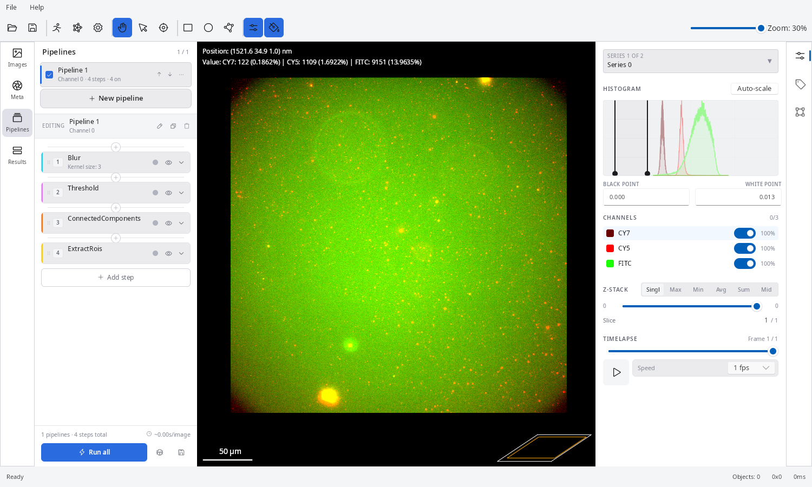
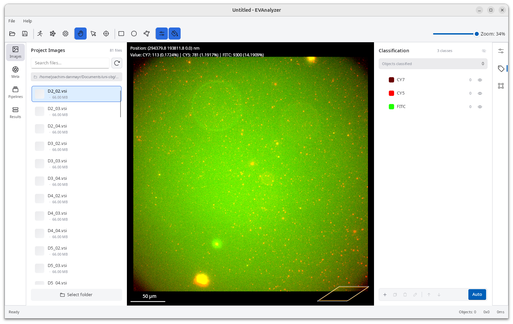
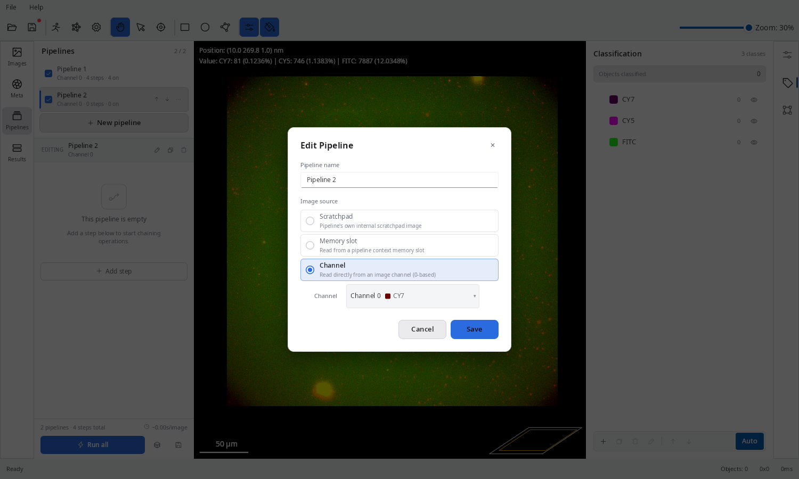
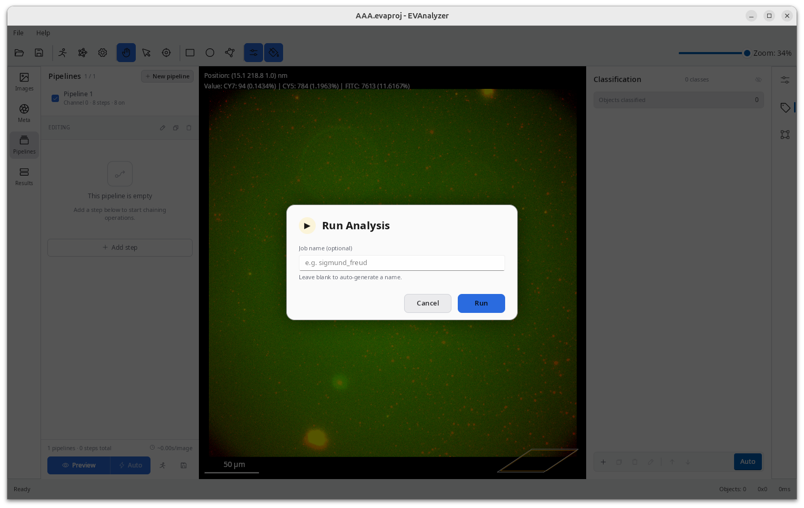
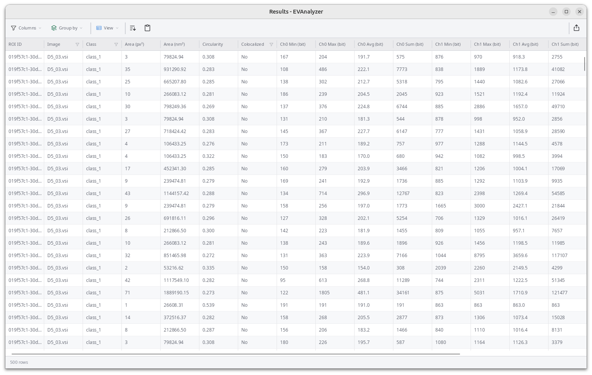

This guide walks you through the essential workflow: open a set of images, configure object classes and pipelines, run the analysis, and inspect the results.

## 1. Open EVAnalyzer

Start EVAnalyzer as described in [Installation](/getting-started/installation/).
The application opens showing the project configuration panel on the left, an empty image viewport in the middle and the image control panel to the right.



## 2. Set Up Your Project

The navigation panels contain four tabs that must be configured in order to set up a project properly.: <br>
**Images → Classification → Pipelines → Results**.

### Images tab

Use the **Select folder** button to select the folder where the images to analyze are stored in.

Once the directory is set, EVAnalyzer lists all found image files.
Click an image to preview it and inspect its metadata (channels, pixel sizes, Z/T dimensions).

### Classification tab

Before building pipelines, define the **object classes** you want to detect - for example, `CY7`, `CY5`, `DAPI`.
The classification tab is the second tab in the right side panel.

- Click the **+** button to add a class.
- Assign a name and a display color.

:::tip[Auto classes]
Use the **Auto** button to extract the classes automatically from the image channels.
:::



### Pipelines tab

Pipelines extract objects from image channels.
Click **New pipeline** which opens the pipeline edit dialog.
Enter a pipeline name and select the image source the pipeline should start.

- **Channel** - the default value is to start with a specific image channel the pipeline should work on.
- **Scratchpad** - starts with an empty image, this option is used if the pipeline should work on already extracted objects
- **Memory slot** - images can be stored to a temporary memory using the `ImageCache` command, start with an image from this cache



Now the **+ Add step** and **+** buttons can be used to add pipeline steps.
The order is always **Preprocessing → Segmentation → Object detection → Object extraction**

A minimal spot-detection pipeline looks like:

1. **Rolling Ball** - remove uneven background
2. **Gaussian Blur** - reduce noise
3. **Threshold** - convert greyscale to binary
4. **Connected Components** - label each foreground region
5. **Watershed** - split touching objects
6. **Extract ROIs** - create region of interest objects to work on
7. **Classify ROIs** - filter by size/circularity and assign an object class

Before the preview can be shown or the analysis can be started, the project must be saved using the **Save** button in the toolbar.

To update the live preview in the middle press the **Preview** button at bottom.
Using the **Auto** button enables auto preview, which automatically refreshes the preview if any parameter has been changed.

## 3. Run the Analysis

Click the **Run** button in the pipelines panel or the **Run** in the toolbar.

A run dialog appears which allows to set a custom job name under which the result is stored.
If no job name is specified, EVAnalyzer will generate a random name for this job.



Once **Run** is pressed a progress dialog appears.

When complete, switch to the **Results** tab to open the results of the analysis.

Results are saved to:

```
<image_directory>/evanalyzer/<job_name>/results.evadb
```

## 4. View Results

Switch to the **Results** tab. EVAnalyzer scans the `evanalyzer/` subfolder inside your image directory and lists every `results.evadb` file it finds. Click any entry to open it.



See the [Results](/guide/results/) guide for full details.

## Next Steps

- Read [Pipelines](/guide/pipelines/) for a detailed explanation of every pipeline option.
- Browse the [Commands](/commands/overview/) reference to learn what each pipeline step does.
- Follow a [Tutorial](/tutorials/spot-count/) for a complete worked example.
