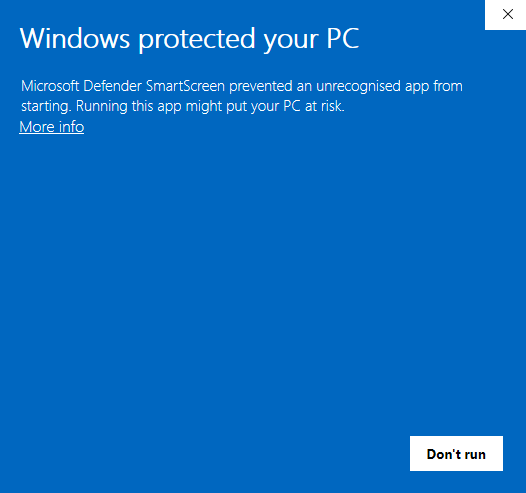
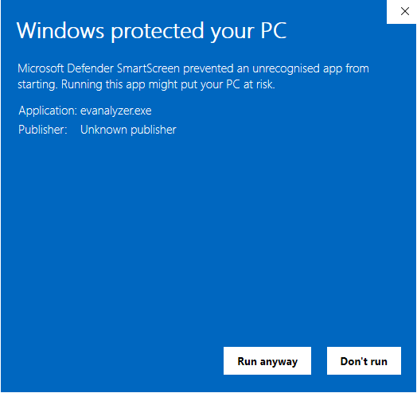

EVAnalyzer is distributed as a pre-built binary for Linux, Windows, and macOS. No package manager or build toolchain is required to run the application.

Before downloading, check the [System Requirements](/getting-started/system-requirements/) page - in particular if you plan to use a CUDA build for GPU-accelerated AI segmentation.

## Downloading

Use the [Downloads](/getting-started/downloads/) page to pick the correct package for your operating system (and, for Windows/Linux, whether you want CUDA acceleration).
It always links to the latest release.

Packages follow this naming scheme on the [GitHub Releases page](https://github.com/evanalyzer/evanalyzer/releases/latest):

| Platform              | CPU-only                         | CUDA-accelerated                                  |
| --------------------- | -------------------------------- | ------------------------------------------------- |
| Windows x86-64        | `evanalyzer-windows-x86_64.zip`  | `evanalyzer-windows-cuda-x86_64.zip`              |
| Linux x86-64          | `evanalyzer-linux-x86_64.tar.gz` | `evanalyzer-linux-cuda-x86_64.7z.001` + `.7z.002` |
| macOS (Apple Silicon) | `evanalyzer-macos-arm64.tar.gz`  | - (CUDA is not available on macOS)                |

:::note[Linux CUDA package is split in two]
The CUDA-enabled Linux build bundles the CUDA runtime libraries and exceeds GitHub's 2 GB single-file limit, so it's published as a two-part 7-Zip archive. Download **both** `.7z.001` and `.7z.002` into the same folder, then extract with:

```sh
7z x evanalyzer-linux-cuda-x86_64.7z.001
```

7-Zip automatically pulls in the second part - you don't need to combine the files yourself first.
:::

Extract the downloaded archive to a directory of your choice.

## Starting EVAnalyzer

### Linux

```sh
./evanalyzer
```

:::note[Linux libraries]

Sometimes the GUI requires a few system libraries on Linux.
If not still installed, install them once with:

```sh
apt-get install libinput10 libxkbcommon0 libfontconfig1 libgbm1
```

:::

### Windows

Double-click `evanalyzer.exe`, or from PowerShell:

```powershell
.\evanalyzer.exe
```

:::note[Windows SmartScreen warning]
Because EVAnalyzer is an open-source project and its releases are not commercially code-signed, Windows SmartScreen may block the application on first launch. This is expected and safe to dismiss.

**Step 1** — When the blue "Windows protected your PC" dialog appears, click **More info**.



**Step 2** — A **Run anyway** button becomes visible at the bottom of the dialog. Click it to start EVAnalyzer.



You will only need to do this once. Windows remembers your choice for this executable.
:::

### macOS

Open `EVAnalyzer.app` from the extracted folder.

:::note[macOS Gatekeeper quarantine]
Because EVAnalyzer is not notarized through Apple's developer program, macOS places a quarantine flag on the downloaded archive. Attempting to open the app with a double-click will show a dialog saying the app cannot be opened. Follow one of the two methods below to start it for the first time — you will not be asked again afterward.

**Method 1 — Right-click (quickest)**

Right-click (or Control-click) `EVAnalyzer.app` in Finder and choose **Open** from the context menu. A dialog will appear that — unlike the double-click dialog — includes an **Open** button. Click it to confirm and launch the application.

**Method 2 — System Settings**

If the right-click method does not work, macOS may have blocked the app silently. To unblock it:

1. Open **System Settings** -> **Privacy & Security**.
2. Scroll down to the **Security** section. You will see a message such as _"EVAnalyzer was blocked from use because it is not from an identified developer."_
3. Click **Open Anyway**, then confirm with **Open** in the dialog that follows.

**Method 3 — Terminal (remove quarantine attribute)**

For users comfortable with the command line, you can remove the quarantine flag directly:

```sh
xattr -cr EVAnalyzer.app
```

After running this command, the app opens normally with a double-click, with no further prompts.
:::

The application opens to the start screen showing the project configuration panel.

## Building from Source

See the [Building](/development/building/) guide if you want to compile EVAnalyzer yourself.
