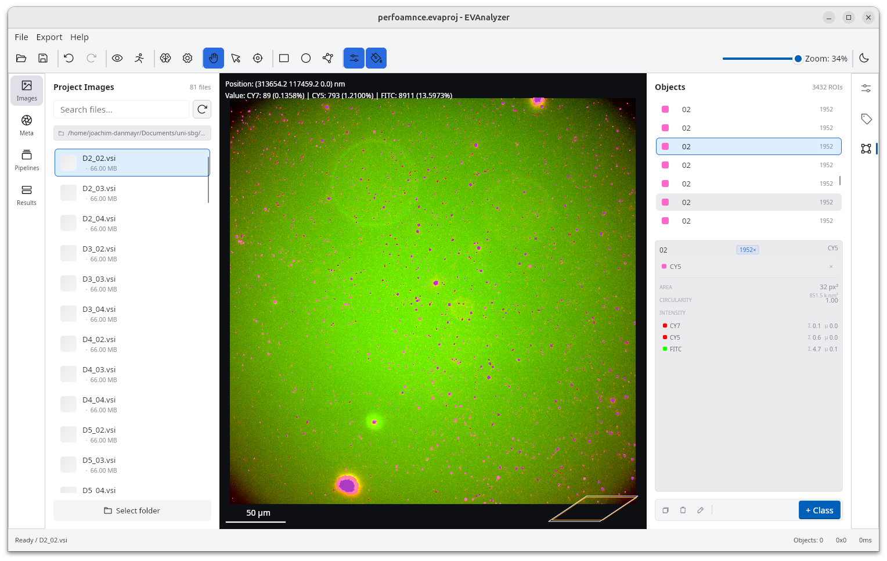

The **Classification** tab is where you define the object populations that your pipelines will detect and measure.
Every detected object is assigned to one ore more classes class.

## What is a Class?

A class represents a distinct object population in your experiment. Examples:

- `dapi@nucleus` - nuclei stained with DAPI
- `cy5@spot` - extracellular vesicles in the Cy5 channel
- `cy7@spot` - vesicles in the Cy7 channel
- `coloc@cy5cy7` - vesicles colocalising across both channels

:::tip[Naming convention]
Use `<prefix>@<type>` where the prefix (typically the fluorophore) is used for sorting in selection drop-downs.
:::

## Adding and Editing Classes

Click the **+** button to add a new class.
Select an existing class and click the **Edit** button to open the **Class Editor**, which lets you set:

| Field      | Description                                            |
| ---------- | ------------------------------------------------------ |
| **Name**   | Class label, e.g. `cy5@spot`                           |
| **Colour** | Display colour used for detected objects in the viewer |
| **Notes**  | Optional free-text description                         |

## Auto-populate from Image Metadata

Click the **Auto** button to have EVAnalyzer automatically create classes based on the channel information read from the current image.
This creates one class per image channel as a starting point.

## Object List

Every image has an **Object list** panel - labeled "Objects", with a live count ("N ROIs") - that lists every object on the current image: both live-preview objects from a pipeline still being edited and objects you've added by hand (see [Region Annotation](/guide/images/#region-annotation)).

Each row shows the object's segmentation label, a chip counting how many other objects share that same label, and up to four stacked color swatches for its assigned classes (a single fallback swatch if it has none yet).

Click a row to select it - the object highlights on the image, and selecting an object directly on the image scrolls the list to match. Click the selected row again to deselect it.

### Selected Object Detail

Selecting an object expands a detail panel showing:

- Its assigned classes, each with a small **×** button to remove that class from the object.
- **Area**, in both pixels² and the physical unit (nm²) derived from the image's pixel calibration.
- **Circularity**.
- Per-channel **intensity**: sum (Σ) and average (μ), with each channel's name and color shown where available.

### Managing Objects

The panel's footer toolbar, enabled once an object is selected:

- **+ Class** - assigns the class currently selected above to the selected object.
- **Delete** (trash icon) - removes the object, after a confirmation dialog warning the action can't be undone.

### Hiding Unclassified Objects

The eye icon next to the class count, in this panel's own header, toggles whether objects with no class assigned are shown in the Object list at all - hidden by default, so a large unfiltered detection result doesn't drown out the objects you've actually classified.

## How Classes Relate to Pipelines

Classes defined here aren't just labels - they're what every object-processing pipeline step selects, filters, and reassigns by. See [Object Classes](/fundamentals/classes/) for the full lifecycle, from a `Threshold` entry's raw segmentation class through to a named class assigned by [Classify Objects](/commands/object/classify-objects/).
