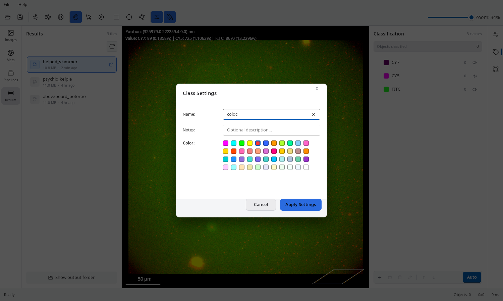

The **Classification** tab is where you define the object populations that your pipelines will detect and measure. Every detected object is assigned to exactly one class.

## What is a Class?

A class represents a distinct object population in your experiment. Examples:
- `dapi@nucleus` — nuclei stained with DAPI
- `cy5@spot` — extracellular vesicles in the Cy5 channel
- `cy7@spot` — vesicles in the Cy7 channel
- `coloc@cy5cy7` — vesicles colocalising across both channels

:::tip[Naming convention]
Use `<prefix>@<type>` where the prefix (typically the fluorophore) is used for sorting in selection drop-downs.
:::

## Adding and Editing Classes

Click the **+** button to add a new class. Double-click an existing class to open the **Class Editor**, which lets you set:

| Field | Description |
|---|---|
| **Name** | Class label, e.g. `cy5@spot` |
| **Colour** | Display colour used for detected objects in the viewer |
| **Notes** | Optional free-text description |
| **Default metrics** | Which measurement columns to display by default after the analysis |

The default metrics can be changed at any time, even after an analysis has been completed, without re-running the analysis.

## Auto-populate from Image Metadata

Click the **Magic Stick** button to have EVAnalyzer automatically create classes based on the channel information read from the current image. This creates one class per image channel as a starting point.

## Classification Presets

Presets are shared sets of class definitions for consistent naming across experiments:

- **Load preset** — choose from the drop-down beside the **+** button to load a predefined set of classes.
- **Save as template** — save your current classification settings as a `.impt` template file for reuse and sharing.

Template files are stored in `~/evanalyzer/templates/` and appear in the preset list on the next launch.

## How Classes Relate to Pipelines

Each pipeline step that produces objects must specify a target class. There are two ways a class is assigned:

1. **Extract ROIs** — the first object-extraction step in a pipeline assigns a *segmentation class* (an internal intermediate class used to hold the binary mask results).
2. **Classify ROIs** — converts segmentation-class objects into named user classes, applying optional filters (area, circularity, intensity) to accept or reject each detected region.

Downstream steps — [Colocalization](/commands/object/colocalization/), [Voronoi](/commands/object/voronoi/), [Distance Transform](/commands/object/distance-transform/) — all reference classes by name to select their input objects.
