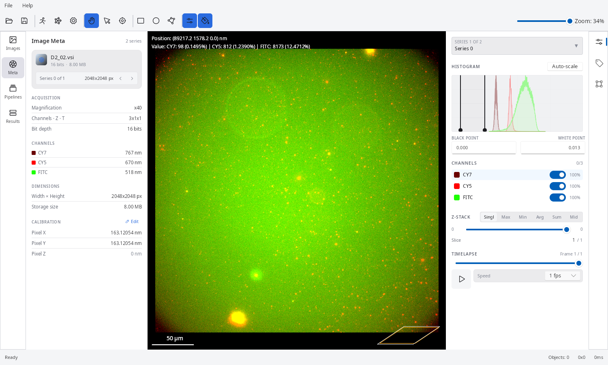
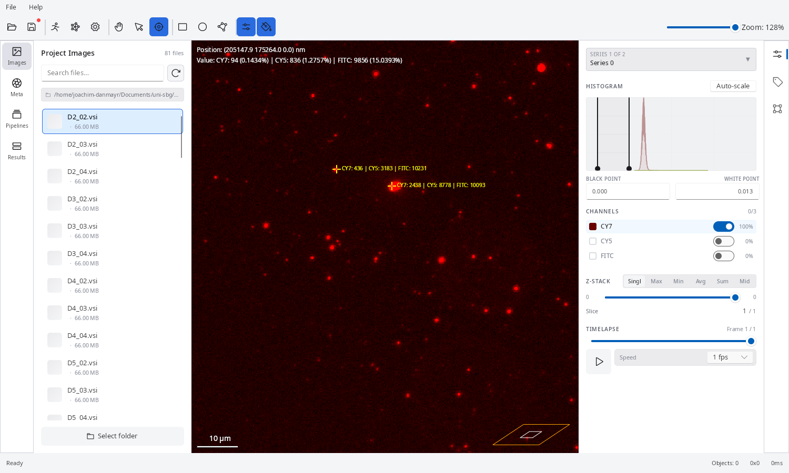

The **Images** tab lists every image file found in the configured image directory. It appears after at least one image directory has been set in the [Project tab](/guide/project-setup/).

## Image List

All discovered images are shown in a table. Use the **search field** at the top to filter by filename.

Click any row to:
- Load the image in the viewport for preview.
- Display image metadata in the properties panel below — dimensions, pixel size, number of channels, Z planes, and time frames.

The selected image is also the one used as the live preview source when editing pipeline parameters.

## Image Meta Panel

Selecting an image opens the **Image Meta** panel, which shows detailed acquisition metadata for that file:

| Section | Fields |
|---|---|
| **Acquisition** | Magnification, Channels · Z · T, Bit depth |
| **Channels** | Per-channel name and emission wavelength (nm) |
| **Dimensions** | Width × Height, storage size |
| **Calibration** | Pixel X / Y / Z size (nm) — editable via **Edit** / **Done** / **Reset** |

Use the **Calibration** section to correct pixel size if it was not embedded correctly in the source file — this affects the scale bar and all physical-unit measurements (area, distance) calculated during analysis.

## Image Viewer

The viewer panel shows the selected image with the following controls:

### Channel controls

For multi-channel images, each channel can be independently configured:
- **Visibility toggle** — show or hide a channel in the composite view.
- **Colour assignment** — map a greyscale channel to a display colour (e.g. blue for DAPI, red for Cy5).
- **Brightness / contrast** — per-channel min/max input range.
- **Auto-adjust** — automatically set min/max from the image histogram.

### Z-stack navigation

When an image has multiple Z planes:
- Use the **Z-plane slider** to step through individual planes.
- Switch between projection modes (Max, Min, Avg, Sum, Middle) in the toolbar.

### T-stack playback

When an image has multiple time frames:
- Click **Play** in the toolbar to animate the sequence.
- Set the playback speed in frames per second.

### Scale bar

A physical scale bar is overlaid on the image. The unit (nm, µm, mm) is configured in the toolbar. Pixel size is read from the image metadata.

### Navigator minimap

For large images, a thumbnail minimap in the corner shows the full image with the current viewport highlighted. Click or drag the minimap to pan to a different area.

### Position and pixel value readout

As you move the mouse over the viewport, a HUD overlay in the top-left corner shows the cursor's **position** (in physical units, using the calibrated pixel size) and the **pixel value** for every visible channel.

This is a live readout that updates continuously with mouse movement — it does not place a persistent measurement marker.

### ROI Annotation

Draw manual regions of interest directly on the image:
- **Rectangle** — drag to define a rectangular ROI.
- **Oval** — drag to define an oval/elliptical ROI.
- **Polygon** — click to place vertices, double-click to close.

Annotations are saved per-image to `<project_directory>/data/<image_id>/*.icroi` and are preserved across sessions.

## Series Selection

Some image formats (e.g. LIF, CZI) store multiple image series in a single file. Select the desired series index in the properties panel to analyse a specific sub-image.

## Supported Formats

See [Image Formats](/fundamentals/image-formats/) for the full list of supported file types.
