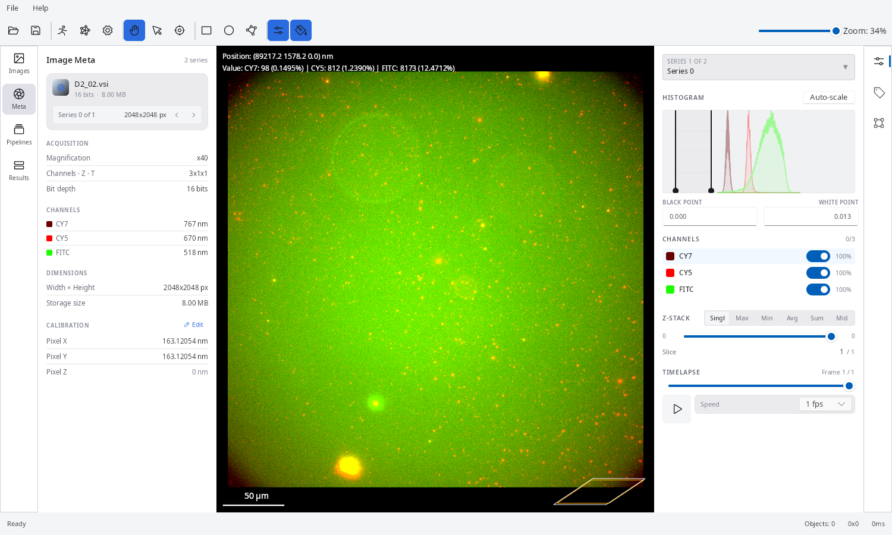
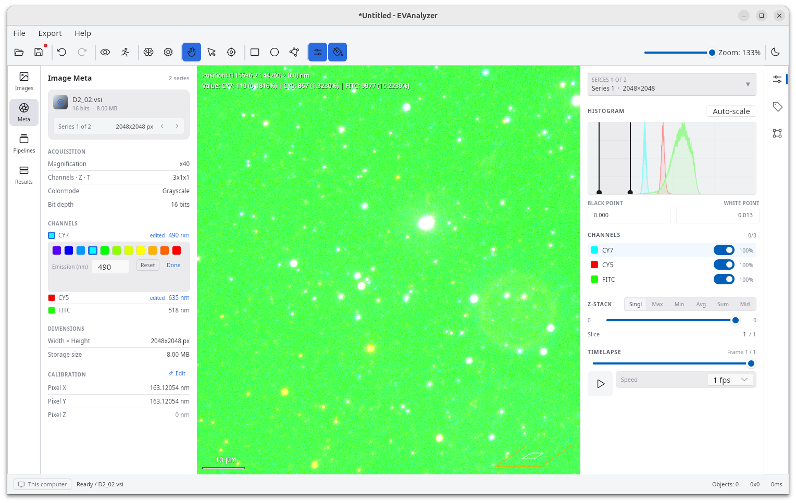
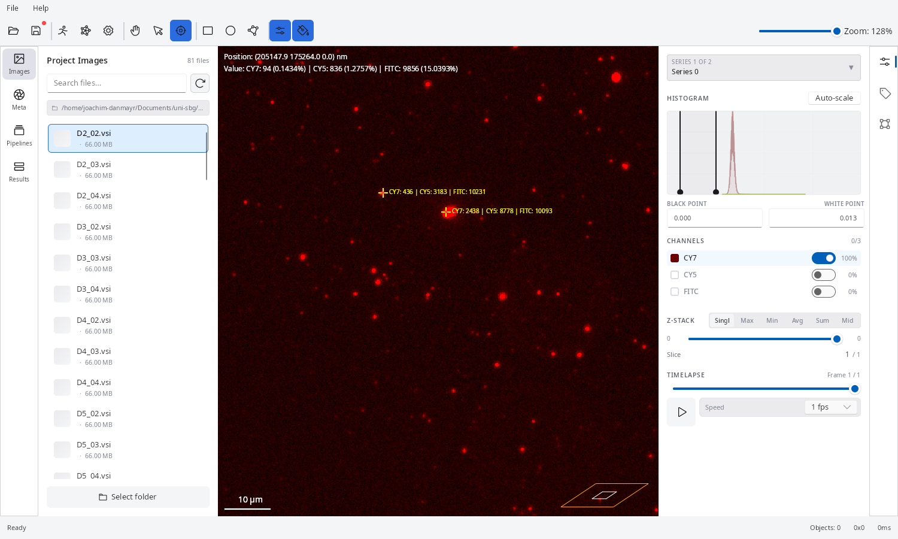

The **Images** tab lists every image file found in the configured image directory.
If a single image was opened using the **Open** button all the other images from the directory this image is placed in are also displayed there.

## Image List

All discovered images are shown in a table.
Use the **search field** at the top to filter by filename.

Click any row to:

- Load the image in the viewport for preview.
- Display image metadata in the meta panel below - dimensions, pixel size, number of channels, Z planes, and time frames.

The selected image is also the one used as the live preview source when editing pipeline parameters.

## Image Meta Panel

Selecting an image fills the **Image Meta** panel with detailed meta information about the image.

| Section         | Fields                                                                   |
| --------------- | ------------------------------------------------------------------------ |
| **Acquisition** | Magnification, Channels · Z · T, Bit depth                               |
| **Channels**    | Per-channel name, display colour and emission wavelength (nm) - colour editable, see below |
| **Dimensions**  | Width × Height, storage size                                             |
| **Calibration** | Pixel X / Y / Z size (nm) - editable via **Edit** / **Done** / **Reset** |

Use the **Calibration** section to correct pixel size if it was not embedded correctly in the source file - this affects the scale bar and all physical-unit measurements (area, distance) calculated during analysis.

### Channel colour

EVAnalyzer colours every channel by its emission wavelength, read from the image metadata. If the metadata is missing or you prefer another colour, click the channel's colour swatch in the **Channels** section to open the colour chooser:

- Pick one of the colour tiles - each tile is an emission wavelength between 420 nm and 635 nm (pure blue, green and red are at 450, 532 and 635 nm), shown in exactly the colour the viewer will use. Alternatively type any wavelength into **Emission (nm)** and press Enter.
- Click **Done** to close the chooser, or **Reset** to go back to the wavelength stored in the image.

The chosen wavelength is saved in the project and applies to that channel in every image of the project. Channels whose colour was set this way are marked **edited**. Classes created with the **Auto** button in the [Classification](/guide/classification/#auto-populate-from-image-metadata) tab take over the channel colour shown in the viewer.

RGB images keep their fixed red, green and blue channel colours.

## Image Viewer

The viewer panel shows the selected image with the following controls:

### Channel controls

For multi-channel images, each channel can be independently configured:

- **Visibility toggle** - show or hide a channel in the composite view.
- **Colour assignment** - map a greyscale channel to a display colour (e.g. blue for DAPI, red for Cy5), see [Channel colour](#channel-colour).
- **Brightness / contrast** - per-channel min/max input range.
- **Auto-adjust** - automatically set min/max from the image histogram.

### Z-stack navigation

When an image has multiple Z planes:

- Use the **Z-plane slider** to step through individual planes.
- Switch between projection modes (Max, Min, Avg, Sum, Middle) in the toolbar.

### T-stack playback

When an image has multiple time frames:

- Click **Play** in the toolbar to animate the sequence.
- Set the playback speed in frames per second.

### Scale bar

A physical scale bar is overlaid on the image.
The units are nm, µm or mm based on the actual zoom level.
Pixel sizes are read from the image metadata.

If the image does not contain pixel size information use the **Calibration** section to define it manually.

### Navigator minimap

For large images, a thumbnail minimap in the corner shows the full image with the current viewport highlighted.

### Position and pixel value readout

As you move the mouse over the viewport, a HUD overlay in the top-left corner shows the cursor's **position** (in physical units, using the calibrated pixel size) and the **pixel value** for every visible channel.

This is a live readout that updates continuously with mouse movement - it does not place a persistent measurement marker.

To place a persistent measurement use the **cross fade** button from the toolbar and click on the wanted position in the image.
A permanent marker with the intensity values of all image channels is displayed.
Right click on the permanent marker to remove it.

### Region Annotation

Draw manual regions directly on the image, independent of any segmentation or classification pipeline:

- **Rectangle** - drag to define a rectangular region.
- **Oval** - drag to define an oval/elliptical region.
- **Polygon** - click to place vertices, double-click to close.

Annotations are saved per-image to the project file and are preserved across sessions.

To measure annotated regions and use them in an analysis - for example to count spots inside a hand-drawn region - add [Load Annotated Objects](/commands/object/load-annotated-objects/) to a pipeline. It turns the annotations of each image into regular pipeline objects.

## Series Selection

Some image formats (e.g. LIF, CZI) store multiple image series in a single file.
Select the desired series index in the properties panel to analyze a specific sub-image.

## Supported Formats

See [Image Formats](/fundamentals/image-formats/) for the full list of supported file types.
