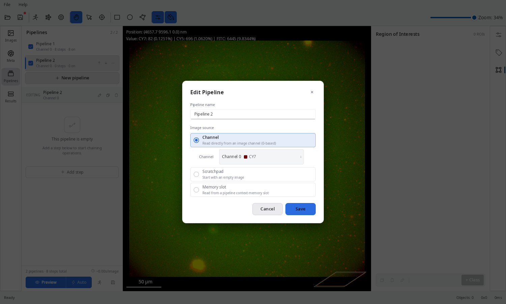
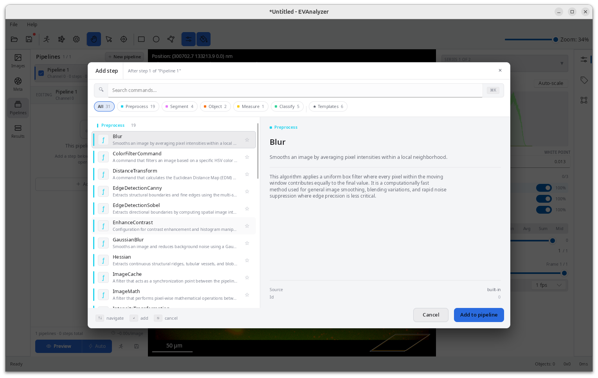
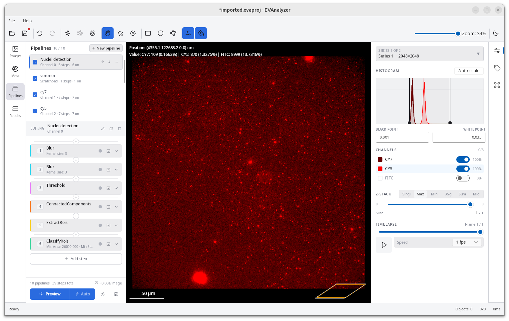
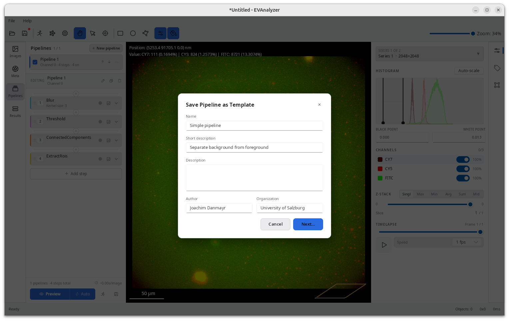

Pipelines define the sequence of image processing commands applied to raw inputs to extract specific Regions of Interest (ROIs).
EVAnalyzer supports multiple, independent pipelines within a single project.
Each pipeline can isolate and process a distinct image channel, or target pre-existing parent ROIs.
Because a pipeline can ingest and refine ROIs generated by a previous workflow step, users can easily construct complex, multi-channel processing architectures to resolve sophisticated biological queries.

## Creating a Pipeline

In the **Pipelines** tab, click:

- **New pipeline** - start with an empty pipeline.
- The **arrow** beside **New pipeline** - choose a preset template to load a pre-configured set of steps.

Available presets include:

- **EV channel** - optimised for extracellular vesicle quantification in single-vesicle imaging with low background.
- **Cell brightfield** - optimised for cell segmentation in brightfield images.
- **Nucleus** - optimised for nucleus segmentation from fluorescent labelling (Hoechst, DAPI).
- **EV in cell** - optimised for EV quantification inside cells.

## Pipeline Editor

Click a pipeline name to open the pipeline editor.



+### Pipeline steps

Steps are listed top-to-bottom and executed in that order.
Click **+ Add step** (the `- + -` button) to open the command picker, which shows only commands compatible with the current pipeline state.



Commands fall into categories indicated by colour:

- **Cyan** - image processing (input: image, output: image) e.g. Smoothing, Edge detection, ...
- **Rosa** - segmentation (input: image, output: segmentation mask) e.g. Threshold, AI UNet, ...
- **Orange** - object operations (input: segmentation mask, output: objects) e.g. Connected components, Watershed, ...
- **Yellow** - measurement (input: objects, output: region of interests)
- **Green** - classify (input: region of interests, output: region of interests)

A typical pipeline flow:

1. **Image processing** commands reduce noise and enhance the signal (Rolling Ball, Gaussian Blur, …).
2. **Segmentation** commands separate foreground from background (Threshold → Connected Components → Watershed).
3. **Extract ROIs** converts the binary mask into a set of segmentation-class objects.
4. **Classify ROIs** applies size/circularity filters and assigns an object class.
5. **Object processing** commands perform further analysis (Colocalization, Distance Transform, …).



### Pipeline templates

The command selection dialog also provides a **Template** section.
This section contain predefined command sequences which can be used inside your pipeline.
By selecting a template the template commands are added in defined order at your selected position.

### Live preview

The viewport on the right shows the result of all pipeline steps applied to the currently selected image. Changing any parameter immediately updates the preview. A live object count is shown in the legend.

Use the **zoom** controls to inspect segmentation quality, and the **side-by-side** button to compare the original and processed image simultaneously.

## Saving a Pipeline as a Template

Click the **Save** button at the button of the pipelines panel, to store the current pipeline (all steps and parameters) for reuse in other projects.



Fill in **Name**, **Short description**, **Description**, **Author**, and **Organization**, then click **Next…** to choose a save location in the native file dialog. Pipeline templates use the `.evapipe` extension.

Templates saved to the default location (`~/evanalyzer/templates/`) automatically appear in the preset drop-down next to **New pipeline** the next time you create a pipeline, alongside the built-in presets (EV channel, Cell brightfield, Nucleus, EV in cell).

## Saving a Project as a Template

In addition to saving individual pipelines, you can save an entire project — including its class definitions, plate configuration, and all pipelines — as a **project template**.

Click **Save as Template** in the **File** menu to open the template dialog.
Fill in **Name**, **Short description**, **Description**, **Author**, and **Organization**, then choose a save location.
Project templates use the `.evapt` extension.

To create a new project from a template, click open the **File** menu and select **New from Template**.
This pre-populates the class editor, plate settings, and all pipelines, so you can start a new experiment with a known-good configuration without rebuilding from scratch.

:::tip
Use project templates to standardize analysis configurations across your lab — share a single `.evapt` file to ensure every team member starts from the same pipeline and class setup.
:::

## Running the Analysis

Once all pipelines are configured, click **Run** in the toolbar to start the analysis.

- A progress dialog shows per-image and per-pipeline progress.
- Click **Stop** to interrupt; in-progress tasks will finish before halting.
- Click **Open results folder** to locate the output files immediately.

Results are written to:

```
<image_directory>/evanalyzer/<job_name>/results.evadb
```

## Best Practices

- Add **one pipeline per image channel** you want to analyze.
- Add **separate pipelines** for object-processing steps (colocalization, in-cell counting) that operate on already-extracted objects.
