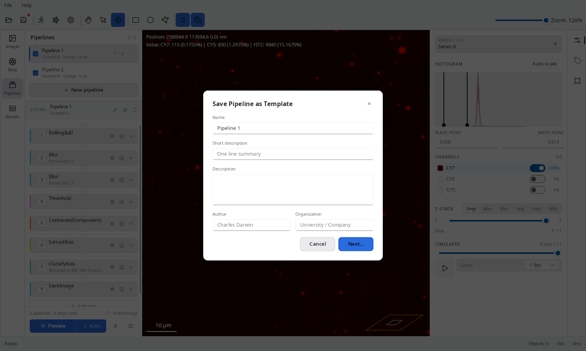

Pipelines define the sequence of processing steps applied to each image. EVAnalyzer supports multiple pipelines per project; each pipeline is executed independently and can process a different image channel.

## Creating a Pipeline

In the **Pipelines** tab, click:

- **New pipeline** - start with an empty pipeline.
- The **arrow** beside **New pipeline** - choose a preset template to load a pre-configured set of steps.

Available presets include:

- **EV channel** - optimised for extracellular vesicle quantification in single-vesicle imaging with low background.
- **Cell brightfield** - optimised for cell segmentation in brightfield images.
- **Nucleus** - optimised for nucleus segmentation from fluorescent labelling (Hoechst, DAPI).
- **EV in cell** - optimised for EV quantification inside cells.

## Pipeline Editor

Click a pipeline name to open the pipeline editor.


### Pipeline settings

| Setting           | Description                                                          |
| ----------------- | -------------------------------------------------------------------- |
| **Pipeline name** | Human-readable label; use distinct names to simplify troubleshooting |
| **Enabled**       | Disabled pipelines are skipped during analysis                       |

### Pipeline input

| Setting           | Description                                                                             |
| ----------------- | --------------------------------------------------------------------------------------- |
| **Image channel** | The channel index (0-based) to use as the starting image                                |
| **Z-projection**  | Which projection mode to use when the project Z-stack setting is _Intensity Projection_ |
| **Z index**       | Which Z plane to use when the Z-stack setting is _Exact one_                            |
| **T index**       | Which time frame to use                                                                 |
| **Empty input**   | Start with a blank image (useful for pure object-manipulation pipelines)                |

### Pipeline steps

Steps are listed top-to-bottom and executed in that order. Click **+ Add step** (the `- + -` button) to open the command picker, which shows only commands compatible with the current pipeline state.


Commands fall into categories indicated by colour:

- **Grey** - image processing (input: image, output: image)
- **White** - segmentation (input: image, output: binary mask)
- **Green** - object operations (input: objects, output: objects or measurements)

A typical pipeline flow:

1. **Image processing** commands reduce noise and enhance the signal (Rolling Ball, Gaussian Blur, …).
2. **Segmentation** commands separate foreground from background (Threshold → Connected Components → Watershed).
3. **Extract ROIs** converts the binary mask into a set of segmentation-class objects.
4. **Classify ROIs** applies size/circularity filters and assigns an object class.
5. **Object processing** commands perform further analysis (Colocalization, Distance Transform, …).

### Live preview

The viewport on the right shows the result of all pipeline steps applied to the currently selected image. Changing any parameter immediately updates the preview. A live object count is shown in the legend.

Use the **zoom** controls to inspect segmentation quality, and the **side-by-side** button to compare the original and processed image simultaneously.

## Saving a Pipeline as a Template

Click **Save as Template** to store the current pipeline (all steps and parameters) for reuse in other projects.



Fill in **Name**, **Short description**, **Description**, **Author**, and **Organization**, then click **Next…** to choose a save location in the native file dialog. Pipeline templates use the `.evapipe` extension.

Templates saved to the default location (`~/evanalyzer/templates/`) automatically appear in the preset drop-down next to **New pipeline** the next time you create a pipeline, alongside the built-in presets (EV channel, Cell brightfield, Nucleus, EV in cell).

## Pipeline History

Every settings change is recorded. Click **History** to open the change log (last 64 changes). Double-click any entry to restore that state. Click **Tag** to mark the current state so it is easy to find later.

## Running the Analysis

Once all pipelines are configured, click **Play** (▶) in the toolbar to start the analysis.

- A progress dialog shows per-image and per-pipeline progress.
- Click **Stop** to interrupt; in-progress tasks will finish before halting.
- Click **Open results folder** to locate the output files immediately.

Results are written to:

```
<image_directory>/evanalyzer/<job_name>/results.evadb
```

## Best Practices

- Add **one pipeline per image channel** you want to analyse.
- Add **separate pipelines** for object-processing steps (colocalization, in-cell counting) that operate on already-extracted objects.
- Use the **Tag** history feature to bookmark a known-good state before experimenting with parameters.
