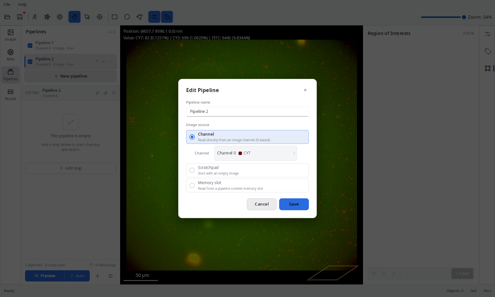
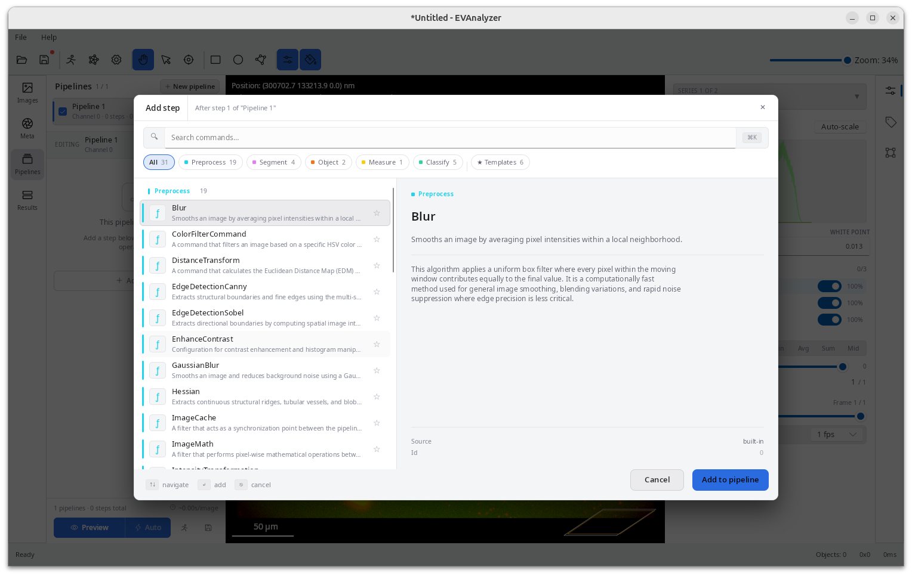
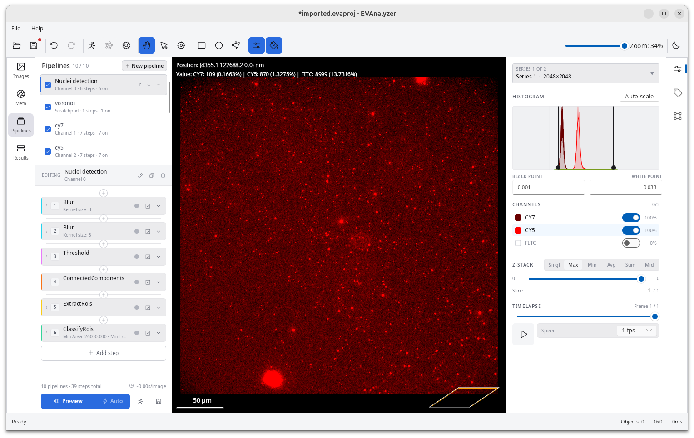
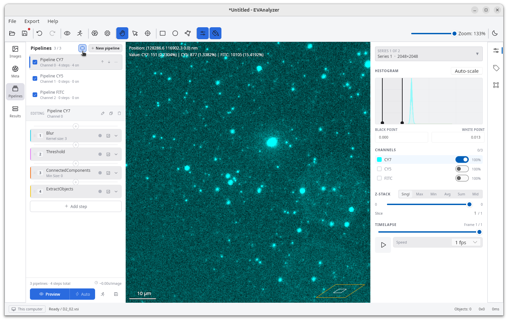
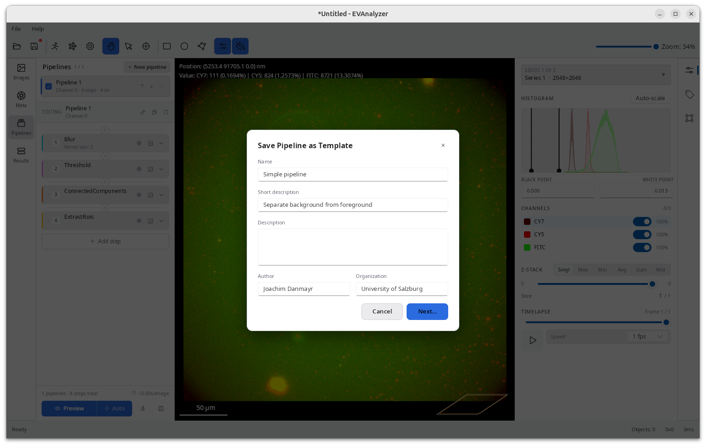

Pipelines define the sequence of image processing commands applied to raw inputs to extract specific objects.
EVAnalyzer supports multiple, independent pipelines within a single project.
Each pipeline can isolate and process a distinct image channel, or target pre-existing parent objects.
Because a pipeline can ingest and refine objects generated by a previous workflow step, users can easily construct complex, multi-channel processing architectures to resolve sophisticated biological queries.

## Creating a Pipeline

In the **Pipelines** tab, click:

- **New pipeline** - start with an empty pipeline.
- The **arrow** beside **New pipeline** - choose a preset template to load a pre-configured set of steps.

Available presets include:

- **EV channel** - optimised for extracellular vesicle quantification in single-vesicle imaging with low background.
- **Cell brightfield** - optimised for cell segmentation in brightfield images.
- **Nucleus** - optimised for nucleus segmentation from fluorescent labelling (Hoechst, DAPI).
- **EV in cell** - optimised for EV quantification inside cells.

## Pipeline Editor

Click a pipeline name to open the pipeline editor. Double-click a pipeline (or use its **…** button) to edit its name and image source.



+### Pipeline steps

Steps are listed top-to-bottom and executed in that order.
Click **+ Add step** (the `- + -` button) to open the command picker, which shows only commands compatible with the current pipeline state.



Commands fall into categories indicated by colour:

- **Cyan** - image processing (input: image, output: image) e.g. Smoothing, Edge detection, ...
- **Rosa** - segmentation (input: image, output: segmentation mask) e.g. Threshold, AI UNet, ...
- **Orange** - connected-component operations (input: segmentation mask, output: labelled mask) e.g. Connected Components, Watershed, ...
- **Yellow** - object extraction (input: labelled mask, output: objects) e.g. Extract Objects
- **Green** - classify (input: objects, output: objects) e.g. Classify Objects, Object Math, Object Transform, Voronoi, Colocalization

A typical pipeline flow:

1. **Image processing** commands reduce noise and enhance the signal (Rolling Ball, Gaussian Blur, …).
2. **Segmentation** commands separate foreground from background (Threshold → Connected Components → Watershed).
3. **Extract Objects** converts the binary mask into a set of segmentation-class objects.
4. **Classify Objects** applies size/circularity filters and assigns an object class.
5. **Object processing** commands perform further analysis (Colocalization, Distance Transform, …).

When a fixed sequence of steps isn't enough - for example to retry a step with other settings depending on the image - use a [Script](/commands/image-processing/script/) step: a small program that runs the same commands with loops and conditions.



### Advanced settings

To keep the step cards short, each command shows only its essential parameters. Settings that rarely need changing - fine-tuning options of the AI models, filters and object commands - are collapsed in a row **Advanced settings (n)** at the bottom of the step card, where _n_ is the number of advanced settings. Click the row to expand or collapse them for that step.

If you changed any advanced setting from its default, the row says so (**· 2 changed**), so modified settings are never hidden unnoticed. Tick **Always show** in the row to expand the advanced settings of every step; EVAnalyzer remembers this preference.

### Pipeline templates

The command selection dialog also provides a **Template** section.
This section contain predefined command sequences which can be used inside your pipeline.
By selecting a template the template commands are added in defined order at your selected position.

### Live preview

The viewport on the right shows the result of all pipeline steps applied to the currently selected image. Changing any parameter immediately updates the preview. A live object count is shown in the legend.

Use the **zoom** controls to inspect segmentation quality, and the **side-by-side** button to compare the original and processed image simultaneously.

Click the **eye** icon in the toolbar to force a preview refresh on demand - useful for re-running the preview after switching images or when automatic live updates are off. The status bar also shows the name of the currently selected image next to the preview status message.

## Focus Mode

A project with several pipelines quickly fills the viewer with channels and object classes that have nothing to do with the pipeline you are working on. **Focus mode** shows only what belongs to the selected pipeline:

- only the pipeline's **image channel** (all channels if the pipeline reads from a scratchpad or memory source), and
- only the **object classes** the pipeline creates, reads or filters on.

While a pipeline is focused, a banner **Focused on "…"** appears above the channel and class lists, so hidden channels and classes never look like a bug. Click **Show all** in the banner to leave the focus.

There are two ways to use it:

| Action                                              | Effect                                                                                                    |
| --------------------------------------------------- | --------------------------------------------------------------------------------------------------------- |
| **Focus** button (crosshair) in the Pipelines header | Switches focus mode on or off. While on, selecting another pipeline moves the focus to it. EVAnalyzer remembers this setting. |
| `Alt`+click on a pipeline, or `F`                    | Focuses this pipeline right away (`F` uses the selected one). Doing it again on the focused pipeline shows everything again.  |

Focus mode only changes what is displayed. Your own visibility settings for channels and classes are not touched - leaving the focus restores them exactly.



## Saving a Pipeline as a Template

Click the **Save** button at the button of the pipelines panel, to store the current pipeline (all steps and parameters) for reuse in other projects.



Fill in **Name**, **Short description**, **Description**, **Author**, and **Organization**, then click **Next…** to choose a save location in the file browser. Pipeline templates use the `.evapipe` extension.

Templates saved to the default location (`~/evanalyzer/templates/`) automatically appear in the preset drop-down next to **New pipeline** the next time you create a pipeline, alongside the built-in presets (EV channel, Cell brightfield, Nucleus, EV in cell).

## Saving a Project as a Template

In addition to saving individual pipelines, you can save an entire project — including its class definitions, plate configuration, and all pipelines — as a **project template**.

Click **Save as Template** in the **File** menu to open the template dialog.
Fill in **Name**, **Short description**, **Description**, **Author**, and **Organization**, then choose a save location.
Project templates use the `.evapt` extension.

To create a new project from a template, click open the **File** menu and select **New from Template**.
This pre-populates the class editor, plate settings, and all pipelines, so you can start a new experiment with a known-good configuration without rebuilding from scratch.

You can also apply an `.evapt` file directly from the regular **Open** button/dialog - EVAnalyzer detects the project-template extension and applies it to the current project the same way **New from Template** does, so a template downloaded or shared with you doesn't need a separate import step.

:::tip
Use project templates to standardize analysis configurations across your lab — share a single `.evapt` file to ensure every team member starts from the same pipeline and class setup.
:::

## Running the Analysis

Once all pipelines are configured, click **Run** in the toolbar to start the analysis.

- A progress dialog shows per-image and per-pipeline progress.
- Click **Stop** to interrupt; in-progress tasks will finish before halting.
- Click **Open results folder** to locate the output files immediately.

Results are written to:

```
<image_directory>/evanalyzer/<job_name>/results.evadb
```

## Best Practices

- Add **one pipeline per image channel** you want to analyze.
- Add **separate pipelines** for object-processing steps (colocalization, in-cell counting) that operate on already-extracted objects.
