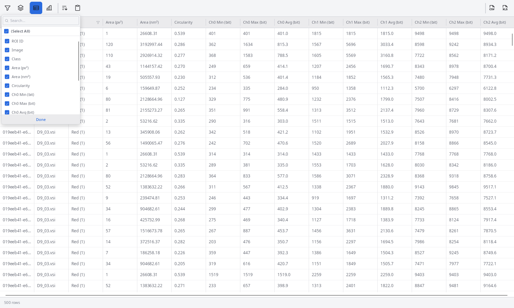

EVAnalyzer stores results in a DuckDB database file named `results.evadb` inside the job folder:

```
<image_directory>/evanalyzer/<job_name>/results.evadb
```

Open an existing results file from the toolbar: click the **arrow** beside the **Open** button and select the file.


## Results Views

### Plate View

The plate view is the default opening view when image grouping is configured. It shows one cell per well, with the selected metric value averaged across all images in that well.

Switch between **table** and **heatmap** display using the heatmap button. In heatmap mode, the colour represents the metric value relative to the full range; the toolbar drop-down selects which column to visualise.

### Image View

Double-click a well in the plate view (or click any row in the table view) to open the **Image view** for that well. Each image is shown in its well-order position as defined in the project settings.

- Images flagged as **excluded** are crossed out and omitted from statistics.
- Use the context menu on any image to toggle exclusion.

### Image Detail View

Double-click an image in the Image view to open the **detail view**, which shows:
- A **density map** — the image is divided into square tiles; the average metric value of all objects within each tile is visualised as a colour.
- A **per-object table** — every detected object with all its measured metrics.


Select a row in the object table to jump to that object in the image and highlight its position.

:::note[Original images required for interactive mode]
The detail view needs access to the original images to overlay objects. If the `results.evadb` file or the images are moved after the analysis, EVAnalyzer will prompt you to specify the new location.
:::

## Adding and Removing Columns

The results table shows only the columns configured in the **Class Editor** by default. To add more:

1. Click the blue **Add column** button.
2. Choose from the list of all available metrics.



Columns can also be removed by right-clicking the column header. Table layout is saved with the `results.evadb` file and restored on the next open.

See [Metrics](/fundamentals/metrics/) for a full description of all available measurements and statistics.

## Grouping and Aggregating Rows

Click the **stack icon** in the table toolbar to open the **Group by** / **Aggregate** panel, which summarises the per-object table into one row per group instead of one row per object.


**Group by** — choose how rows are bucketed:

| Mode | Behaviour |
|---|---|
| **None** | No grouping; one row per object (default) |
| **Image name** | One row per source image |
| **Folder name** | One row per parent folder |
| **Regex on image name** | One row per distinct match of a regular expression against the filename, e.g. `^([A-Z]\d+)_` to group by well ID |

**Aggregate** — choose which statistics to compute per group for each numeric metric: **Min**, **Max**, **Average** (checked by default), **Median**, **Std. dev.**, **Sum**.

Click **Apply** to replace the per-object view with the grouped/aggregated summary. Switch **Group by** back to **None** to return to the full per-object table.

## Exporting Results

Click the **Download** button (↓) in the toolbar to export the current view. Available formats:
- **XLSX** — Microsoft Excel workbook.
- **R** — data frame suitable for import into R.

You can export at the plate level, well level, or individual image level.

### Export styles

| Style | Description |
|---|---|
| **Table** | One row per object/well; columns are metrics |
| **Heatmap** | Values arranged in the plate grid layout |

## File Layout

After an analysis run, the job folder contains:

| Path | Description |
|---|---|
| `results.evadb` | DuckDB database with all object metrics |
| `settings.improj` | Snapshot of the project settings used for this run |
| `profiling.json` | Execution timing per pipeline step |
| `images/` | Control images saved by [Save Image](/commands/object/save-image/) steps |
| `models/` | Copy of any ML model files referenced in the project |
| `data/` | Copy of manual ROI annotations |

The `results.evadb` file can also be opened directly with any [DuckDB client](https://duckdb.org/docs/stable/clients/cli/overview.html) for custom SQL queries.
