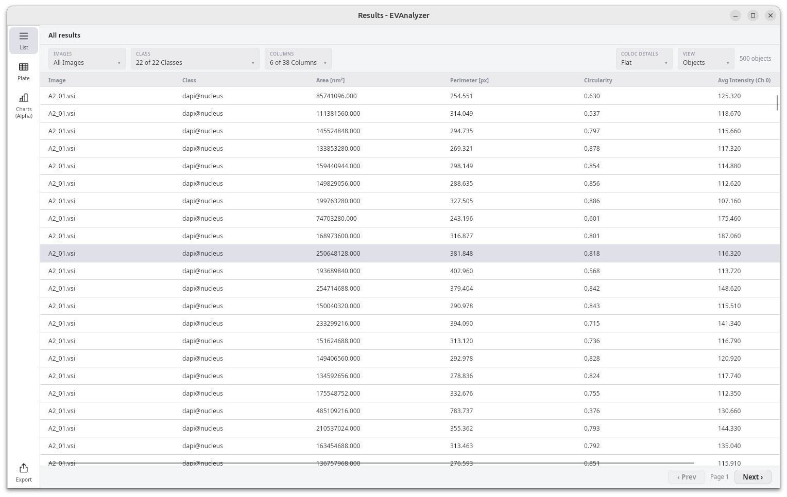
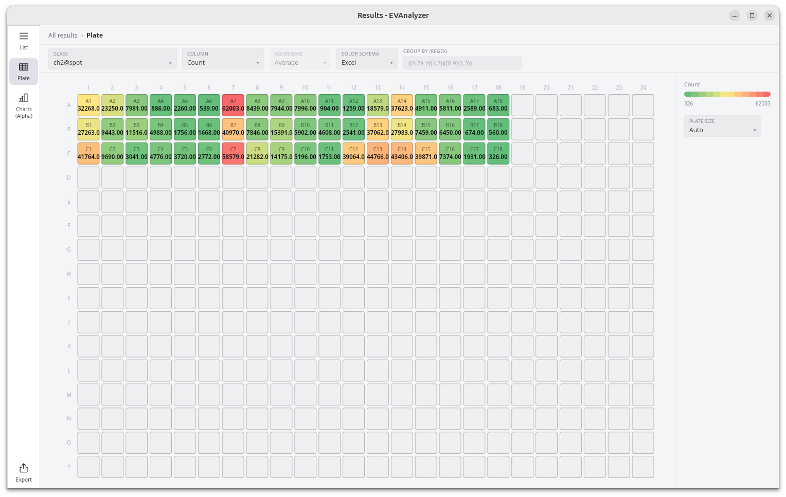
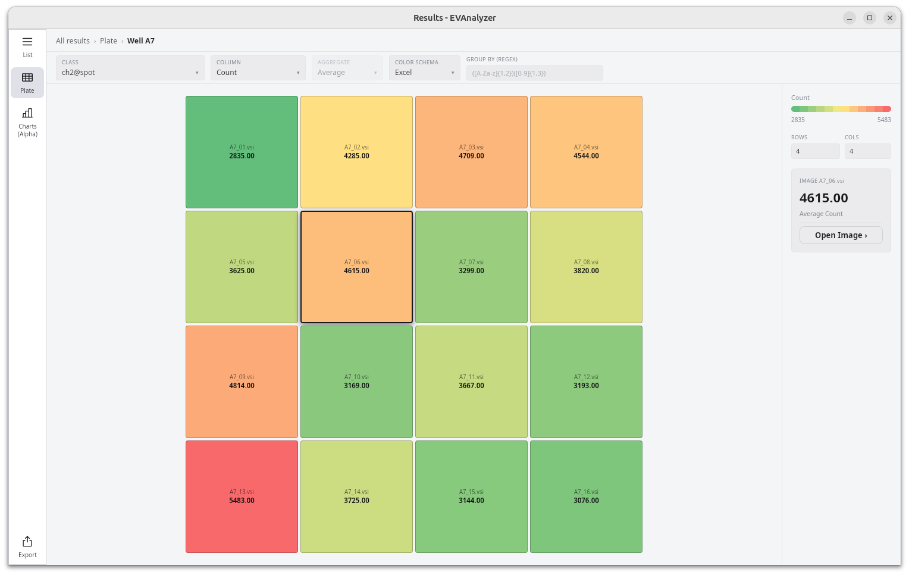

EVAnalyzer stores results in a DuckDB database file named `results.evadb` inside the project folder:

```
<image_directory>/evanalyzer/<job_name>/results.evadb
```

Open an existing results file from the toolbar: click the **arrow** beside the **Open** button and select the file.


## The Results Window

The results window has a left icon rail for switching between the three ways of looking at your data - **List**, **Plate**, and **Charts** - plus an **Export** shortcut pinned to the bottom. A breadcrumb bar sits above the active view; when your dataset has Z-stacks or time-lapse frames, a **Z/T** stepper is docked on the right of that same bar and applies to whichever view is currently open.

## List View

The **List** view (the default) shows one row per detected object: **Object ID**, **Image**, **Class**, geometry columns like **Area** and **Circularity**, and one **Min/Max/Avg/Sum** column per measured channel.

The filter bar above the table has three dropdowns - **Images**, **Class**, and **Columns** - each a searchable, multi-select checklist with a **X of Y** summary (e.g. _"19 of 22 Classes"_) and select-all/none shortcuts. **Columns** groups per-channel intensity metrics so you can toggle a whole channel at once instead of column by column. The object count for the current filters is shown at the top-right.



Results are paginated - use **‹ Prev** / **Next ›** at the bottom of the table rather than scrolling through everything at once. Click any row to jump straight to that object: EVAnalyzer opens the image it belongs to and highlights it, so you don't have to hunt for it manually.

### Grouping and Aggregating Rows

Use the **View** dropdown to switch the table from **Objects** (flat, one row per object) to **Images** (one row per image/class combination). Switching to **Images** reveals an **Aggregate** dropdown - a multi-select of **Average**, **Min**, **Max**, **Std. dev.**, **Sum**, **Median**, and **Skewness**. Every numeric column is duplicated per selected aggregation (for example **Area (px²) \[avg\]** and **Area (px²) \[sum\]**), so you can compare, say, average object size against total covered area per image.


### Colocalization Details

While viewing **Objects**, the **Coloc Details** dropdown switches between **Flat** (the default) and **Details**. **Details** flattens each object's matched partners into their own columns - one set of measurement columns per partner class, with a dash where no partner was found.


## Charts

The **Charts** section (marked **Alpha** in the rail - expect rough edges) plots the currently filtered rows instead of listing them. Three chart types are available as tabs along the top: **Histogram**, **Scatter**, and **Boxplot**.

**Histogram** bins a chosen numeric **Property**, optionally restricted to one **Class**, and shows the object count plus the distribution across bins with the value range labelled below.


**Scatter** plots two numeric columns (**X** and **Y**), optionally restricted to one **Class**. Large datasets are downsampled for rendering - a note like _"218 of 622833 objects plotted"_ appears above the plot when this happens.


**Boxplot** draws one box (quartile box, median line, whiskers, and outlier dots) per class for a chosen **Property**, with the object count for each class labelled underneath - useful for comparing a metric's spread across classes at a glance.

## Plate View

Switch to **Plate** in the rail to lay results out as a physical plate/well grid instead of a table or chart - useful for spotting spatial patterns across a multi-well high-content screening plate. It drills down through three levels, tracked by the breadcrumb at the top: **Plate → Well → Image**.

A shared toolbar runs across all three levels: **Class**, **Column** (the metric to color by), **Aggregate**, **Color Schema** (Excel, Viridis, Plasma, Inferno, Cividis, Coolwarm, Red-Blue, YlGnBu, Haline, Algae, or Thermal), and a **Group By (regex)** field for decoding well/field identifiers out of filenames. A legend on the right shows the active color range - click it to switch between **Auto** and a **Manual** min/max.

### Plate

Each cell is one well, colored by the aggregated metric across everything grouped into it. Wells are placed by decoding their group label into a row/column coordinate (e.g. `A14`). Pick a **Plate Size** - **Auto** (picks the smallest standard layout that fits your data) or a fixed 6-, 12-, 24-, 48-, 96-, 384-, or 1536-well layout. Click a well to select it and see its value in the side panel, then **Open well ›** to drill in.



### Well

Drill into a well to see its individual fields laid out as their own grid (configurable **Rows**/**Cols** in the side panel). Click a field to select it, then **Open Image ›** to drill into its spatial heatmap.



### Image Heatmap

The innermost level bins a single image's objects into square tiles - configure the **Square Size** (36, 48, 64, 128, 256, or 1024 px) - colored by the same metric/aggregate as the levels above. Click a tile to jump to that region of the image in the editor, highlighted with a rectangle.


## Exporting Results

Click **Export** at the bottom of the rail to open the **Export Results** dialog. Every checked option is written out together in one run - there's no separate queue to build up.


- **Output Folder** - pick a destination with **Browse…**.
- **Format** - **XLSX** (default), **CSV**, or **Parquet**.
- **Images/Objects (ungrouped)** - **Object list** (with optional **With coloc details** and **Each image in a separate file**), **Image list** (the same aggregated-by-image data as [grouping the List view](#grouping-and-aggregating-rows)), and **Image heatmap** (the per-image spatial heatmap grid, with its own **Squares sizes** setting).
- **Plates/Wells (group by regex)** - **Plate and Wells as list** and **Plate and Wells as heatmap**, both using the **Grouping regex** field below them (leave it blank to use the default well/field pattern).
- **Z/T Range** - restrict the export to a Z and/or T plane range.
- **Filters** - **Images**, **Classes**, and **Columns**, the same multi-select dropdowns as the List view.
- **Plate/Wells Options** - **Aggregations** (multi-select), **Color Schema**, **Plate Size**, and **Well rows/cols**, applied to any checked Plate/Well export.

**Image heatmap** and both **Plates/Wells** options are XLSX-only - they're disabled whenever **CSV** or **Parquet** is selected. **Parquet** goes further: picking it ignores every other setting on this page (filters, columns, grouping, checkboxes) and writes a single `objects.parquet` file - a raw, unfiltered dump of every column in the results database, meant for downstream tools that read Parquet natively rather than for a human to open.

Click **Start Export** once an output folder is chosen; a progress bar tracks the run and a status message confirms completion or reports an error. For XLSX/CSV, results are named for what they contain (`list.xlsx`/`.csv`, `grouped_by_image.xlsx`/`.csv`, `plate.xlsx`, `well.xlsx`, `plate_list.xlsx`, `well_list.xlsx`, `heatmap_{image}.xlsx`).

:::tip
For colocalization exports, partner lookups are resolved in batches of 5,000 source objects at a time - large colocalization datasets export reliably without needing to load everything at once.
:::
