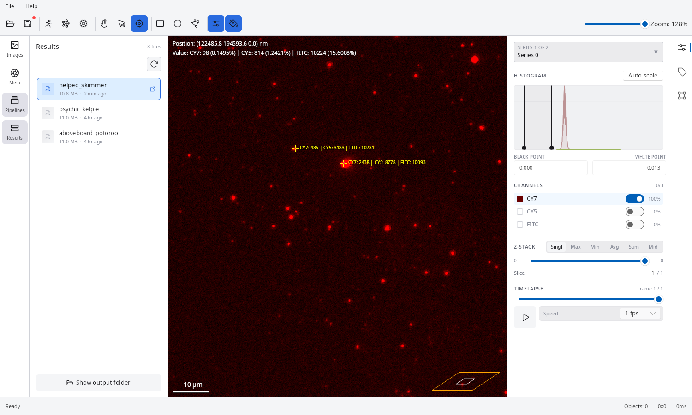
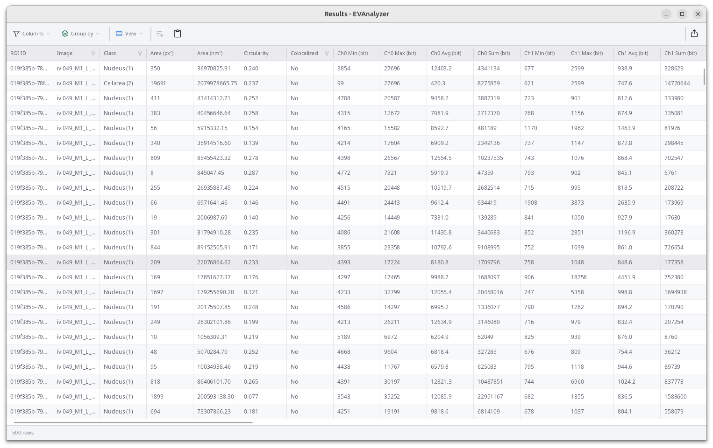
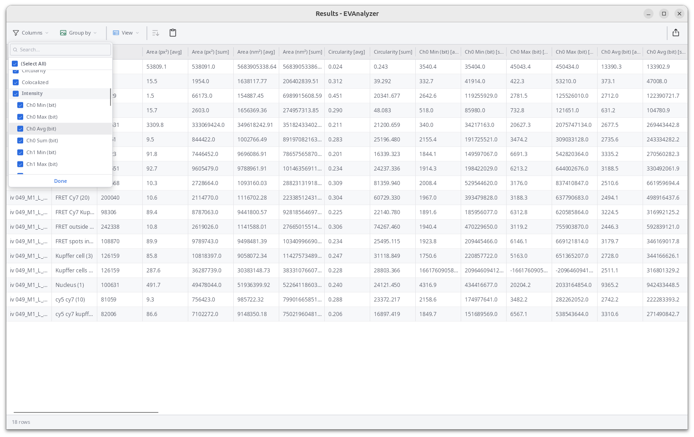
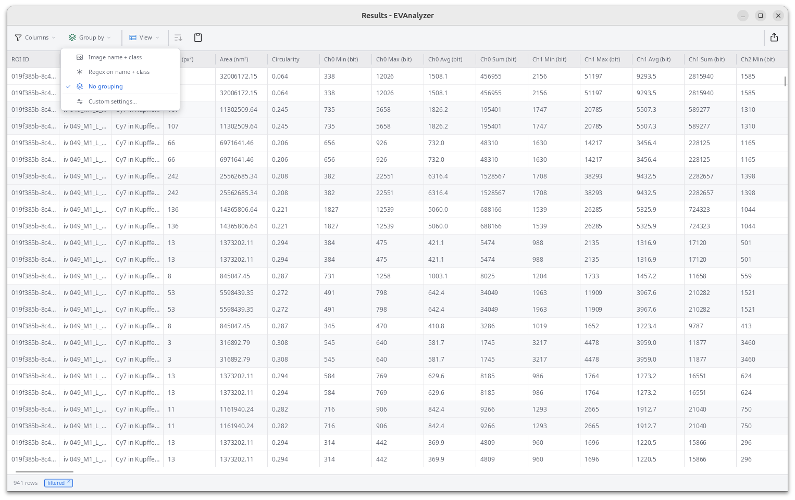
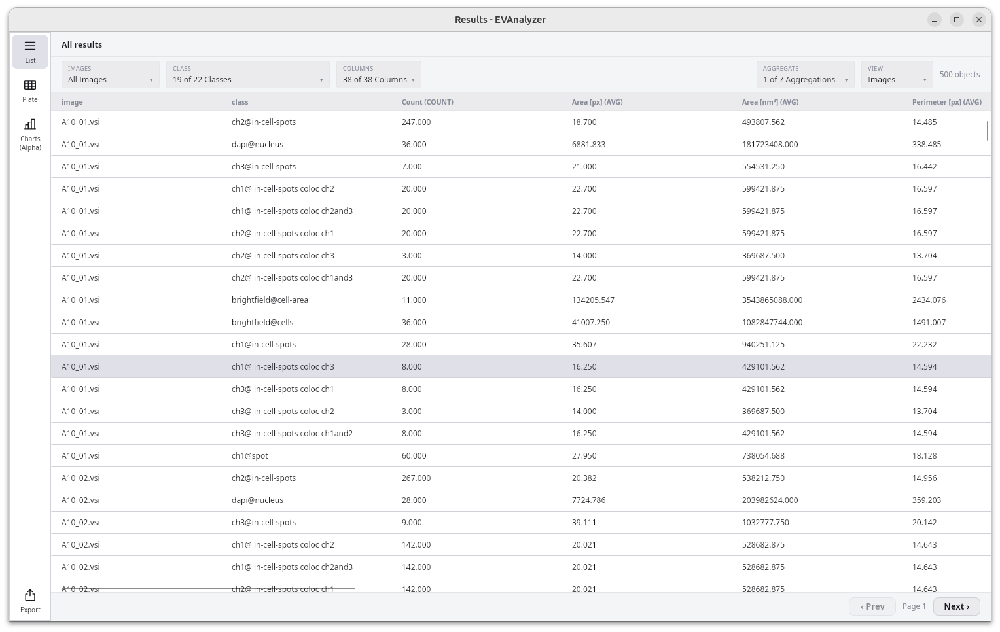
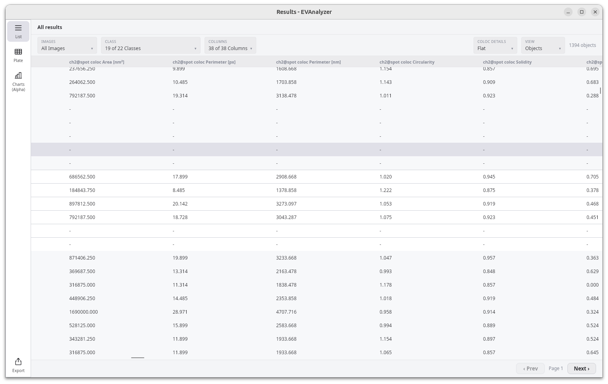
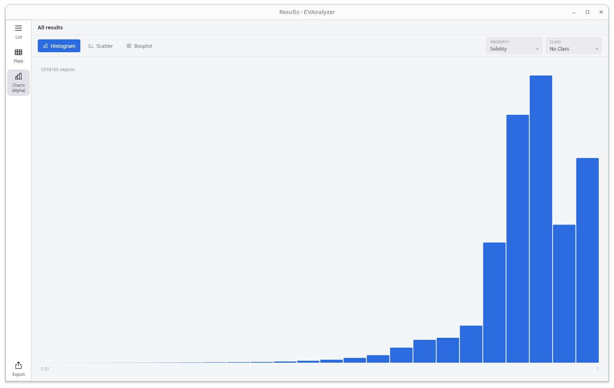
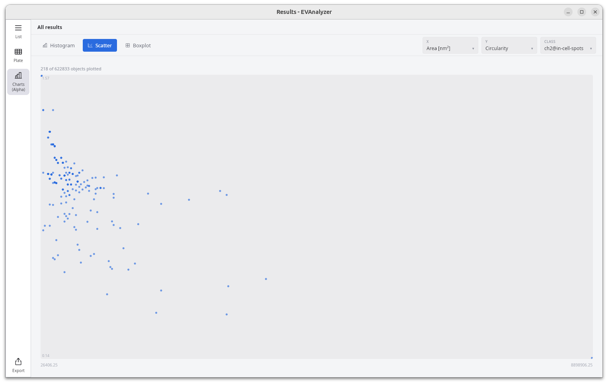
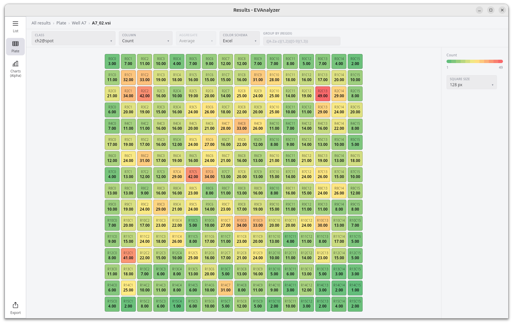
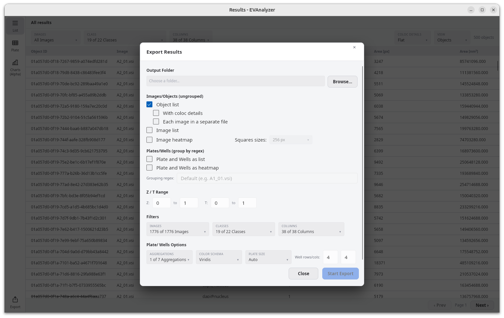

EVAnalyzer stores results in a DuckDB database file named `results.evadb` inside the project folder:

```
<image_directory>/evanalyzer/<job_name>/results.evadb
```

Open an existing results file from the toolbar: click the **arrow** beside the **Open** button and select the file.



## Results Table

By default, results open in the **Table** view: one row per detected object, with columns for **Object ID**, **Image**, **Class**, **Area (px²)**, **Area (nm²)**, **Circularity**, **Colocalized**, and one **Min / Max / Avg / Sum** column per measured channel (Ch0, Ch1, …).

Click a column header to sort by it; click again to reverse the direction. The **Image**, **Class**, and **Colocalized** headers each have a filter icon that opens a searchable checklist of values, so you can narrow the table to specific images or classes without leaving the results window.

In the **Image** filter's checklist, each row also has a disable icon next to it. Toggling it marks that image as disabled: its label turns red wherever the image appears (including the Matrix view, where the image is shown crossed out), and it's excluded from exports by default - though it can still be checked back in for an individual export in the [export dialog](#exporting-results). This state is saved into the `.evadb` results file, so it persists the next time the file is opened.

Results load in pages as you scroll, so even large result sets with hundreds of thousands of objects stay responsive.



### Columns

Click **Columns** in the toolbar to show or hide individual columns, including per-channel intensity metrics, without changing what was measured.



### Grouping and Aggregation

Click **Group by** to collapse the per-object table into one row per **image name**, **folder name**, or a **regex** extracted from the image name. Choose one or more aggregation functions — **Min**, **Max**, **Average**, **Median**, **Std. dev.**, **Sum** — then click **Apply**.



Each numeric column is duplicated per selected aggregation (for example **Area (px²) [avg]** and **Area (px²) [sum]**), so you can compare, say, average object size against total covered area per image.



With grouped results, the **Columns** picker nests per-channel metrics under an **Intensity** group so you can toggle a whole channel's aggregates at once instead of one column at a time.


### Colocalization Details

If a pipeline includes a [Colocalization](/commands/object/colocalization/) step, switch to the **Coloc details** view to flatten each object's matched partners into their own columns — one set of measurement columns per partner class, with a dash where no partner was found. This is the same underlying data as the **Colocalized** column in the main table, broken out partner by partner.



## Charts

Switch **View** to **Chart** to visualize the currently filtered/grouped rows instead of reading them as a table. Three chart types are available; all three respect the active column filters and grouping, shown as removable chips (e.g. **filtered**) beneath the toolbar, with the plotted row count in the bottom-left corner.

### Histogram

Pick a numeric **Column**, the number of **Buckets**, and optionally enable **Log scale** for right-skewed distributions (like object area). **Color by** **Class** or **Colocalized** to overlay multiple distributions using shared bucket edges, making them directly comparable.



### Scatter

Choose numeric **X** and **Y** columns and optionally **Color by** class or colocalization status. Very large datasets are downsampled deterministically (not randomly) for rendering — a note like _"Showing 5000 of 273725 points (sampled)"_ appears above the plot when this happens, and the legend shows the object count behind each color.



### Spatial Heatmap

Bins object centroids into a grid across the image (or plate) and colors each cell by object **Count** or the **Average** of a chosen metric. Configure the **Cell size (px)** and a **Colors** scheme (Viridis, Magma, Plasma, or Grayscale). This is particularly useful for spotting spatial trends across a whole-slide image or across wells in a plate.



Hover any bar, point, or cell for its exact value. Use the export icon in the chart toolbar to save the current plot as a PNG.

## Exporting Results

Click the export icon in the toolbar to open the **Export results** dialog. Unlike the table itself, exporting is built around a **queue of one or more export combinations** ("batches") that all get written out together.



### 1. Configure a combination

- **Export style** — **Table** or **Coloc details**.
- **Group by** — **No Grouping**, **Image**, or **Regex** (table style only; the aggregation functions from the main table apply here too). Folder grouping isn't available in the batch queue — use **Export as Displayed** below for that. When **Regex** is selected, click **Auto-detect** to derive a grouping pattern from the loaded image filenames instead of writing one by hand — a hint below the field reports how many filenames matched (e.g. _"Matched 24/24 filenames"_), or that no consistent pattern was found. The detected pattern is also saved to the project's plate settings, so Matrix grouping picks it up too.
- **Images to export** — pick at least one image. Images [disabled](#results-table) in the table's Image filter start out unchecked here, so they're left out unless you check them back in. Enable **Export each checked image as its own file** to write one file per checked image (the filename gets the image name) instead of a single combined file.
- **Classes to include** — pick at least one class.
- **Columns to export** — pick which columns to include, with **None** / **Avg+Sum** / **All** presets for intensity columns.
- **Name** and **Format** (CSV or XLSX) for the resulting file(s). If **Name** is left blank, it's generated from the selected classes.

### 2. Queue it

- Click **+ Add** to snapshot the current dialog settings above as a batch and add it to the **Combinations to export** list below. The checklists then stay open so you can change them and add another, different combination.
- Click **Add from table** instead to queue a batch that mirrors exactly what the results table is *currently* showing — its live filters, grouping, and visible columns — reusing whichever Name/Format you've typed.

Repeat as many times as needed; each queued combination appears as its own row (name, classes, images, style/grouping, format) and can be removed individually with its **X**.

### 3. Export

Click **Export All** to choose a single destination **folder**, then every queued combination is written as its own file into it (or one file per image, for batches with "export each image as its own file" enabled) — all in one background run, with a progress bar and a status message, cancellable partway through. If you never clicked **+ Add**, the dialog's current settings are exported as a single one-off batch, so a lone export doesn't require the extra step.

Filenames are de-duplicated automatically if two combinations would otherwise collide.

Separately, **Export as Displayed** (bottom-left of the dialog) skips the queue entirely: it immediately exports a single file matching the results table's live state — including folder grouping, which only works here — and prompts for one output file rather than a folder.

Both CSV and XLSX exports stream rows to disk rather than holding the whole result set in memory, so exporting very large projects doesn't require large amounts of RAM.

:::tip
For colocalization exports, partner lookups are resolved in batches of 5,000 source objects at a time — large colocalization datasets export reliably without needing to load everything at once.
:::

## Copying to the Clipboard

Click the clipboard icon in the toolbar to copy the currently visible rows — respecting active filters and sorting — as tab-separated values, ready to paste directly into a spreadsheet.

## Filtering by Frame

For time-lapse or Z-stack acquisitions, use the **T** and **Z** frame steppers in the toolbar to restrict the table and charts to a single time point or depth slice.
